# Gallery

Folded light curve for every object with a plot (567 of 567). Each entry links to the full-resolution figure and to that object's **reasoning sheet**: per-sector detections, the gates it passed, whether its 1P/2P doubling was measured or conventional, and any caveat attached to it.

## Slow rotators, P > 100 h (54)

The programme's target class. Rotation this slow is hard to reach from the ground, where a single night covers a few percent of a cycle.

| | | | |
|--|--|--|--|
|  **(25880)** 433.59 h · 2P · U=2 [reasoning](objects/25880.md) · [plot](plots/25880.png) |  **(28257)** 391.13 h · 2P · U=2 [reasoning](objects/28257.md) · [plot](plots/28257.png) |  **(2909)** 312.07 h · 2P · U=2 [reasoning](objects/2909.md) · [plot](plots/2909.png) |  **(2869)** 310.47 h · 2P · U=2 [reasoning](objects/2869.md) · [plot](plots/2869.png) |
|  **(13388)** 305.59 h · 2P · U=2 [reasoning](objects/13388.md) · [plot](plots/13388.png) |  **(8508)** 275.67 h · 2P · U=2 [reasoning](objects/8508.md) · [plot](plots/8508.png) |  **(2211)** 227.79 h · 2P · U=2 [reasoning](objects/2211.md) · [plot](plots/2211.png) |  **(6603)** 223.39 h · 2P · U=2 [reasoning](objects/6603.md) · [plot](plots/6603.png) |
|  **(18070)** 222.50 h · 2P · U=2 [reasoning](objects/18070.md) · [plot](plots/18070.png) |  **(73689)** 216.41 h · 2P · U=2 [reasoning](objects/73689.md) · [plot](plots/73689.png) |  **(23052)** 206.67 h · 2P · U=2 [reasoning](objects/23052.md) · [plot](plots/23052.png) |  **(5185)** 204.60 h · 2P · U=2 [reasoning](objects/5185.md) · [plot](plots/5185.png) |
|  **(5910)** 202.12 h · 2P · U=1 [reasoning](objects/5910.md) · [plot](plots/5910.png) |  **(9449)** 193.19 h · 2P · U=1 [reasoning](objects/9449.md) · [plot](plots/9449.png) |  **(2601)** 191.52 h · ambiguous · U=1 [reasoning](objects/2601.md) · [plot](plots/2601.png) |  **(7883)** 190.54 h · 2P · U=2 [reasoning](objects/7883.md) · [plot](plots/7883.png) |
|  **(53365)** 190.07 h · 2P · U=1 [reasoning](objects/53365.md) · [plot](plots/53365.png) |  **(6740)** 189.62 h · ambiguous · U=1 [reasoning](objects/6740.md) · [plot](plots/6740.png) |  **(3469)** 180.88 h · 2P · U=2 [reasoning](objects/3469.md) · [plot](plots/3469.png) |  **(6162)** 167.68 h · 2P · U=2 [reasoning](objects/6162.md) · [plot](plots/6162.png) |
|  **(2024)** 167.52 h · 2P · U=2 [reasoning](objects/2024.md) · [plot](plots/2024.png) |  **(5269)** 161.70 h · 2P · U=1 [reasoning](objects/5269.md) · [plot](plots/5269.png) |  **(3440)** 158.43 h · 2P · U=2 [reasoning](objects/3440.md) · [plot](plots/3440.png) |  **(4698)** 158.30 h · 2P · U=2 [reasoning](objects/4698.md) · [plot](plots/4698.png) |
|  **(8214)** 158.26 h · 2P · U=2 [reasoning](objects/8214.md) · [plot](plots/8214.png) |  **(7389)** 157.34 h · 2P · U=2 [reasoning](objects/7389.md) · [plot](plots/7389.png) |  **(2401)** 153.69 h · 2P · U=1 [reasoning](objects/2401.md) · [plot](plots/2401.png) | <a href='plots/2705.png'>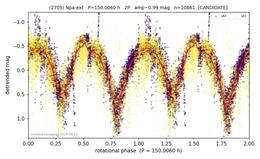</a> **(2705)** 150.01 h · 2P · U=1 [reasoning](objects/2705.md) · [plot](plots/2705.png) |
|  **(5844)** 148.10 h · 1P · U=2 [reasoning](objects/5844.md) · [plot](plots/5844.png) |  **(7068)** 144.99 h · 2P · U=2 [reasoning](objects/7068.md) · [plot](plots/7068.png) |  **(14179)** 141.81 h · 2P · U=1 [reasoning](objects/14179.md) · [plot](plots/14179.png) | <a href='plots/1473.png'>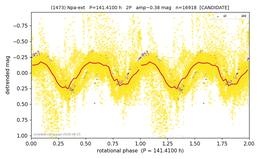</a> **(1473)** 141.41 h · 2P · U=1 [reasoning](objects/1473.md) · [plot](plots/1473.png) |
|  **(16785)** 139.88 h · 1P · U=1 [reasoning](objects/16785.md) · [plot](plots/16785.png) |  **(2451)** 138.36 h · 2P · U=2 [reasoning](objects/2451.md) · [plot](plots/2451.png) |  **(4725)** 137.36 h · 2P · U=1 [reasoning](objects/4725.md) · [plot](plots/4725.png) |  **(10505)** 133.31 h · 2P · U=2 [reasoning](objects/10505.md) · [plot](plots/10505.png) |
|  **(2866)** 130.77 h · 2P · U=2 [reasoning](objects/2866.md) · [plot](plots/2866.png) |  **(29622)** 130.64 h · 2P · U=1 [reasoning](objects/29622.md) · [plot](plots/29622.png) | <a href='plots/27396.png'>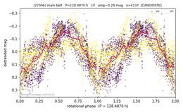</a> **(27396)** 128.49 h · 1P · U=1 [reasoning](objects/27396.md) · [plot](plots/27396.png) | <a href='plots/6574.png'>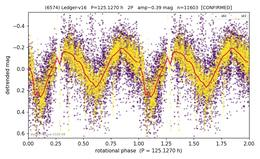</a> **(6574)** 125.13 h · 2P · U=2 [reasoning](objects/6574.md) · [plot](plots/6574.png) |
|  **(6614)** 120.43 h · 2P · U=1 [reasoning](objects/6614.md) · [plot](plots/6614.png) |  **(10561)** 118.97 h · 2P · U=1 [reasoning](objects/10561.md) · [plot](plots/10561.png) |  **(15286)** 118.76 h · 1P · U=2 [reasoning](objects/15286.md) · [plot](plots/15286.png) |  **(7887)** 111.71 h · 2P · U=2 [reasoning](objects/7887.md) · [plot](plots/7887.png) |
|  **(6468)** 110.49 h · 2P · U=1 [reasoning](objects/6468.md) · [plot](plots/6468.png) |  **(4164)** 109.47 h · 2P · U=1 [reasoning](objects/4164.md) · [plot](plots/4164.png) |  **(14720)** 108.08 h · 2P · U=2 [reasoning](objects/14720.md) · [plot](plots/14720.png) |  **(8513)** 107.54 h · 1P · U=2 [reasoning](objects/8513.md) · [plot](plots/8513.png) |
|  **(2886)** 107.23 h · 2P · U=1 [reasoning](objects/2886.md) · [plot](plots/2886.png) |  **(5297)** 106.92 h · 2P · U=2 [reasoning](objects/5297.md) · [plot](plots/5297.png) | <a href='plots/49973.png'>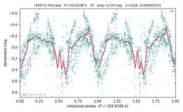</a> **(49973)** 104.83 h · 2P · U=1 [reasoning](objects/49973.md) · [plot](plots/49973.png) |  **(7631)** 102.66 h · 2P · U=1 [reasoning](objects/7631.md) · [plot](plots/7631.png) |
|  **(10735)** 102.43 h · 2P · U=2 [reasoning](objects/10735.md) · [plot](plots/10735.png) |  **(16405)** 100.22 h · 1P · U=1 [reasoning](objects/16405.md) · [plot](plots/16405.png) |  |  |

## main belt (survey), part 1 of 4 (120)

| | | | |
|--|--|--|--|
|  **(4253)** 2.30 h · 1P · U=2 [reasoning](objects/4253.md) · [plot](plots/4253.png) |  **(9955)** 2.31 h · 1P · U=2 [reasoning](objects/9955.md) · [plot](plots/9955.png) | <a href='plots/6630.png'>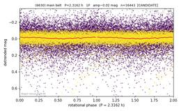</a> **(6630)** 2.32 h · 1P · U=1 [reasoning](objects/6630.md) · [plot](plots/6630.png) |  **(16650)** 2.32 h · 1P · U=2 [reasoning](objects/16650.md) · [plot](plots/16650.png) |
|  **(18083)** 2.36 h · 1P · U=1 [reasoning](objects/18083.md) · [plot](plots/18083.png) |  **(4728)** 2.42 h · 1P · U=2 [reasoning](objects/4728.md) · [plot](plots/4728.png) |  **(24362)** 2.44 h · 1P · U=2 [reasoning](objects/24362.md) · [plot](plots/24362.png) |  **(18069)** 2.50 h · 1P · U=1 [reasoning](objects/18069.md) · [plot](plots/18069.png) |
|  **(2514)** 2.53 h · 1P · U=1 [reasoning](objects/2514.md) · [plot](plots/2514.png) |  **(3636)** 2.57 h · 1P · U=1 [reasoning](objects/3636.md) · [plot](plots/3636.png) |  **(6336)** 2.59 h · 1P · U=1 [reasoning](objects/6336.md) · [plot](plots/6336.png) |  **(8707)** 2.64 h · 1P · U=1 [reasoning](objects/8707.md) · [plot](plots/8707.png) |
|  **(5167)** 2.66 h · 1P · U=2 [reasoning](objects/5167.md) · [plot](plots/5167.png) |  **(20750)** 2.66 h · 1P · U=2 [reasoning](objects/20750.md) · [plot](plots/20750.png) |  **(2690)** 2.66 h · 1P · U=2 [reasoning](objects/2690.md) · [plot](plots/2690.png) |  **(23044)** 2.68 h · 1P · U=1 [reasoning](objects/23044.md) · [plot](plots/23044.png) |
|  **(13081)** 2.72 h · 1P · U=1 [reasoning](objects/13081.md) · [plot](plots/13081.png) |  **(15877)** 2.76 h · 1P · U=2 [reasoning](objects/15877.md) · [plot](plots/15877.png) |  **(6640)** 2.77 h · 1P · U=2 [reasoning](objects/6640.md) · [plot](plots/6640.png) |  **(9594)** 2.89 h · 1P · U=1 [reasoning](objects/9594.md) · [plot](plots/9594.png) |
|  **(33082)** 2.93 h · 1P · U=1 [reasoning](objects/33082.md) · [plot](plots/33082.png) |  **(13370)** 2.99 h · 1P · U=1 [reasoning](objects/13370.md) · [plot](plots/13370.png) |  **(23985)** 3.03 h · 1P · U=2 [reasoning](objects/23985.md) · [plot](plots/23985.png) |  **(5793)** 3.04 h · 2P · U=2 [reasoning](objects/5793.md) · [plot](plots/5793.png) |
|  **(2810)** 3.05 h · 2P · U=2 [reasoning](objects/2810.md) · [plot](plots/2810.png) |  **(6078)** 3.09 h · 2P · U=1 [reasoning](objects/6078.md) · [plot](plots/6078.png) |  **(34812)** 3.10 h · 2P · U=1 [reasoning](objects/34812.md) · [plot](plots/34812.png) |  **(5862)** 3.11 h · 1P · U=1 [reasoning](objects/5862.md) · [plot](plots/5862.png) |
|  **(43891)** 3.12 h · 1P · U=2 [reasoning](objects/43891.md) · [plot](plots/43891.png) |  **(28748)** 3.12 h · 1P · U=2 [reasoning](objects/28748.md) · [plot](plots/28748.png) |  **(11541)** 3.12 h · 2P · U=1 [reasoning](objects/11541.md) · [plot](plots/11541.png) |  **(2124)** 3.12 h · 2P · U=2 [reasoning](objects/2124.md) · [plot](plots/2124.png) |
|  **(24757)** 3.15 h · 2P · U=1 [reasoning](objects/24757.md) · [plot](plots/24757.png) |  **(19762)** 3.15 h · 1P · U=1 [reasoning](objects/19762.md) · [plot](plots/19762.png) |  **(9494)** 3.16 h · 2P · U=1 [reasoning](objects/9494.md) · [plot](plots/9494.png) |  **(7392)** 3.17 h · 1P · U=2 [reasoning](objects/7392.md) · [plot](plots/7392.png) |
|  **(8835)** 3.17 h · 2P · U=2 [reasoning](objects/8835.md) · [plot](plots/8835.png) |  **(5954)** 3.17 h · 2P · U=1 [reasoning](objects/5954.md) · [plot](plots/5954.png) |  **(50545)** 3.18 h · 2P · U=2 [reasoning](objects/50545.md) · [plot](plots/50545.png) | <a href='plots/7874.png'>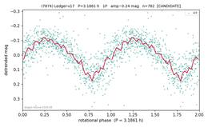</a> **(7874)** 3.19 h · 1P · U=1 [reasoning](objects/7874.md) · [plot](plots/7874.png) |
|  **(10885)** 3.20 h · 2P · U=1 [reasoning](objects/10885.md) · [plot](plots/10885.png) |  **(28844)** 3.21 h · 2P · U=2 [reasoning](objects/28844.md) · [plot](plots/28844.png) |  **(4367)** 3.23 h · 2P · U=2 [reasoning](objects/4367.md) · [plot](plots/4367.png) |  **(7773)** 3.23 h · 2P · U=1 [reasoning](objects/7773.md) · [plot](plots/7773.png) |
|  **(43926)** 3.23 h · 2P · U=2 [reasoning](objects/43926.md) · [plot](plots/43926.png) |  **(3168)** 3.24 h · 1P · U=2 [reasoning](objects/3168.md) · [plot](plots/3168.png) |  **(8294)** 3.24 h · 2P · U=1 [reasoning](objects/8294.md) · [plot](plots/8294.png) |  **(18615)** 3.24 h · 2P · U=1 [reasoning](objects/18615.md) · [plot](plots/18615.png) |
| <a href='plots/25064.png'>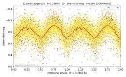</a> **(25064)** 3.25 h · 2P · U=2 [reasoning](objects/25064.md) · [plot](plots/25064.png) |  **(12077)** 3.27 h · 2P · U=1 [reasoning](objects/12077.md) · [plot](plots/12077.png) |  **(7176)** 3.29 h · 2P · U=2 [reasoning](objects/7176.md) · [plot](plots/7176.png) |  **(10798)** 3.29 h · 2P · U=1 [reasoning](objects/10798.md) · [plot](plots/10798.png) |
|  **(10164)** 3.31 h · 2P · U=1 [reasoning](objects/10164.md) · [plot](plots/10164.png) |  **(11576)** 3.31 h · 2P · U=2 [reasoning](objects/11576.md) · [plot](plots/11576.png) |  **(17766)** 3.32 h · 2P · U=1 [reasoning](objects/17766.md) · [plot](plots/17766.png) |  **(3828)** 3.32 h · 2P · U=2 [reasoning](objects/3828.md) · [plot](plots/3828.png) |
|  **(25316)** 3.33 h · 2P · U=1 [reasoning](objects/25316.md) · [plot](plots/25316.png) |  **(11327)** 3.33 h · 2P · U=2 [reasoning](objects/11327.md) · [plot](plots/11327.png) |  **(13632)** 3.37 h · 2P · U=1 [reasoning](objects/13632.md) · [plot](plots/13632.png) |  **(11872)** 3.41 h · 2P · U=2 [reasoning](objects/11872.md) · [plot](plots/11872.png) |
|  **(43469)** 3.45 h · 2P · U=1 [reasoning](objects/43469.md) · [plot](plots/43469.png) |  **(12335)** 3.46 h · 2P · U=2 [reasoning](objects/12335.md) · [plot](plots/12335.png) |  **(15446)** 3.48 h · 1P · U=1 [reasoning](objects/15446.md) · [plot](plots/15446.png) |  **(17410)** 3.50 h · 2P · U=2 [reasoning](objects/17410.md) · [plot](plots/17410.png) |
|  **(5600)** 3.51 h · 1P · U=1 [reasoning](objects/5600.md) · [plot](plots/5600.png) |  **(12821)** 3.51 h · 1P · U=1 [reasoning](objects/12821.md) · [plot](plots/12821.png) |  **(8168)** 3.52 h · 1P · U=2 [reasoning](objects/8168.md) · [plot](plots/8168.png) |  **(19197)** 3.52 h · 1P · U=1 [reasoning](objects/19197.md) · [plot](plots/19197.png) |
|  **(2116)** 3.54 h · 2P · U=2 [reasoning](objects/2116.md) · [plot](plots/2116.png) |  **(7911)** 3.56 h · 1P · U=2 [reasoning](objects/7911.md) · [plot](plots/7911.png) |  **(3774)** 3.57 h · 2P · U=2 [reasoning](objects/3774.md) · [plot](plots/3774.png) |  **(16125)** 3.58 h · 2P · U=1 [reasoning](objects/16125.md) · [plot](plots/16125.png) |
|  **(18840)** 3.60 h · 2P · U=1 [reasoning](objects/18840.md) · [plot](plots/18840.png) |  **(22015)** 3.60 h · 2P · U=1 [reasoning](objects/22015.md) · [plot](plots/22015.png) |  **(3949)** 3.62 h · 2P · U=2 [reasoning](objects/3949.md) · [plot](plots/3949.png) |  **(4539)** 3.64 h · 2P · U=2 [reasoning](objects/4539.md) · [plot](plots/4539.png) |
|  **(11285)** 3.65 h · 2P · U=1 [reasoning](objects/11285.md) · [plot](plots/11285.png) |  **(1053)** 3.66 h · 2P · U=2 [reasoning](objects/1053.md) · [plot](plots/1053.png) |  **(12975)** 3.67 h · 2P · U=1 [reasoning](objects/12975.md) · [plot](plots/12975.png) |  **(17141)** 3.67 h · 2P · U=2 [reasoning](objects/17141.md) · [plot](plots/17141.png) |
|  **(37113)** 3.68 h · 1P · U=1 [reasoning](objects/37113.md) · [plot](plots/37113.png) | <a href='plots/10090.png'>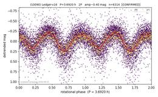</a> **(10090)** 3.69 h · 2P · U=2 [reasoning](objects/10090.md) · [plot](plots/10090.png) |  **(6710)** 3.70 h · 2P · U=1 [reasoning](objects/6710.md) · [plot](plots/6710.png) |  **(5722)** 3.74 h · 2P · U=2 [reasoning](objects/5722.md) · [plot](plots/5722.png) |
|  **(21977)** 3.78 h · 1P · U=2 [reasoning](objects/21977.md) · [plot](plots/21977.png) |  **(24417)** 3.78 h · 1P · U=2 [reasoning](objects/24417.md) · [plot](plots/24417.png) |  **(2828)** 3.80 h · 2P · U=2 [reasoning](objects/2828.md) · [plot](plots/2828.png) |  **(8530)** 3.82 h · 1P · U=1 [reasoning](objects/8530.md) · [plot](plots/8530.png) |
|  **(4671)** 3.83 h · 2P · U=1 [reasoning](objects/4671.md) · [plot](plots/4671.png) |  **(13786)** 3.85 h · 2P · U=2 [reasoning](objects/13786.md) · [plot](plots/13786.png) |  **(11186)** 3.85 h · 2P · U=1 [reasoning](objects/11186.md) · [plot](plots/11186.png) |  **(3810)** 3.86 h · 1P · U=2 [reasoning](objects/3810.md) · [plot](plots/3810.png) |
|  **(8286)** 3.87 h · 2P · U=2 [reasoning](objects/8286.md) · [plot](plots/8286.png) |  **(10932)** 3.90 h · 2P · U=2 [reasoning](objects/10932.md) · [plot](plots/10932.png) |  **(9020)** 3.96 h · 2P · U=1 [reasoning](objects/9020.md) · [plot](plots/9020.png) |  **(39899)** 3.96 h · 1P · U=1 [reasoning](objects/39899.md) · [plot](plots/39899.png) |
|  **(18654)** 4.00 h · 2P · U=1 [reasoning](objects/18654.md) · [plot](plots/18654.png) |  **(13947)** 4.00 h · 2P · U=1 [reasoning](objects/13947.md) · [plot](plots/13947.png) |  **(8593)** 4.00 h · 1P · U=2 [reasoning](objects/8593.md) · [plot](plots/8593.png) |  **(7878)** 4.01 h · 2P · U=2 [reasoning](objects/7878.md) · [plot](plots/7878.png) |
| <a href='plots/3320.png'>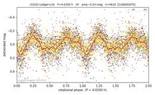</a> **(3320)** 4.02 h · 2P · U=1 [reasoning](objects/3320.md) · [plot](plots/3320.png) |  **(26161)** 4.04 h · 2P · U=1 [reasoning](objects/26161.md) · [plot](plots/26161.png) |  **(13749)** 4.05 h · 2P · U=2 [reasoning](objects/13749.md) · [plot](plots/13749.png) | <a href='plots/33365.png'>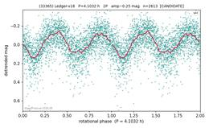</a> **(33365)** 4.10 h · 2P · U=1 [reasoning](objects/33365.md) · [plot](plots/33365.png) |
| <a href='plots/43754.png'>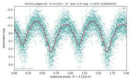</a> **(43754)** 4.11 h · 2P · U=1 [reasoning](objects/43754.md) · [plot](plots/43754.png) |  **(17019)** 4.14 h · 2P · U=1 [reasoning](objects/17019.md) · [plot](plots/17019.png) |  **(4938)** 4.14 h · 2P · U=1 [reasoning](objects/4938.md) · [plot](plots/4938.png) |  **(6005)** 4.15 h · 2P · U=2 [reasoning](objects/6005.md) · [plot](plots/6005.png) |
| <a href='plots/3834.png'>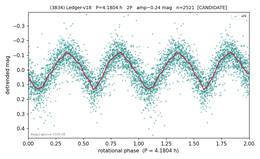</a> **(3834)** 4.18 h · 2P · U=1 [reasoning](objects/3834.md) · [plot](plots/3834.png) |  **(31147)** 4.18 h · 2P · U=1 [reasoning](objects/31147.md) · [plot](plots/31147.png) |  **(2366)** 4.20 h · 2P · U=1 [reasoning](objects/2366.md) · [plot](plots/2366.png) |  **(4573)** 4.24 h · 2P · U=2 [reasoning](objects/4573.md) · [plot](plots/4573.png) |
|  **(5218)** 4.26 h · 2P · U=1 [reasoning](objects/5218.md) · [plot](plots/5218.png) |  **(10710)** 4.28 h · 1P · U=1 [reasoning](objects/10710.md) · [plot](plots/10710.png) |  **(24503)** 4.29 h · 2P · U=1 [reasoning](objects/24503.md) · [plot](plots/24503.png) | <a href='plots/5860.png'>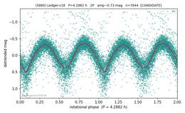</a> **(5860)** 4.29 h · 2P · U=1 [reasoning](objects/5860.md) · [plot](plots/5860.png) |
|  **(3294)** 4.30 h · 1P · U=1 [reasoning](objects/3294.md) · [plot](plots/3294.png) |  **(9403)** 4.32 h · 1P · U=1 [reasoning](objects/9403.md) · [plot](plots/9403.png) |  **(19657)** 4.35 h · 2P · U=2 [reasoning](objects/19657.md) · [plot](plots/19657.png) |  **(2805)** 4.37 h · 1P · U=2 [reasoning](objects/2805.md) · [plot](plots/2805.png) |

## main belt (survey), part 2 of 4 (120)

| | | | |
|--|--|--|--|
|  **(7472)** 4.37 h · 2P · U=2 [reasoning](objects/7472.md) · [plot](plots/7472.png) |  **(45287)** 4.41 h · 1P · U=2 [reasoning](objects/45287.md) · [plot](plots/45287.png) |  **(6462)** 4.43 h · 2P · U=1 [reasoning](objects/6462.md) · [plot](plots/6462.png) |  **(4597)** 4.44 h · 1P · U=2 [reasoning](objects/4597.md) · [plot](plots/4597.png) |
|  **(9146)** 4.47 h · 1P · U=1 [reasoning](objects/9146.md) · [plot](plots/9146.png) |  **(6389)** 4.50 h · 1P · U=2 [reasoning](objects/6389.md) · [plot](plots/6389.png) |  **(17482)** 4.51 h · 1P · U=1 [reasoning](objects/17482.md) · [plot](plots/17482.png) |  **(7386)** 4.52 h · 1P · U=1 [reasoning](objects/7386.md) · [plot](plots/7386.png) |
|  **(1588)** 4.61 h · 2P · U=2 [reasoning](objects/1588.md) · [plot](plots/1588.png) |  **(3594)** 4.61 h · 2P · U=2 [reasoning](objects/3594.md) · [plot](plots/3594.png) |  **(9543)** 4.63 h · 2P · U=1 [reasoning](objects/9543.md) · [plot](plots/9543.png) |  **(55103)** 4.64 h · 2P · U=2 [reasoning](objects/55103.md) · [plot](plots/55103.png) |
|  **(6281)** 4.66 h · 1P · U=2 [reasoning](objects/6281.md) · [plot](plots/6281.png) |  **(12011)** 4.66 h · 1P · U=1 [reasoning](objects/12011.md) · [plot](plots/12011.png) |  **(17986)** 4.67 h · 2P · U=1 [reasoning](objects/17986.md) · [plot](plots/17986.png) |  **(5113)** 4.76 h · 2P · U=2 [reasoning](objects/5113.md) · [plot](plots/5113.png) |
|  **(22870)** 4.76 h · 1P · U=1 [reasoning](objects/22870.md) · [plot](plots/22870.png) |  **(18067)** 4.77 h · 1P · U=2 [reasoning](objects/18067.md) · [plot](plots/18067.png) |  **(66949)** 4.77 h · 1P · U=1 [reasoning](objects/66949.md) · [plot](plots/66949.png) |  **(9214)** 4.78 h · 2P · U=2 [reasoning](objects/9214.md) · [plot](plots/9214.png) |
|  **(7251)** 4.79 h · 2P · U=1 [reasoning](objects/7251.md) · [plot](plots/7251.png) |  **(7466)** 4.88 h · 1P · U=1 [reasoning](objects/7466.md) · [plot](plots/7466.png) |  **(11861)** 4.90 h · 2P · U=1 [reasoning](objects/11861.md) · [plot](plots/11861.png) |  **(9947)** 4.95 h · 2P · U=1 [reasoning](objects/9947.md) · [plot](plots/9947.png) |
|  **(5278)** 5.00 h · 2P · U=2 [reasoning](objects/5278.md) · [plot](plots/5278.png) |  **(10031)** 5.00 h · 2P · U=1 [reasoning](objects/10031.md) · [plot](plots/10031.png) |  **(7046)** 5.01 h · 1P · U=1 [reasoning](objects/7046.md) · [plot](plots/7046.png) |  **(4001)** 5.01 h · 2P · U=1 [reasoning](objects/4001.md) · [plot](plots/4001.png) |
|  **(5777)** 5.11 h · 2P · U=1 [reasoning](objects/5777.md) · [plot](plots/5777.png) |  **(20396)** 5.15 h · 2P · U=1 [reasoning](objects/20396.md) · [plot](plots/20396.png) |  **(3846)** 5.17 h · 1P · U=2 [reasoning](objects/3846.md) · [plot](plots/3846.png) |  **(5805)** 5.18 h · 2P · U=2 [reasoning](objects/5805.md) · [plot](plots/5805.png) |
|  **(19794)** 5.20 h · 1P · U=1 [reasoning](objects/19794.md) · [plot](plots/19794.png) |  **(6038)** 5.23 h · 1P · U=2 [reasoning](objects/6038.md) · [plot](plots/6038.png) |  **(1381)** 5.26 h · 2P · U=2 [reasoning](objects/1381.md) · [plot](plots/1381.png) |  **(19840)** 5.29 h · 2P · U=1 [reasoning](objects/19840.md) · [plot](plots/19840.png) |
|  **(19144)** 5.29 h · 1P · U=2 [reasoning](objects/19144.md) · [plot](plots/19144.png) |  **(6873)** 5.31 h · 2P · U=1 [reasoning](objects/6873.md) · [plot](plots/6873.png) |  **(6967)** 5.32 h · 2P · U=1 [reasoning](objects/6967.md) · [plot](plots/6967.png) |  **(6658)** 5.33 h · 2P · U=2 [reasoning](objects/6658.md) · [plot](plots/6658.png) |
|  **(2553)** 5.37 h · 1P · U=2 [reasoning](objects/2553.md) · [plot](plots/2553.png) |  **(48423)** 5.46 h · 2P · U=1 [reasoning](objects/48423.md) · [plot](plots/48423.png) |  **(19150)** 5.48 h · 2P · U=1 [reasoning](objects/19150.md) · [plot](plots/19150.png) |  **(19510)** 5.51 h · 2P · U=1 [reasoning](objects/19510.md) · [plot](plots/19510.png) |
|  **(14858)** 5.52 h · 2P · U=1 [reasoning](objects/14858.md) · [plot](plots/14858.png) |  **(17051)** 5.55 h · 2P · U=1 [reasoning](objects/17051.md) · [plot](plots/17051.png) |  **(3278)** 5.62 h · 1P · U=2 [reasoning](objects/3278.md) · [plot](plots/3278.png) |  **(31446)** 5.62 h · 1P · U=1 [reasoning](objects/31446.md) · [plot](plots/31446.png) |
|  **(13073)** 5.68 h · 2P · U=1 [reasoning](objects/13073.md) · [plot](plots/13073.png) |  **(50380)** 5.68 h · 2P · U=2 [reasoning](objects/50380.md) · [plot](plots/50380.png) |  **(3520)** 5.79 h · 2P · U=1 [reasoning](objects/3520.md) · [plot](plots/3520.png) |  **(14302)** 5.86 h · 2P · U=1 [reasoning](objects/14302.md) · [plot](plots/14302.png) |
|  **(10112)** 5.87 h · 2P · U=2 [reasoning](objects/10112.md) · [plot](plots/10112.png) |  **(9174)** 5.90 h · 1P · U=1 [reasoning](objects/9174.md) · [plot](plots/9174.png) |  **(26347)** 5.91 h · 2P · U=1 [reasoning](objects/26347.md) · [plot](plots/26347.png) | <a href='plots/4069.png'>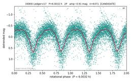</a> **(4069)** 6.00 h · 2P · U=1 [reasoning](objects/4069.md) · [plot](plots/4069.png) |
|  **(2350)** 6.03 h · 2P · U=2 [reasoning](objects/2350.md) · [plot](plots/2350.png) |  **(5688)** 6.06 h · 2P · U=1 [reasoning](objects/5688.md) · [plot](plots/5688.png) |  **(21934)** 6.06 h · 1P · U=1 [reasoning](objects/21934.md) · [plot](plots/21934.png) |  **(7215)** 6.09 h · 2P · U=2 [reasoning](objects/7215.md) · [plot](plots/7215.png) |
|  **(86402)** 6.10 h · 2P · U=1 [reasoning](objects/86402.md) · [plot](plots/86402.png) |  **(4303)** 6.14 h · 2P · U=2 [reasoning](objects/4303.md) · [plot](plots/4303.png) | <a href='plots/31569.png'>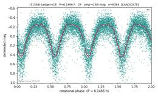</a> **(31569)** 6.15 h · 2P · U=1 [reasoning](objects/31569.md) · [plot](plots/31569.png) |  **(28056)** 6.16 h · 1P · U=2 [reasoning](objects/28056.md) · [plot](plots/28056.png) |
|  **(28462)** 6.24 h · 2P · U=2 [reasoning](objects/28462.md) · [plot](plots/28462.png) |  **(11182)** 6.26 h · 2P · U=1 [reasoning](objects/11182.md) · [plot](plots/11182.png) |  **(15142)** 6.29 h · 1P · U=1 [reasoning](objects/15142.md) · [plot](plots/15142.png) |  **(19932)** 6.39 h · 1P · U=1 [reasoning](objects/19932.md) · [plot](plots/19932.png) |
|  **(27791)** 6.39 h · 2P · U=1 [reasoning](objects/27791.md) · [plot](plots/27791.png) |  **(24809)** 6.44 h · 2P · U=1 [reasoning](objects/24809.md) · [plot](plots/24809.png) |  **(13501)** 6.45 h · 2P · U=1 [reasoning](objects/13501.md) · [plot](plots/13501.png) |  **(4088)** 6.45 h · 2P · U=2 [reasoning](objects/4088.md) · [plot](plots/4088.png) |
|  **(4682)** 6.46 h · 2P · U=2 [reasoning](objects/4682.md) · [plot](plots/4682.png) |  **(3239)** 6.47 h · 2P · U=1 [reasoning](objects/3239.md) · [plot](plots/3239.png) |  **(16019)** 6.49 h · 1P · U=2 [reasoning](objects/16019.md) · [plot](plots/16019.png) |  **(5966)** 6.64 h · 1P · U=1 [reasoning](objects/5966.md) · [plot](plots/5966.png) |
|  **(17725)** 6.67 h · 2P · U=1 [reasoning](objects/17725.md) · [plot](plots/17725.png) |  **(6678)** 6.71 h · 1P · U=2 [reasoning](objects/6678.md) · [plot](plots/6678.png) |  **(4203)** 6.77 h · 2P · U=2 [reasoning](objects/4203.md) · [plot](plots/4203.png) |  **(59522)** 6.88 h · 2P · U=1 [reasoning](objects/59522.md) · [plot](plots/59522.png) |
|  **(2724)** 6.90 h · 1P · U=2 [reasoning](objects/2724.md) · [plot](plots/2724.png) |  **(5816)** 6.90 h · 2P · U=1 [reasoning](objects/5816.md) · [plot](plots/5816.png) |  **(6137)** 6.93 h · 2P · U=1 [reasoning](objects/6137.md) · [plot](plots/6137.png) |  **(5203)** 6.93 h · 2P · U=2 [reasoning](objects/5203.md) · [plot](plots/5203.png) |
|  **(32253)** 6.94 h · 2P · U=2 [reasoning](objects/32253.md) · [plot](plots/32253.png) |  **(3858)** 7.09 h · 2P · U=2 [reasoning](objects/3858.md) · [plot](plots/3858.png) |  **(17857)** 7.17 h · 1P · U=1 [reasoning](objects/17857.md) · [plot](plots/17857.png) |  **(2826)** 7.18 h · 1P · U=1 [reasoning](objects/2826.md) · [plot](plots/2826.png) |
|  **(3246)** 7.18 h · 2P · U=2 [reasoning](objects/3246.md) · [plot](plots/3246.png) |  **(10778)** 7.19 h · 2P · U=1 [reasoning](objects/10778.md) · [plot](plots/10778.png) |  **(4315)** 7.23 h · 1P · U=1 [reasoning](objects/4315.md) · [plot](plots/4315.png) |  **(7498)** 7.24 h · 2P · U=1 [reasoning](objects/7498.md) · [plot](plots/7498.png) |
|  **(33729)** 7.26 h · 1P · U=1 [reasoning](objects/33729.md) · [plot](plots/33729.png) |  **(5051)** 7.26 h · 1P · U=2 [reasoning](objects/5051.md) · [plot](plots/5051.png) |  **(13163)** 7.26 h · 2P · U=1 [reasoning](objects/13163.md) · [plot](plots/13163.png) |  **(25977)** 7.31 h · 1P · U=1 [reasoning](objects/25977.md) · [plot](plots/25977.png) |
|  **(9859)** 7.33 h · 1P · U=1 [reasoning](objects/9859.md) · [plot](plots/9859.png) |  **(2168)** 7.35 h · 2P · U=1 [reasoning](objects/2168.md) · [plot](plots/2168.png) |  **(4018)** 7.48 h · 2P · U=1 [reasoning](objects/4018.md) · [plot](plots/4018.png) |  **(13808)** 7.57 h · 2P · U=2 [reasoning](objects/13808.md) · [plot](plots/13808.png) |
|  **(9141)** 7.72 h · 2P · U=1 [reasoning](objects/9141.md) · [plot](plots/9141.png) |  **(36273)** 7.73 h · 1P · U=2 [reasoning](objects/36273.md) · [plot](plots/36273.png) |  **(6808)** 8.00 h · 2P · U=2 [reasoning](objects/6808.md) · [plot](plots/6808.png) |  **(3081)** 8.01 h · 2P · U=1 [reasoning](objects/3081.md) · [plot](plots/3081.png) |
|  **(9609)** 8.08 h · 2P · U=1 [reasoning](objects/9609.md) · [plot](plots/9609.png) |  **(12064)** 8.12 h · 1P · U=1 [reasoning](objects/12064.md) · [plot](plots/12064.png) | <a href='plots/66803.png'>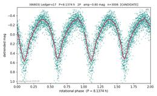</a> **(66803)** 8.14 h · 2P · U=1 [reasoning](objects/66803.md) · [plot](plots/66803.png) |  **(5768)** 8.14 h · 2P · U=2 [reasoning](objects/5768.md) · [plot](plots/5768.png) |
|  **(5990)** 8.30 h · 1P · U=1 [reasoning](objects/5990.md) · [plot](plots/5990.png) |  **(2775)** 8.33 h · 2P · U=2 [reasoning](objects/2775.md) · [plot](plots/2775.png) |  **(6128)** 8.34 h · 1P · U=1 [reasoning](objects/6128.md) · [plot](plots/6128.png) |  **(3477)** 8.40 h · 2P · U=2 [reasoning](objects/3477.md) · [plot](plots/3477.png) |
|  **(31361)** 8.50 h · 1P · U=1 [reasoning](objects/31361.md) · [plot](plots/31361.png) | <a href='plots/23444.png'>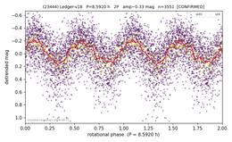</a> **(23444)** 8.59 h · 2P · U=2 [reasoning](objects/23444.md) · [plot](plots/23444.png) |  **(42921)** 8.72 h · 1P · U=2 [reasoning](objects/42921.md) · [plot](plots/42921.png) |  **(4118)** 8.73 h · 2P · U=2 [reasoning](objects/4118.md) · [plot](plots/4118.png) |
| <a href='plots/15736.png'>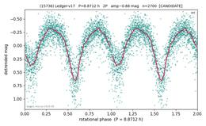</a> **(15736)** 8.87 h · 2P · U=1 [reasoning](objects/15736.md) · [plot](plots/15736.png) |  **(2122)** 8.90 h · 2P · U=2 [reasoning](objects/2122.md) · [plot](plots/2122.png) | <a href='plots/14999.png'>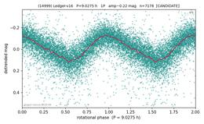</a> **(14999)** 9.03 h · 1P · U=2 [reasoning](objects/14999.md) · [plot](plots/14999.png) |  **(7252)** 9.06 h · 1P · U=2 [reasoning](objects/7252.md) · [plot](plots/7252.png) |

## main belt (survey), part 3 of 4 (120)

| | | | |
|--|--|--|--|
|  **(34588)** 9.14 h · 2P · U=1 [reasoning](objects/34588.md) · [plot](plots/34588.png) |  **(14338)** 9.20 h · 1P · U=1 [reasoning](objects/14338.md) · [plot](plots/14338.png) |  **(5950)** 9.22 h · 2P · U=1 [reasoning](objects/5950.md) · [plot](plots/5950.png) |  **(11119)** 9.26 h · 2P · U=2 [reasoning](objects/11119.md) · [plot](plots/11119.png) |
|  **(45456)** 9.26 h · 2P · U=1 [reasoning](objects/45456.md) · [plot](plots/45456.png) |  **(2736)** 9.38 h · 1P · U=2 [reasoning](objects/2736.md) · [plot](plots/2736.png) |  **(20511)** 9.38 h · 2P · U=2 [reasoning](objects/20511.md) · [plot](plots/20511.png) |  **(5814)** 9.41 h · 2P · U=1 [reasoning](objects/5814.md) · [plot](plots/5814.png) |
|  **(6492)** 9.58 h · 2P · U=1 [reasoning](objects/6492.md) · [plot](plots/6492.png) |  **(6277)** 9.58 h · 2P · U=1 [reasoning](objects/6277.md) · [plot](plots/6277.png) |  **(9891)** 9.60 h · 1P · U=1 [reasoning](objects/9891.md) · [plot](plots/9891.png) |  **(6862)** 9.71 h · 1P · U=1 [reasoning](objects/6862.md) · [plot](plots/6862.png) |
|  **(4777)** 9.74 h · 2P · U=2 [reasoning](objects/4777.md) · [plot](plots/4777.png) |  **(9149)** 9.87 h · 2P · U=2 [reasoning](objects/9149.md) · [plot](plots/9149.png) |  **(10226)** 10.12 h · 2P · U=2 [reasoning](objects/10226.md) · [plot](plots/10226.png) |  **(3046)** 10.17 h · 1P · U=1 [reasoning](objects/3046.md) · [plot](plots/3046.png) |
|  **(10451)** 10.18 h · 2P · U=2 [reasoning](objects/10451.md) · [plot](plots/10451.png) | <a href='plots/12234.png'>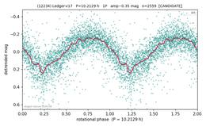</a> **(12234)** 10.21 h · 1P · U=1 [reasoning](objects/12234.md) · [plot](plots/12234.png) |  **(5818)** 10.23 h · 2P · U=1 [reasoning](objects/5818.md) · [plot](plots/5818.png) |  **(3158)** 10.33 h · 2P · U=2 [reasoning](objects/3158.md) · [plot](plots/3158.png) |
|  **(3716)** 10.47 h · 2P · U=2 [reasoning](objects/3716.md) · [plot](plots/3716.png) |  **(8602)** 10.52 h · 2P · U=2 [reasoning](objects/8602.md) · [plot](plots/8602.png) |  **(94030)** 10.76 h · 2P · U=1 [reasoning](objects/94030.md) · [plot](plots/94030.png) |  **(1948)** 10.77 h · 2P · U=2 [reasoning](objects/1948.md) · [plot](plots/1948.png) |
|  **(15524)** 10.80 h · 1P · U=1 [reasoning](objects/15524.md) · [plot](plots/15524.png) |  **(7628)** 10.82 h · 2P · U=2 [reasoning](objects/7628.md) · [plot](plots/7628.png) |  **(12745)** 10.93 h · 1P · U=1 [reasoning](objects/12745.md) · [plot](plots/12745.png) |  **(11930)** 10.93 h · 1P · U=1 [reasoning](objects/11930.md) · [plot](plots/11930.png) |
|  **(6769)** 10.97 h · 2P · U=1 [reasoning](objects/6769.md) · [plot](plots/6769.png) |  **(30849)** 11.10 h · 2P · U=1 [reasoning](objects/30849.md) · [plot](plots/30849.png) |  **(28304)** 11.19 h · 1P · U=1 [reasoning](objects/28304.md) · [plot](plots/28304.png) |  **(19364)** 11.25 h · 2P · U=1 [reasoning](objects/19364.md) · [plot](plots/19364.png) |
|  **(35709)** 11.41 h · 1P · U=1 [reasoning](objects/35709.md) · [plot](plots/35709.png) |  **(14945)** 11.49 h · 1P · U=2 [reasoning](objects/14945.md) · [plot](plots/14945.png) |  **(20314)** 11.52 h · 2P · U=1 [reasoning](objects/20314.md) · [plot](plots/20314.png) |  **(2761)** 11.65 h · 1P · U=2 [reasoning](objects/2761.md) · [plot](plots/2761.png) |
|  **(41430)** 11.66 h · 2P · U=1 [reasoning](objects/41430.md) · [plot](plots/41430.png) |  **(4645)** 11.77 h · 2P · U=2 [reasoning](objects/4645.md) · [plot](plots/4645.png) |  **(8378)** 11.79 h · 2P · U=2 [reasoning](objects/8378.md) · [plot](plots/8378.png) |  **(27755)** 11.80 h · 1P · U=1 [reasoning](objects/27755.md) · [plot](plots/27755.png) |
|  **(7605)** 11.94 h · 2P · U=2 [reasoning](objects/7605.md) · [plot](plots/7605.png) |  **(10017)** 12.05 h · 1P · U=2 [reasoning](objects/10017.md) · [plot](plots/10017.png) |  **(5576)** 12.09 h · 1P · U=2 [reasoning](objects/5576.md) · [plot](plots/5576.png) |  **(7129)** 12.18 h · 2P · U=1 [reasoning](objects/7129.md) · [plot](plots/7129.png) |
|  **(18114)** 12.20 h · 1P · U=1 [reasoning](objects/18114.md) · [plot](plots/18114.png) |  **(5975)** 12.26 h · 2P · U=2 [reasoning](objects/5975.md) · [plot](plots/5975.png) |  **(3532)** 12.32 h · 1P · U=2 [reasoning](objects/3532.md) · [plot](plots/3532.png) |  **(2765)** 12.33 h · 1P · U=2 [reasoning](objects/2765.md) · [plot](plots/2765.png) |
|  **(3650)** 12.37 h · 2P · U=1 [reasoning](objects/3650.md) · [plot](plots/3650.png) |  **(16513)** 12.52 h · 1P · U=2 [reasoning](objects/16513.md) · [plot](plots/16513.png) |  **(3475)** 12.53 h · 1P · U=2 [reasoning](objects/3475.md) · [plot](plots/3475.png) |  **(7463)** 12.61 h · 1P · U=1 [reasoning](objects/7463.md) · [plot](plots/7463.png) |
|  **(5074)** 12.66 h · 2P · U=2 [reasoning](objects/5074.md) · [plot](plots/5074.png) |  **(5162)** 12.76 h · 2P · U=2 [reasoning](objects/5162.md) · [plot](plots/5162.png) |  **(8850)** 12.81 h · 2P · U=1 [reasoning](objects/8850.md) · [plot](plots/8850.png) |  **(27128)** 13.08 h · 1P · U=1 [reasoning](objects/27128.md) · [plot](plots/27128.png) |
|  **(4523)** 13.16 h · 2P · U=2 [reasoning](objects/4523.md) · [plot](plots/4523.png) |  **(6286)** 13.21 h · 1P · U=1 [reasoning](objects/6286.md) · [plot](plots/6286.png) |  **(4165)** 13.31 h · 1P · U=1 [reasoning](objects/4165.md) · [plot](plots/4165.png) |  **(26542)** 13.52 h · 1P · U=1 [reasoning](objects/26542.md) · [plot](plots/26542.png) |
|  **(17872)** 13.53 h · 1P · U=2 [reasoning](objects/17872.md) · [plot](plots/17872.png) |  **(8472)** 13.63 h · 1P · U=2 [reasoning](objects/8472.md) · [plot](plots/8472.png) |  **(5504)** 13.95 h · 1P · U=2 [reasoning](objects/5504.md) · [plot](plots/5504.png) |  **(3405)** 14.00 h · 2P · U=2 [reasoning](objects/3405.md) · [plot](plots/3405.png) |
|  **(9171)** 14.03 h · 2P · U=2 [reasoning](objects/9171.md) · [plot](plots/9171.png) |  **(11933)** 14.14 h · 1P · U=1 [reasoning](objects/11933.md) · [plot](plots/11933.png) |  **(4208)** 14.28 h · 1P · U=1 [reasoning](objects/4208.md) · [plot](plots/4208.png) |  **(9092)** 14.45 h · 2P · U=2 [reasoning](objects/9092.md) · [plot](plots/9092.png) |
|  **(18074)** 14.79 h · 2P · U=1 [reasoning](objects/18074.md) · [plot](plots/18074.png) |  **(4617)** 14.92 h · 2P · U=1 [reasoning](objects/4617.md) · [plot](plots/4617.png) |  **(1285)** 15.24 h · 1P · U=2 [reasoning](objects/1285.md) · [plot](plots/1285.png) |  **(29199)** 15.38 h · 2P · U=2 [reasoning](objects/29199.md) · [plot](plots/29199.png) |
|  **(8464)** 15.86 h · 2P · U=2 [reasoning](objects/8464.md) · [plot](plots/8464.png) |  **(7113)** 16.07 h · 2P · U=2 [reasoning](objects/7113.md) · [plot](plots/7113.png) |  **(11022)** 16.08 h · 2P · U=2 [reasoning](objects/11022.md) · [plot](plots/11022.png) |  **(11226)** 16.28 h · 1P · U=2 [reasoning](objects/11226.md) · [plot](plots/11226.png) |
| <a href='plots/7402.png'>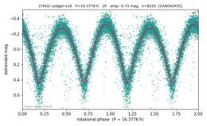</a> **(7402)** 16.38 h · 2P · U=1 [reasoning](objects/7402.md) · [plot](plots/7402.png) |  **(17662)** 16.39 h · 2P · U=1 [reasoning](objects/17662.md) · [plot](plots/17662.png) |  **(2465)** 16.49 h · 1P · U=2 [reasoning](objects/2465.md) · [plot](plots/2465.png) |  **(8105)** 16.70 h · 1P · U=2 [reasoning](objects/8105.md) · [plot](plots/8105.png) |
|  **(5106)** 16.75 h · 2P · U=1 [reasoning](objects/5106.md) · [plot](plots/5106.png) |  **(19371)** 16.76 h · 2P · U=1 [reasoning](objects/19371.md) · [plot](plots/19371.png) |  **(7588)** 17.70 h · 1P · U=1 [reasoning](objects/7588.md) · [plot](plots/7588.png) |  **(1485)** 17.88 h · 1P · U=1 [reasoning](objects/1485.md) · [plot](plots/1485.png) |
|  **(9255)** 18.15 h · 2P · U=1 [reasoning](objects/9255.md) · [plot](plots/9255.png) |  **(12209)** 18.21 h · 2P · U=1 [reasoning](objects/12209.md) · [plot](plots/12209.png) | <a href='plots/4837.png'>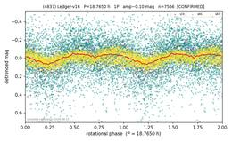</a> **(4837)** 18.77 h · 1P · U=2 [reasoning](objects/4837.md) · [plot](plots/4837.png) |  **(6113)** 18.85 h · 1P · U=2 [reasoning](objects/6113.md) · [plot](plots/6113.png) |
|  **(15070)** 19.17 h · 2P · U=2 [reasoning](objects/15070.md) · [plot](plots/15070.png) |  **(22790)** 19.26 h · 2P · U=2 [reasoning](objects/22790.md) · [plot](plots/22790.png) |  **(6544)** 20.00 h · 2P · U=1 [reasoning](objects/6544.md) · [plot](plots/6544.png) |  **(5683)** 20.32 h · 1P · U=2 [reasoning](objects/5683.md) · [plot](plots/5683.png) |
|  **(2878)** 20.49 h · 2P · U=1 [reasoning](objects/2878.md) · [plot](plots/2878.png) |  **(8984)** 21.12 h · 1P · U=1 [reasoning](objects/8984.md) · [plot](plots/8984.png) |  **(3231)** 21.51 h · 2P · U=1 [reasoning](objects/3231.md) · [plot](plots/3231.png) |  **(17219)** 21.58 h · 2P · U=2 [reasoning](objects/17219.md) · [plot](plots/17219.png) |
|  **(30428)** 22.12 h · 2P · U=1 [reasoning](objects/30428.md) · [plot](plots/30428.png) |  **(1395)** 22.26 h · 1P · U=2 [reasoning](objects/1395.md) · [plot](plots/1395.png) |  **(18910)** 22.31 h · 2P · U=2 [reasoning](objects/18910.md) · [plot](plots/18910.png) | <a href='plots/3631.png'>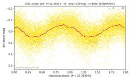</a> **(3631)** 22.36 h · 1P · U=2 [reasoning](objects/3631.md) · [plot](plots/3631.png) |
|  **(5480)** 23.11 h · 2P · U=2 [reasoning](objects/5480.md) · [plot](plots/5480.png) |  **(56439)** 23.70 h · 1P · U=2 [reasoning](objects/56439.md) · [plot](plots/56439.png) |  **(25875)** 23.70 h · 1P · U=2 [reasoning](objects/25875.md) · [plot](plots/25875.png) |  **(67508)** 23.79 h · 2P · U=1 [reasoning](objects/67508.md) · [plot](plots/67508.png) |
|  **(31382)** 23.88 h · 1P · U=2 [reasoning](objects/31382.md) · [plot](plots/31382.png) | <a href='plots/15730.png'>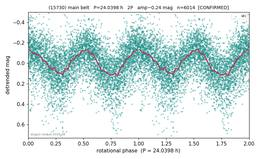</a> **(15730)** 24.04 h · 2P · U=2 [reasoning](objects/15730.md) · [plot](plots/15730.png) |  **(5824)** 24.10 h · ambiguous · U=1 [reasoning](objects/5824.md) · [plot](plots/5824.png) |  **(12262)** 25.16 h · 1P · U=1 [reasoning](objects/12262.md) · [plot](plots/12262.png) |
|  **(16818)** 25.90 h · 1P · U=1 [reasoning](objects/16818.md) · [plot](plots/16818.png) |  **(5024)** 26.05 h · 2P · U=1 [reasoning](objects/5024.md) · [plot](plots/5024.png) |  **(5519)** 26.32 h · 1P · U=2 [reasoning](objects/5519.md) · [plot](plots/5519.png) | <a href='plots/4163.png'>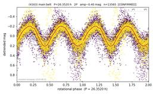</a> **(4163)** 26.35 h · 2P · U=2 [reasoning](objects/4163.md) · [plot](plots/4163.png) |
|  **(16147)** 26.79 h · 1P · U=1 [reasoning](objects/16147.md) · [plot](plots/16147.png) |  **(1519)** 27.35 h · 1P · U=2 [reasoning](objects/1519.md) · [plot](plots/1519.png) |  **(3768)** 28.16 h · 1P · U=1 [reasoning](objects/3768.md) · [plot](plots/3768.png) |  **(106622)** 28.19 h · 2P · U=1 [reasoning](objects/106622.md) · [plot](plots/106622.png) |
|  **(4973)** 28.53 h · 1P · U=1 [reasoning](objects/4973.md) · [plot](plots/4973.png) |  **(34060)** 29.75 h · 2P · U=1 [reasoning](objects/34060.md) · [plot](plots/34060.png) |  **(3707)** 30.59 h · 2P · U=2 [reasoning](objects/3707.md) · [plot](plots/3707.png) |  **(20170)** 31.26 h · 2P · U=1 [reasoning](objects/20170.md) · [plot](plots/20170.png) |

## main belt (survey), part 4 of 4 (89)

| | | | |
|--|--|--|--|
|  **(3741)** 32.36 h · 2P · U=2 [reasoning](objects/3741.md) · [plot](plots/3741.png) |  **(2711)** 32.44 h · 1P · U=2 [reasoning](objects/2711.md) · [plot](plots/2711.png) | <a href='plots/6309.png'>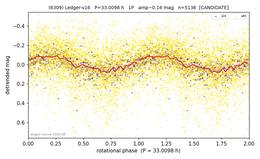</a> **(6309)** 33.01 h · 1P · U=1 [reasoning](objects/6309.md) · [plot](plots/6309.png) |  **(3184)** 33.46 h · 1P · U=2 [reasoning](objects/3184.md) · [plot](plots/3184.png) |
|  **(3993)** 34.47 h · 2P · U=2 [reasoning](objects/3993.md) · [plot](plots/3993.png) |  **(18153)** 38.45 h · 2P · U=2 [reasoning](objects/18153.md) · [plot](plots/18153.png) |  **(58143)** 39.16 h · 1P · U=1 [reasoning](objects/58143.md) · [plot](plots/58143.png) |  **(15427)** 39.45 h · 1P · U=2 [reasoning](objects/15427.md) · [plot](plots/15427.png) |
|  **(16555)** 40.42 h · 2P · U=1 [reasoning](objects/16555.md) · [plot](plots/16555.png) |  **(2352)** 41.18 h · 2P · U=1 [reasoning](objects/2352.md) · [plot](plots/2352.png) |  **(2521)** 41.58 h · 2P · U=1 [reasoning](objects/2521.md) · [plot](plots/2521.png) | <a href='plots/1454.png'>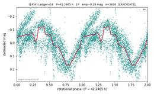</a> **(1454)** 42.25 h · 1P · U=1 [reasoning](objects/1454.md) · [plot](plots/1454.png) |
|  **(45469)** 42.39 h · 1P · U=2 [reasoning](objects/45469.md) · [plot](plots/45469.png) |  **(5977)** 42.44 h · 2P · U=2 [reasoning](objects/5977.md) · [plot](plots/5977.png) |  **(16791)** 42.49 h · 2P · U=2 [reasoning](objects/16791.md) · [plot](plots/16791.png) |  **(32158)** 44.09 h · 1P · U=2 [reasoning](objects/32158.md) · [plot](plots/32158.png) |
|  **(2488)** 44.24 h · 1P · U=1 [reasoning](objects/2488.md) · [plot](plots/2488.png) |  **(8377)** 45.05 h · 1P · U=1 [reasoning](objects/8377.md) · [plot](plots/8377.png) |  **(3840)** 45.10 h · 2P · U=2 [reasoning](objects/3840.md) · [plot](plots/3840.png) |  **(5109)** 45.39 h · 1P · U=1 [reasoning](objects/5109.md) · [plot](plots/5109.png) |
|  **(11055)** 46.42 h · 2P · U=2 [reasoning](objects/11055.md) · [plot](plots/11055.png) | <a href='plots/31644.png'>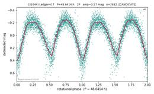</a> **(31644)** 48.64 h · 2P · U=2 [reasoning](objects/31644.md) · [plot](plots/31644.png) | <a href='plots/7858.png'>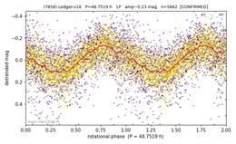</a> **(7858)** 48.75 h · 1P · U=2 [reasoning](objects/7858.md) · [plot](plots/7858.png) |  **(6101)** 49.03 h · 1P · U=2 [reasoning](objects/6101.md) · [plot](plots/6101.png) |
| <a href='plots/4048.png'>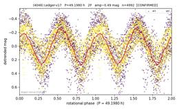</a> **(4048)** 49.20 h · 2P · U=2 [reasoning](objects/4048.md) · [plot](plots/4048.png) |  **(4020)** 50.15 h · 1P · U=1 [reasoning](objects/4020.md) · [plot](plots/4020.png) |  **(33717)** 50.31 h · 2P · U=2 [reasoning](objects/33717.md) · [plot](plots/33717.png) |  **(5829)** 50.93 h · 1P · U=2 [reasoning](objects/5829.md) · [plot](plots/5829.png) |
| <a href='plots/47834.png'>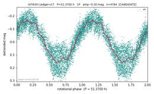</a> **(47834)** 51.37 h · 1P · U=1 [reasoning](objects/47834.md) · [plot](plots/47834.png) |  **(10363)** 51.80 h · 2P · U=1 [reasoning](objects/10363.md) · [plot](plots/10363.png) |  **(15706)** 52.30 h · 1P · U=1 [reasoning](objects/15706.md) · [plot](plots/15706.png) |  **(2538)** 53.42 h · 2P · U=2 [reasoning](objects/2538.md) · [plot](plots/2538.png) |
|  **(46992)** 53.80 h · 2P · U=1 [reasoning](objects/46992.md) · [plot](plots/46992.png) | <a href='plots/16965.png'>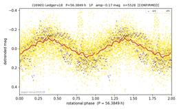</a> **(16965)** 56.38 h · 1P · U=2 [reasoning](objects/16965.md) · [plot](plots/16965.png) |  **(6900)** 57.43 h · 2P · U=1 [reasoning](objects/6900.md) · [plot](plots/6900.png) |  **(5015)** 58.71 h · 1P · U=2 [reasoning](objects/5015.md) · [plot](plots/5015.png) |
|  **(18903)** 59.06 h · 2P · U=2 [reasoning](objects/18903.md) · [plot](plots/18903.png) |  **(5463)** 60.07 h · 2P · U=2 [reasoning](objects/5463.md) · [plot](plots/5463.png) |  **(24730)** 60.49 h · 1P · U=2 [reasoning](objects/24730.md) · [plot](plots/24730.png) |  **(15991)** 61.02 h · 2P · U=2 [reasoning](objects/15991.md) · [plot](plots/15991.png) |
|  **(28024)** 61.28 h · 1P · U=1 [reasoning](objects/28024.md) · [plot](plots/28024.png) |  **(18887)** 61.62 h · 1P · U=2 [reasoning](objects/18887.md) · [plot](plots/18887.png) |  **(3396)** 61.96 h · 1P · U=2 [reasoning](objects/3396.md) · [plot](plots/3396.png) |  **(37567)** 62.13 h · 2P · U=1 [reasoning](objects/37567.md) · [plot](plots/37567.png) |
|  **(43275)** 64.44 h · 1P · U=2 [reasoning](objects/43275.md) · [plot](plots/43275.png) |  **(46568)** 64.47 h · 2P · U=1 [reasoning](objects/46568.md) · [plot](plots/46568.png) |  **(3371)** 64.85 h · 1P · U=1 [reasoning](objects/3371.md) · [plot](plots/3371.png) |  **(14912)** 67.38 h · 1P · U=1 [reasoning](objects/14912.md) · [plot](plots/14912.png) |
|  **(4062)** 68.44 h · 2P · U=2 [reasoning](objects/4062.md) · [plot](plots/4062.png) |  **(9447)** 68.95 h · 1P · U=1 [reasoning](objects/9447.md) · [plot](plots/9447.png) |  **(1887)** 70.18 h · 2P · U=2 [reasoning](objects/1887.md) · [plot](plots/1887.png) |  **(10594)** 70.32 h · 2P · U=1 [reasoning](objects/10594.md) · [plot](plots/10594.png) |
| <a href='plots/6339.png'>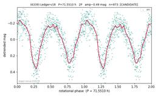</a> **(6339)** 71.55 h · 2P · U=1 [reasoning](objects/6339.md) · [plot](plots/6339.png) |  **(44118)** 72.21 h · 2P · U=1 [reasoning](objects/44118.md) · [plot](plots/44118.png) |  **(3137)** 72.48 h · 1P · U=1 [reasoning](objects/3137.md) · [plot](plots/3137.png) |  **(133054)** 73.25 h · 2P · U=1 [reasoning](objects/133054.md) · [plot](plots/133054.png) |
|  **(17818)** 73.65 h · 2P · U=2 [reasoning](objects/17818.md) · [plot](plots/17818.png) |  **(4331)** 73.68 h · 1P · U=1 [reasoning](objects/4331.md) · [plot](plots/4331.png) |  **(32164)** 73.72 h · 1P · U=1 [reasoning](objects/32164.md) · [plot](plots/32164.png) |  **(65668)** 74.55 h · 1P · U=1 [reasoning](objects/65668.md) · [plot](plots/65668.png) |
| <a href='plots/3574.png'>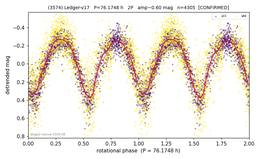</a> **(3574)** 76.17 h · 2P · U=2 [reasoning](objects/3574.md) · [plot](plots/3574.png) |  **(2885)** 76.32 h · 2P · U=2 [reasoning](objects/2885.md) · [plot](plots/2885.png) | <a href='plots/23090.png'>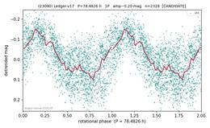</a> **(23090)** 78.48 h · 1P · U=1 [reasoning](objects/23090.md) · [plot](plots/23090.png) |  **(7245)** 79.53 h · 2P · U=1 [reasoning](objects/7245.md) · [plot](plots/7245.png) |
|  **(5282)** 79.91 h · 2P · U=1 [reasoning](objects/5282.md) · [plot](plots/5282.png) |  **(8925)** 82.37 h · 2P · U=1 [reasoning](objects/8925.md) · [plot](plots/8925.png) |  **(24903)** 83.36 h · 2P · U=2 [reasoning](objects/24903.md) · [plot](plots/24903.png) |  **(19011)** 83.85 h · 2P · U=1 [reasoning](objects/19011.md) · [plot](plots/19011.png) |
|  **(22635)** 84.34 h · 2P · U=1 [reasoning](objects/22635.md) · [plot](plots/22635.png) |  **(17923)** 84.65 h · 1P · U=2 [reasoning](objects/17923.md) · [plot](plots/17923.png) |  **(28263)** 85.70 h · 2P · U=1 [reasoning](objects/28263.md) · [plot](plots/28263.png) |  **(14927)** 86.20 h · 2P · U=2 [reasoning](objects/14927.md) · [plot](plots/14927.png) |
|  **(5921)** 86.24 h · 1P · U=2 [reasoning](objects/5921.md) · [plot](plots/5921.png) |  **(17569)** 89.17 h · 2P · U=1 [reasoning](objects/17569.md) · [plot](plots/17569.png) |  **(8265)** 89.55 h · 2P · U=2 [reasoning](objects/8265.md) · [plot](plots/8265.png) |  **(4763)** 91.40 h · 2P · U=2 [reasoning](objects/4763.md) · [plot](plots/4763.png) |
|  **(8333)** 92.12 h · 2P · U=2 [reasoning](objects/8333.md) · [plot](plots/8333.png) |  **(6914)** 92.23 h · 2P · U=1 [reasoning](objects/6914.md) · [plot](plots/6914.png) |  **(10158)** 93.40 h · 2P · U=1 [reasoning](objects/10158.md) · [plot](plots/10158.png) |  **(10707)** 94.29 h · 2P · U=1 [reasoning](objects/10707.md) · [plot](plots/10707.png) |
|  **(35566)** 94.77 h · 2P · U=1 [reasoning](objects/35566.md) · [plot](plots/35566.png) |  **(18549)** 95.10 h · 2P · U=1 [reasoning](objects/18549.md) · [plot](plots/18549.png) |  **(38042)** 95.46 h · 1P · U=1 [reasoning](objects/38042.md) · [plot](plots/38042.png) |  **(28230)** 96.06 h · 2P · U=2 [reasoning](objects/28230.md) · [plot](plots/28230.png) |
| <a href='plots/8367.png'>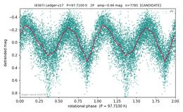</a> **(8367)** 97.71 h · 2P · U=1 [reasoning](objects/8367.md) · [plot](plots/8367.png) |  **(27708)** 98.08 h · 2P · U=1 [reasoning](objects/27708.md) · [plot](plots/27708.png) |  **(5914)** 99.00 h · 1P · U=1 [reasoning](objects/5914.md) · [plot](plots/5914.png) |  **(13927)** 99.37 h · 2P · U=1 [reasoning](objects/13927.md) · [plot](plots/13927.png) |
|  **(32138)** 99.50 h · 2P · U=2 [reasoning](objects/32138.md) · [plot](plots/32138.png) |  |  |  |

## Hungaria (19)

| | | | |
|--|--|--|--|
|  **(76865)** 2.29 h · S · U=2 [reasoning](objects/76865.md) · [plot](plots/76865.png) |  **(23452)** 3.77 h · Dd · U=2 [reasoning](objects/23452.md) · [plot](plots/23452.png) |  **(24687)** 4.10 h · Dd · U=2 [reasoning](objects/24687.md) · [plot](plots/24687.png) |  **(71737)** 4.29 h · Dd · U=1 [reasoning](objects/71737.md) · [plot](plots/71737.png) |
|  **(97779)** 7.01 h · Dd · U=1 [reasoning](objects/97779.md) · [plot](plots/97779.png) |  **(200474)** 7.14 h · Dd · U=2 [reasoning](objects/200474.md) · [plot](plots/200474.png) |  **(86420)** 8.21 h · Sq · U=2 [reasoning](objects/86420.md) · [plot](plots/86420.png) |  **(55720)** 10.47 h · Dd · U=1 [reasoning](objects/55720.md) · [plot](plots/55720.png) |
|  **(74511)** 16.90 h · Sq · U=2 [reasoning](objects/74511.md) · [plot](plots/74511.png) |  **(10667)** 20.29 h · Sq · U=2 [reasoning](objects/10667.md) · [plot](plots/10667.png) |  **(53422)** 26.60 h · Dd · U=2 [reasoning](objects/53422.md) · [plot](plots/53422.png) |  **(147449)** 33.55 h · D · U=2 [reasoning](objects/147449.md) · [plot](plots/147449.png) |
|  **(45825)** 33.71 h · Dd · U=1 [reasoning](objects/45825.md) · [plot](plots/45825.png) |  **(56351)** 33.89 h · Dd · U=1 [reasoning](objects/56351.md) · [plot](plots/56351.png) |  **(43357)** 34.05 h · Dd · U=2 [reasoning](objects/43357.md) · [plot](plots/43357.png) |  **(39866)** 44.77 h · D · U=2 [reasoning](objects/39866.md) · [plot](plots/39866.png) |
|  **(66195)** 52.40 h · 2P · U=2 [reasoning](objects/66195.md) · [plot](plots/66195.png) |  **(58098)** 56.54 h · D · U=2 [reasoning](objects/58098.md) · [plot](plots/58098.png) |  **(92227)** 93.12 h · 2P · U=2 [reasoning](objects/92227.md) · [plot](plots/92227.png) |  |

## Koronis (9)

| | | | |
|--|--|--|--|
|  **(10708)** 3.10 h · 2P · U=1 [reasoning](objects/10708.md) · [plot](plots/10708.png) |  **(8049)** 3.21 h · 2P · U=2 [reasoning](objects/8049.md) · [plot](plots/8049.png) |  **(5465)** 3.22 h · 2P · U=2 [reasoning](objects/5465.md) · [plot](plots/5465.png) |  **(13382)** 3.74 h · 2P · U=2 [reasoning](objects/13382.md) · [plot](plots/13382.png) |
|  **(5809)** 4.18 h · 2P · U=2 [reasoning](objects/5809.md) · [plot](plots/5809.png) |  **(2300)** 4.29 h · 2P · U=2 [reasoning](objects/2300.md) · [plot](plots/2300.png) |  **(3545)** 4.83 h · 2P · U=2 [reasoning](objects/3545.md) · [plot](plots/3545.png) |  **(4260)** 29.24 h · 1P · U=2 [reasoning](objects/4260.md) · [plot](plots/4260.png) |
|  **(2092)** 30.49 h · 2P · U=2 [reasoning](objects/2092.md) · [plot](plots/2092.png) |  |  |  |

## Phocaea (7)

| | | | |
|--|--|--|--|
| <a href='plots/59123.png'>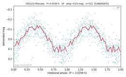</a> **(59123)** 3.02 h · 1P · U=1 [reasoning](objects/59123.md) · [plot](plots/59123.png) |  **(30968)** 8.30 h · 2P · U=2 [reasoning](objects/30968.md) · [plot](plots/30968.png) |  **(15315)** 12.94 h · 2P · U=2 [reasoning](objects/15315.md) · [plot](plots/15315.png) |  **(29909)** 14.38 h · 2P · U=2 [reasoning](objects/29909.md) · [plot](plots/29909.png) |
|  **(4482)** 53.10 h · 1P · U=1- [reasoning](objects/4482.md) · [plot](plots/4482.png) |  **(19290)** 65.02 h · 2P · U=2 [reasoning](objects/19290.md) · [plot](plots/19290.png) |  **(19169)** 87.55 h · 2P · U=2 [reasoning](objects/19169.md) · [plot](plots/19169.png) |  |

## Themis (5)

| | | | |
|--|--|--|--|
|  **(3852)** 5.80 h · 2P · U=2 [reasoning](objects/3852.md) · [plot](plots/3852.png) |  **(3208)** 7.47 h · 1P · U=2 [reasoning](objects/3208.md) · [plot](plots/3208.png) |  **(3071)** 10.28 h · 2P · U=2 [reasoning](objects/3071.md) · [plot](plots/3071.png) |  **(2863)** 10.50 h · 2P · U=2 [reasoning](objects/2863.md) · [plot](plots/2863.png) |
|  **(5225)** 71.27 h · 2P · U=2 [reasoning](objects/5225.md) · [plot](plots/5225.png) |  |  |  |

## Ursula (5)

| | | | |
|--|--|--|--|
|  **(29931)** 4.58 h · 2P · U=2 [reasoning](objects/29931.md) · [plot](plots/29931.png) |  **(14039)** 5.28 h · 2P · U=2 [reasoning](objects/14039.md) · [plot](plots/14039.png) |  **(2967)** 8.37 h · 2P · U=2 [reasoning](objects/2967.md) · [plot](plots/2967.png) |  **(30482)** 8.67 h · 2P · U=2 [reasoning](objects/30482.md) · [plot](plots/30482.png) |
|  **(6079)** 31.39 h · 2P · U=2 [reasoning](objects/6079.md) · [plot](plots/6079.png) |  |  |  |

## Hoffmeister (4)

| | | | |
|--|--|--|--|
|  **(4516)** 3.26 h · 1P · U=1 [reasoning](objects/4516.md) · [plot](plots/4516.png) |  **(6782)** 3.93 h · 1P · U=2 [reasoning](objects/6782.md) · [plot](plots/6782.png) |  **(5091)** 13.91 h · 2P · U=2 [reasoning](objects/5091.md) · [plot](plots/5091.png) |  **(7607)** 38.77 h · 2P · U=2 [reasoning](objects/7607.md) · [plot](plots/7607.png) |

## Baptistina (3)

| | | | |
|--|--|--|--|
|  **(10292)** 2.42 h · 1P · U=2 [reasoning](objects/10292.md) · [plot](plots/10292.png) |  **(7031)** 2.95 h · 1P · U=1 [reasoning](objects/7031.md) · [plot](plots/7031.png) |  **(12537)** 11.01 h · 1P · U=1 [reasoning](objects/12537.md) · [plot](plots/12537.png) |  |

## Padua (3)

| | | | |
|--|--|--|--|
|  **(22719)** 4.78 h · 2P · U=2 [reasoning](objects/22719.md) · [plot](plots/22719.png) |  **(8450)** 5.31 h · 2P · U=2 [reasoning](objects/8450.md) · [plot](plots/8450.png) |  **(12315)** 5.56 h · 2P · U=2 [reasoning](objects/12315.md) · [plot](plots/12315.png) |  |

## Veritas (3)

| | | | |
|--|--|--|--|
|  **(6343)** 14.12 h · 1P · U=2 [reasoning](objects/6343.md) · [plot](plots/6343.png) |  **(7231)** 17.00 h · ambiguous · U=1 [reasoning](objects/7231.md) · [plot](plots/7231.png) |  **(7612)** 26.05 h · 2P · U=2 [reasoning](objects/7612.md) · [plot](plots/7612.png) |  |

## Cameron (2)

| | | | |
|--|--|--|--|
|  **(19013)** 4.44 h · 1P · U=2 [reasoning](objects/19013.md) · [plot](plots/19013.png) |  **(6978)** 4.63 h · 2P · U=2 [reasoning](objects/6978.md) · [plot](plots/6978.png) |  |  |

## Dora (2)

| | | | |
|--|--|--|--|
|  **(3630)** 9.33 h · 2P · U=2 [reasoning](objects/3630.md) · [plot](plots/3630.png) |  **(16549)** 10.22 h · 2P · U=2 [reasoning](objects/16549.md) · [plot](plots/16549.png) |  |  |

## Agnia (1)

| | | | |
|--|--|--|--|
|  **(7056)** 61.91 h · 2P · U=2 [reasoning](objects/7056.md) · [plot](plots/7056.png) |  |  |  |

## Npa-ext (1)

| | | | |
|--|--|--|--|
| <a href='plots/1255.png'>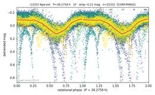</a> **(1255)** 38.28 h · 1P · U=2 [reasoning](objects/1255.md) · [plot](plots/1255.png) |  |  |  |
