# Gallery

Folded light curve for every object with a plot (529 of 529). Click a thumbnail for the full-resolution figure; the object's reasoning is in `objects/<number>.md`.

## Slow rotators, P > 100 h (50)

The programme's target class. Rotation this slow is hard to reach from the ground, where a single night covers a few percent of a cycle.

| | | | |
|--|--|--|--|
| [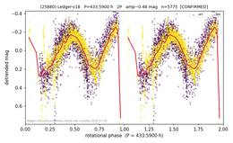 **(25880)** 433.59 h · 2P · U=2](plots/25880.png) | [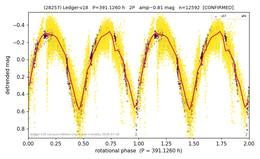 **(28257)** 391.13 h · 2P · U=2](plots/28257.png) | [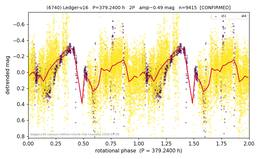 **(6740)** 379.24 h · 2P · U=2](plots/6740.png) | [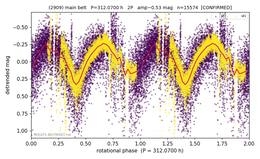 **(2909)** 312.07 h · 2P · U=2](plots/2909.png) |
| [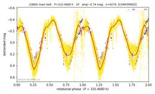 **(2869)** 310.47 h · 2P · U=2](plots/2869.png) | [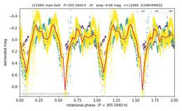 **(13388)** 305.59 h · 2P · U=2](plots/13388.png) | [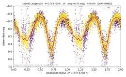 **(8508)** 275.67 h · 2P · U=2](plots/8508.png) | [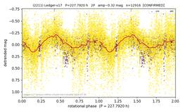 **(2211)** 227.79 h · 2P · U=2](plots/2211.png) |
| [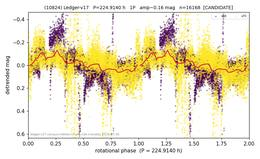 **(10824)** 224.91 h · 1P · U=1](plots/10824.png) | [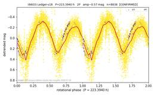 **(6603)** 223.39 h · 2P · U=2](plots/6603.png) | [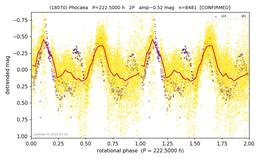 **(18070)** 222.50 h · 2P · U=2](plots/18070.png) | [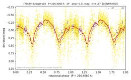 **(73689)** 216.41 h · 2P · U=2](plots/73689.png) |
| [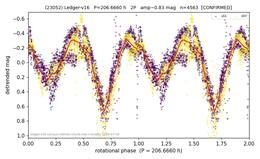 **(23052)** 206.67 h · 2P · U=2](plots/23052.png) | [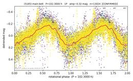 **(5185)** 204.60 h · 2P · U=2](plots/5185.png) | [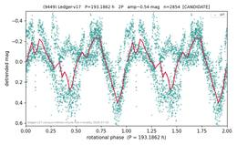 **(9449)** 193.19 h · 2P · U=1](plots/9449.png) | [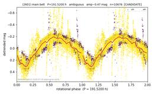 **(2601)** 191.52 h · ambiguous · U=1](plots/2601.png) |
| [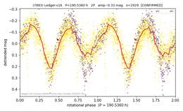 **(7883)** 190.54 h · 2P · U=2](plots/7883.png) | [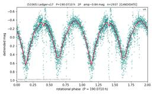 **(53365)** 190.07 h · 2P · U=1](plots/53365.png) | [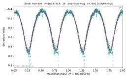 **(3469)** 180.88 h · 2P · U=2](plots/3469.png) | [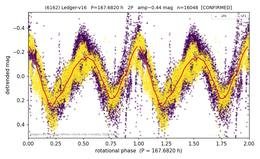 **(6162)** 167.68 h · 2P · U=2](plots/6162.png) |
| [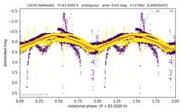 **(2024)** 167.52 h · 2P · U=2](plots/2024.png) | [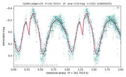 **(5269)** 161.70 h · 2P · U=1](plots/5269.png) | [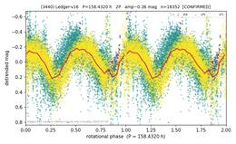 **(3440)** 158.43 h · 2P · U=2](plots/3440.png) | [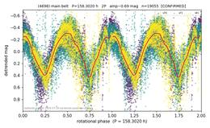 **(4698)** 158.30 h · 2P · U=2](plots/4698.png) |
| [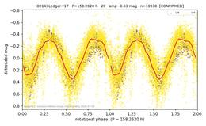 **(8214)** 158.26 h · 2P · U=2](plots/8214.png) | [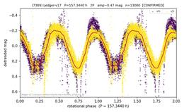 **(7389)** 157.34 h · 2P · U=2](plots/7389.png) | [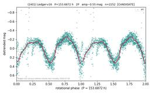 **(2401)** 153.69 h · 2P · U=1](plots/2401.png) | [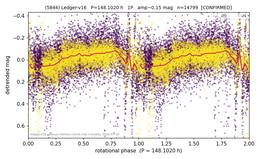 **(5844)** 148.10 h · 1P · U=2](plots/5844.png) |
| [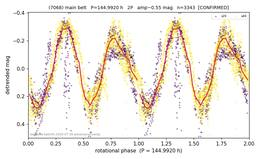 **(7068)** 144.99 h · 2P · U=2](plots/7068.png) | [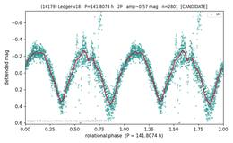 **(14179)** 141.81 h · 2P · U=1](plots/14179.png) | [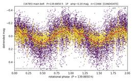 **(16785)** 139.88 h · 1P · U=1](plots/16785.png) | [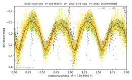 **(2451)** 138.36 h · 2P · U=2](plots/2451.png) |
| [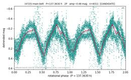 **(4725)** 137.36 h · 2P · U=1](plots/4725.png) | [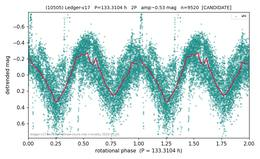 **(10505)** 133.31 h · 2P · U=1](plots/10505.png) | [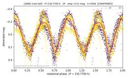 **(2866)** 130.77 h · 2P · U=2](plots/2866.png) | [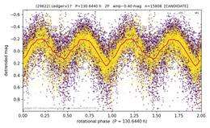 **(29622)** 130.64 h · 2P · U=1](plots/29622.png) |
| [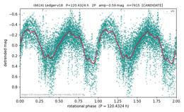 **(6614)** 120.43 h · 2P · U=1](plots/6614.png) | [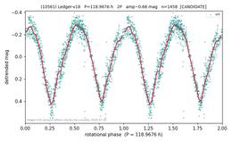 **(10561)** 118.97 h · 2P · U=1](plots/10561.png) | [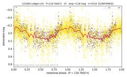 **(15286)** 118.76 h · 1P · U=2](plots/15286.png) | [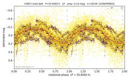 **(7887)** 111.71 h · 2P · U=2](plots/7887.png) |
| [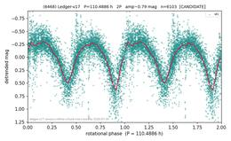 **(6468)** 110.49 h · 2P · U=1](plots/6468.png) | [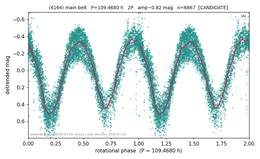 **(4164)** 109.47 h · 2P · U=1](plots/4164.png) | [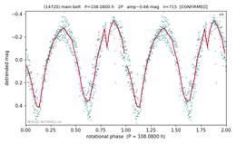 **(14720)** 108.08 h · 2P · U=2](plots/14720.png) | [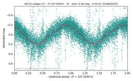 **(8513)** 107.54 h · 1P · U=1](plots/8513.png) |
| [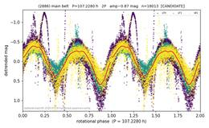 **(2886)** 107.23 h · 2P · U=1](plots/2886.png) | [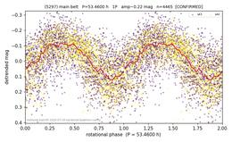 **(5297)** 106.92 h · 2P · U=2](plots/5297.png) | [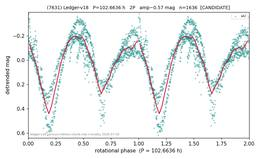 **(7631)** 102.66 h · 2P · U=1](plots/7631.png) | [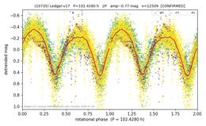 **(10735)** 102.43 h · 2P · U=2](plots/10735.png) |
| [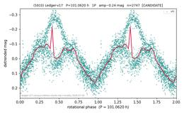 **(5910)** 101.06 h · 1P · U=1](plots/5910.png) | [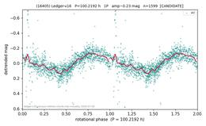 **(16405)** 100.22 h · 1P · U=1](plots/16405.png) |  |  |

## Agnia (1)

| | | | |
|--|--|--|--|
| [ **(7056)** 61.91 h · 2P · U=2](plots/7056.png) |  |  |  |

## Baptistina (3)

| | | | |
|--|--|--|--|
| [ **(10292)** 2.42 h · 1P · U=2](plots/10292.png) | [ **(7031)** 2.95 h · 1P · U=1](plots/7031.png) | [ **(12537)** 11.01 h · 1P · U=1](plots/12537.png) |  |

## Cameron (2)

| | | | |
|--|--|--|--|
| [ **(19013)** 4.44 h · 1P · U=2](plots/19013.png) | [ **(6978)** 4.63 h · 2P · U=2](plots/6978.png) |  |  |

## Dora (2)

| | | | |
|--|--|--|--|
| [ **(3630)** 9.33 h · 2P · U=2](plots/3630.png) | [ **(16549)** 10.22 h · 2P · U=1](plots/16549.png) |  |  |

## Hoffmeister (4)

| | | | |
|--|--|--|--|
| [ **(4516)** 3.26 h · 1P · U=1](plots/4516.png) | [ **(6782)** 3.93 h · 1P · U=2](plots/6782.png) | [ **(5091)** 13.91 h · 2P · U=2](plots/5091.png) | [ **(7607)** 38.77 h · 2P · U=2](plots/7607.png) |

## Hungaria (19)

| | | | |
|--|--|--|--|
| [ **(76865)** 2.29 h · S · U=2](plots/76865.png) | [ **(23452)** 3.77 h · Dd · U=2](plots/23452.png) | [ **(24687)** 4.10 h · Dd · U=2](plots/24687.png) | [ **(71737)** 4.29 h · Dd · U=1](plots/71737.png) |
| [ **(97779)** 7.01 h · Dd · U=1](plots/97779.png) | [ **(200474)** 7.14 h · Dd · U=2](plots/200474.png) | [ **(86420)** 8.21 h · Sq · U=2](plots/86420.png) | [ **(55720)** 10.47 h · Dd · U=1](plots/55720.png) |
| [ **(74511)** 16.90 h · Sq · U=2](plots/74511.png) | [ **(10667)** 20.29 h · Sq · U=2](plots/10667.png) | [ **(53422)** 26.60 h · Dd · U=2](plots/53422.png) | [ **(147449)** 33.55 h · D · U=2](plots/147449.png) |
| [ **(45825)** 33.71 h · Dd · U=1](plots/45825.png) | [ **(56351)** 33.89 h · Dd · U=1](plots/56351.png) | [ **(43357)** 34.05 h · Dd · U=2](plots/43357.png) | [ **(39866)** 44.77 h · D · U=2](plots/39866.png) |
| [ **(66195)** 52.40 h · 2P · U=2](plots/66195.png) | [ **(58098)** 56.54 h · D · U=2](plots/58098.png) | [ **(92227)** 93.12 h · 2P · U=2](plots/92227.png) |  |

## Koronis (9)

| | | | |
|--|--|--|--|
| [ **(13382)** 1.87 h · 1P · U=2](plots/13382.png) | [ **(10708)** 3.10 h · 2P · U=1](plots/10708.png) | [ **(8049)** 3.21 h · 2P · U=2](plots/8049.png) | [ **(5465)** 3.22 h · 2P · U=2](plots/5465.png) |
| [ **(5809)** 4.18 h · 2P · U=2](plots/5809.png) | [ **(2300)** 4.29 h · 2P · U=2](plots/2300.png) | [ **(3545)** 4.83 h · 2P · U=2](plots/3545.png) | [ **(4260)** 29.24 h · 1P · U=2](plots/4260.png) |
| [ **(2092)** 30.49 h · 2P · U=2](plots/2092.png) |  |  |  |

## Ledger-v16 (65)

| | | | |
|--|--|--|--|
| [ **(10885)** 1.60 h · 1P · U=1](plots/10885.png) | [ **(11576)** 1.66 h · 1P · U=2](plots/11576.png) | [ **(12975)** 1.83 h · 1P · U=1](plots/12975.png) | [ **(5722)** 1.87 h · 1P · U=2](plots/5722.png) |
| [ **(8286)** 1.94 h · 1P · U=2](plots/8286.png) | [ **(17019)** 2.07 h · 1P · U=1](plots/17019.png) | [ **(2366)** 2.10 h · 1P · U=1](plots/2366.png) | [ **(4573)** 2.12 h · 1P · U=2](plots/4573.png) |
| [ **(19657)** 2.17 h · 1P · U=2](plots/19657.png) | [ **(7472)** 2.19 h · 1P · U=2](plots/7472.png) | [ **(55103)** 2.32 h · 1P · U=2](plots/55103.png) | [ **(16650)** 2.32 h · 1P · U=2](plots/16650.png) |
| [ **(18069)** 2.50 h · 1P · U=1](plots/18069.png) | [ **(2514)** 2.53 h · 1P · U=1](plots/2514.png) | [ **(19150)** 2.74 h · 1P · U=1](plots/19150.png) | [ **(13073)** 2.84 h · 1P · U=1](plots/13073.png) |
| [ **(7215)** 3.04 h · 1P · U=2](plots/7215.png) | [ **(21977)** 3.78 h · 1P · U=2](plots/21977.png) | [ **(8530)** 3.82 h · 1P · U=1](plots/8530.png) | [ **(2775)** 4.17 h · 1P · U=2](plots/2775.png) |
| [ **(9146)** 4.47 h · 1P · U=1](plots/9146.png) | [ **(6281)** 4.66 h · 1P · U=2](plots/6281.png) | [ **(6277)** 4.79 h · 1P · U=1](plots/6277.png) | [ **(7046)** 5.01 h · 1P · U=1](plots/7046.png) |
| [ **(6873)** 5.31 h · 2P · U=1](plots/6873.png) | [ **(4645)** 5.88 h · 1P · U=2](plots/4645.png) | [ **(28056)** 6.16 h · 1P · U=2](plots/28056.png) | [ **(27791)** 6.39 h · 2P · U=1](plots/27791.png) |
| [ **(24809)** 6.44 h · 2P · U=1](plots/24809.png) | [ **(6678)** 6.71 h · 1P · U=2](plots/6678.png) | [ **(4315)** 7.23 h · 1P · U=1](plots/4315.png) | [ **(33729)** 7.26 h · 1P · U=1](plots/33729.png) |
| [ **(12064)** 8.12 h · 1P · U=1](plots/12064.png) | [ **(31361)** 8.50 h · 1P · U=1](plots/31361.png) | [ **(9891)** 9.60 h · 1P · U=1](plots/9891.png) | [ **(6862)** 9.71 h · 1P · U=1](plots/6862.png) |
| [ **(94030)** 10.76 h · 2P · U=1](plots/94030.png) | [ **(15524)** 10.80 h · 1P · U=1](plots/15524.png) | [ **(7628)** 10.82 h · 2P · U=2](plots/7628.png) | [ **(19364)** 11.25 h · 2P · U=1](plots/19364.png) |
| [ **(18114)** 12.20 h · 1P · U=1](plots/18114.png) | [ **(3475)** 12.53 h · 1P · U=2](plots/3475.png) | [ **(5024)** 13.02 h · 1P · U=1](plots/5024.png) | [ **(4523)** 13.16 h · 2P · U=2](plots/4523.png) |
| [ **(11933)** 14.14 h · 1P · U=1](plots/11933.png) | [ **(29199)** 15.38 h · 2P · U=2](plots/29199.png) | [ **(7113)** 16.07 h · 2P · U=2](plots/7113.png) | [ **(11022)** 16.08 h · 2P · U=2](plots/11022.png) |
| [ **(5106)** 16.75 h · 2P · U=1](plots/5106.png) | [ **(15070)** 19.17 h · 2P · U=2](plots/15070.png) | [ **(16555)** 20.21 h · 1P · U=1](plots/16555.png) | [ **(5683)** 20.32 h · 1P · U=2](plots/5683.png) |
| [ **(3231)** 21.51 h · 2P · U=1](plots/3231.png) | [ **(4973)** 28.53 h · 1P · U=1](plots/4973.png) | [ **(2488)** 44.24 h · 1P · U=1](plots/2488.png) | [ **(11055)** 46.42 h · 2P · U=2](plots/11055.png) |
| [ **(6101)** 49.03 h · 1P · U=2](plots/6101.png) | [ **(5015)** 58.71 h · 1P · U=2](plots/5015.png) | [ **(46568)** 64.47 h · 2P · U=1](plots/46568.png) | [ **(10594)** 70.32 h · 2P · U=1](plots/10594.png) |
| [ **(3137)** 72.48 h · 1P · U=1](plots/3137.png) | [ **(14927)** 86.20 h · 2P · U=2](plots/14927.png) | [ **(5921)** 86.24 h · 1P · U=2](plots/5921.png) | [ **(6914)** 92.23 h · 2P · U=1](plots/6914.png) |
| [ **(10707)** 94.29 h · 2P · U=1](plots/10707.png) |  |  |  |

## Ledger-v17 (113)

| | | | |
|--|--|--|--|
| [ **(6078)** 1.54 h · 1P · U=1](plots/6078.png) | [ **(34812)** 1.55 h · 1P · U=1](plots/34812.png) | [ **(9494)** 1.58 h · 1P · U=1](plots/9494.png) | [ **(5954)** 1.58 h · 1P · U=1](plots/5954.png) |
| [ **(28844)** 1.60 h · 1P · U=2](plots/28844.png) | [ **(4367)** 1.61 h · 1P · U=2](plots/4367.png) | [ **(7773)** 1.61 h · 1P · U=1](plots/7773.png) | [ **(43926)** 1.62 h · 1P · U=2](plots/43926.png) |
| [ **(18615)** 1.62 h · 1P · U=1](plots/18615.png) | [ **(7176)** 1.64 h · 1P · U=2](plots/7176.png) | [ **(13632)** 1.68 h · 1P · U=1](plots/13632.png) | [ **(12335)** 1.73 h · 1P · U=1](plots/12335.png) |
| [ **(18840)** 1.80 h · 1P · U=1](plots/18840.png) | [ **(4539)** 1.82 h · 1P · U=2](plots/4539.png) | [ **(13786)** 1.92 h · 1P · U=2](plots/13786.png) | [ **(11186)** 1.92 h · 1P · U=1](plots/11186.png) |
| [ **(9020)** 1.98 h · 1P · U=1](plots/9020.png) | [ **(18654)** 2.00 h · 1P · U=1](plots/18654.png) | [ **(7878)** 2.00 h · 1P · U=2](plots/7878.png) | [ **(26161)** 2.02 h · 1P · U=1](plots/26161.png) |
| [ **(4938)** 2.07 h · 1P · U=1](plots/4938.png) | [ **(6005)** 2.08 h · 1P · U=2](plots/6005.png) | [ **(9955)** 2.31 h · 1P · U=2](plots/9955.png) | [ **(4728)** 2.42 h · 1P · U=2](plots/4728.png) |
| [ **(3636)** 2.57 h · 1P · U=1](plots/3636.png) | [ **(20750)** 2.66 h · 1P · U=2](plots/20750.png) | [ **(6967)** 2.66 h · 1P · U=1](plots/6967.png) | [ **(15877)** 2.76 h · 1P · U=2](plots/15877.png) |
| [ **(6640)** 2.77 h · 1P · U=2](plots/6640.png) | [ **(10112)** 2.94 h · 1P · U=2](plots/10112.png) | [ **(5688)** 3.03 h · 1P · U=1](plots/5688.png) | [ **(28748)** 3.12 h · 1P · U=2](plots/28748.png) |
| [ **(7392)** 3.17 h · 1P · U=2](plots/7392.png) | [ **(15446)** 3.48 h · 1P · U=1](plots/15446.png) | [ **(17410)** 3.50 h · 2P · U=2](plots/17410.png) | [ **(8168)** 3.52 h · 1P · U=2](plots/8168.png) |
| [ **(19197)** 3.52 h · 1P · U=1](plots/19197.png) | [ **(7911)** 3.56 h · 1P · U=2](plots/7911.png) | [ **(17141)** 3.67 h · 2P · U=1](plots/17141.png) | [ **(13808)** 3.79 h · 1P · U=2](plots/13808.png) |
| [ **(10932)** 3.90 h · 2P · U=2](plots/10932.png) | [ **(8593)** 4.00 h · 1P · U=2](plots/8593.png) | [ **(9609)** 4.04 h · 1P · U=1](plots/9609.png) | [ **(10710)** 4.28 h · 1P · U=1](plots/10710.png) |
| [ **(3294)** 4.30 h · 1P · U=1](plots/3294.png) | [ **(7386)** 4.52 h · 1P · U=1](plots/7386.png) | [ **(19794)** 5.20 h · 1P · U=1](plots/19794.png) | [ **(48423)** 5.46 h · 2P · U=1](plots/48423.png) |
| [ **(31446)** 5.62 h · 1P · U=1](plots/31446.png) | [ **(50380)** 5.68 h · 2P · U=2](plots/50380.png) | [ **(9174)** 5.90 h · 1P · U=1](plots/9174.png) | [ **(21934)** 6.06 h · 1P · U=1](plots/21934.png) |
| [ **(86402)** 6.10 h · 2P · U=1](plots/86402.png) | [ **(4303)** 6.14 h · 2P · U=2](plots/4303.png) | [ **(19932)** 6.39 h · 1P · U=1](plots/19932.png) | [ **(3239)** 6.47 h · 2P · U=1](plots/3239.png) |
| [ **(16019)** 6.49 h · 1P · U=2](plots/16019.png) | [ **(17857)** 7.17 h · 1P · U=1](plots/17857.png) | [ **(7498)** 7.24 h · 2P · U=1](plots/7498.png) | [ **(25977)** 7.31 h · 1P · U=1](plots/25977.png) |
| [ **(3081)** 8.01 h · 2P · U=1](plots/3081.png) | [ **(6128)** 8.34 h · 1P · U=1](plots/6128.png) | [ **(7252)** 9.06 h · 1P · U=2](plots/7252.png) | [ **(14338)** 9.20 h · 1P · U=1](plots/14338.png) |
| [ **(5950)** 9.22 h · 2P · U=1](plots/5950.png) | [ **(11119)** 9.26 h · 2P · U=2](plots/11119.png) | [ **(4777)** 9.74 h · 2P · U=2](plots/4777.png) | [ **(3716)** 10.47 h · 2P · U=2](plots/3716.png) |
| [ **(12745)** 10.93 h · 1P · U=1](plots/12745.png) | [ **(6769)** 10.97 h · 2P · U=1](plots/6769.png) | [ **(28304)** 11.19 h · 1P · U=1](plots/28304.png) | [ **(35709)** 11.41 h · 1P · U=1](plots/35709.png) |
| [ **(14945)** 11.49 h · 1P · U=2](plots/14945.png) | [ **(20314)** 11.52 h · 2P · U=1](plots/20314.png) | [ **(2761)** 11.65 h · 1P · U=2](plots/2761.png) | [ **(41430)** 11.66 h · 2P · U=1](plots/41430.png) |
| [ **(2765)** 12.33 h · 1P · U=2](plots/2765.png) | [ **(27128)** 13.08 h · 1P · U=1](plots/27128.png) | [ **(4165)** 13.31 h · 1P · U=1](plots/4165.png) | [ **(17872)** 13.53 h · 1P · U=2](plots/17872.png) |
| [ **(20170)** 15.63 h · 1P · U=1](plots/20170.png) | [ **(8105)** 16.70 h · 1P · U=2](plots/8105.png) | [ **(9255)** 18.15 h · 2P · U=1](plots/9255.png) | [ **(6113)** 18.85 h · 1P · U=2](plots/6113.png) |
| [ **(17219)** 21.58 h · 2P · U=2](plots/17219.png) | [ **(31382)** 23.88 h · 1P · U=2](plots/31382.png) | [ **(16147)** 26.79 h · 1P · U=1](plots/16147.png) | [ **(34060)** 29.75 h · 2P · U=1](plots/34060.png) |
| [ **(4020)** 50.15 h · 1P · U=1](plots/4020.png) | [ **(5829)** 50.93 h · 1P · U=2](plots/5829.png) | [ **(10363)** 51.80 h · 2P · U=1](plots/10363.png) | [ **(15706)** 52.30 h · 1P · U=1](plots/15706.png) |
| [ **(18903)** 59.06 h · 2P · U=2](plots/18903.png) | [ **(24730)** 60.49 h · 1P · U=2](plots/24730.png) | [ **(28024)** 61.28 h · 1P · U=1](plots/28024.png) | [ **(37567)** 62.13 h · 2P · U=1](plots/37567.png) |
| [ **(43275)** 64.44 h · 1P · U=2](plots/43275.png) | [ **(14912)** 67.38 h · 1P · U=1](plots/14912.png) | [ **(17818)** 73.65 h · 2P · U=2](plots/17818.png) | [ **(65668)** 74.55 h · 1P · U=1](plots/65668.png) |
| [ **(2885)** 76.32 h · 2P · U=2](plots/2885.png) | [ **(7245)** 79.53 h · 2P · U=1](plots/7245.png) | [ **(5282)** 79.91 h · 2P · U=1](plots/5282.png) | [ **(8925)** 82.37 h · 2P · U=1](plots/8925.png) |
| [ **(24903)** 83.36 h · 2P · U=2](plots/24903.png) | [ **(19011)** 83.85 h · 2P · U=1](plots/19011.png) | [ **(22635)** 84.34 h · 2P · U=1](plots/22635.png) | [ **(28263)** 85.70 h · 2P · U=1](plots/28263.png) |
| [ **(8333)** 92.12 h · 2P · U=2](plots/8333.png) | [ **(35566)** 94.77 h · 2P · U=1](plots/35566.png) | [ **(18549)** 95.10 h · 2P · U=1](plots/18549.png) | [ **(28230)** 96.06 h · 2P · U=2](plots/28230.png) |
| [ **(32138)** 99.50 h · 2P · U=2](plots/32138.png) |  |  |  |

## Ledger-v18 (111)

| | | | |
|--|--|--|--|
| [ **(24757)** 1.57 h · 1P · U=1](plots/24757.png) | [ **(8835)** 1.58 h · 1P · U=2](plots/8835.png) | [ **(12077)** 1.64 h · 1P · U=1](plots/12077.png) | [ **(10798)** 1.64 h · 1P · U=1](plots/10798.png) |
| [ **(17766)** 1.66 h · 1P · U=1](plots/17766.png) | [ **(11327)** 1.67 h · 1P · U=2](plots/11327.png) | [ **(11872)** 1.70 h · 1P · U=2](plots/11872.png) | [ **(43469)** 1.72 h · 1P · U=1](plots/43469.png) |
| [ **(16125)** 1.79 h · 1P · U=1](plots/16125.png) | [ **(22015)** 1.80 h · 1P · U=1](plots/22015.png) | [ **(11285)** 1.82 h · 1P · U=1](plots/11285.png) | [ **(6710)** 1.85 h · 1P · U=1](plots/6710.png) |
| [ **(13947)** 2.00 h · 1P · U=1](plots/13947.png) | [ **(5218)** 2.13 h · 1P · U=1](plots/5218.png) | [ **(24503)** 2.14 h · 1P · U=1](plots/24503.png) | [ **(6462)** 2.21 h · 1P · U=1](plots/6462.png) |
| [ **(18083)** 2.36 h · 1P · U=1](plots/18083.png) | [ **(24362)** 2.44 h · 1P · U=2](plots/24362.png) | [ **(20396)** 2.57 h · 1P · U=1](plots/20396.png) | [ **(8707)** 2.64 h · 1P · U=1](plots/8707.png) |
| [ **(23044)** 2.68 h · 1P · U=1](plots/23044.png) | [ **(33082)** 2.93 h · 1P · U=1](plots/33082.png) | [ **(13370)** 2.99 h · 1P · U=1](plots/13370.png) | [ **(23985)** 3.03 h · 1P · U=2](plots/23985.png) |
| [ **(5862)** 3.11 h · 1P · U=1](plots/5862.png) | [ **(43891)** 3.12 h · 1P · U=2](plots/43891.png) | [ **(11541)** 3.12 h · 2P · U=1](plots/11541.png) | [ **(11182)** 3.13 h · 1P · U=1](plots/11182.png) |
| [ **(19762)** 3.15 h · 1P · U=1](plots/19762.png) | [ **(13501)** 3.22 h · 1P · U=1](plots/13501.png) | [ **(59522)** 3.44 h · 1P · U=1](plots/59522.png) | [ **(5816)** 3.45 h · 1P · U=1](plots/5816.png) |
| [ **(12821)** 3.51 h · 1P · U=1](plots/12821.png) | [ **(37113)** 3.68 h · 1P · U=1](plots/37113.png) | [ **(4018)** 3.74 h · 1P · U=1](plots/4018.png) | [ **(9141)** 3.86 h · 1P · U=1](plots/9141.png) |
| [ **(39899)** 3.96 h · 1P · U=1](plots/39899.png) | [ **(13749)** 4.05 h · 2P · U=2](plots/13749.png) | [ **(31147)** 4.18 h · 2P · U=1](plots/31147.png) | [ **(9403)** 4.32 h · 1P · U=1](plots/9403.png) |
| [ **(45287)** 4.41 h · 1P · U=2](plots/45287.png) | [ **(6389)** 4.50 h · 1P · U=2](plots/6389.png) | [ **(17482)** 4.51 h · 1P · U=1](plots/17482.png) | [ **(34588)** 4.57 h · 1P · U=1](plots/34588.png) |
| [ **(9543)** 4.63 h · 2P · U=1](plots/9543.png) | [ **(45456)** 4.63 h · 1P · U=1](plots/45456.png) | [ **(12011)** 4.66 h · 1P · U=1](plots/12011.png) | [ **(17986)** 4.67 h · 2P · U=1](plots/17986.png) |
| [ **(66949)** 4.77 h · 1P · U=1](plots/66949.png) | [ **(7251)** 4.79 h · 2P · U=1](plots/7251.png) | [ **(6492)** 4.79 h · 1P · U=1](plots/6492.png) | [ **(7466)** 4.88 h · 1P · U=1](plots/7466.png) |
| [ **(9149)** 4.93 h · 1P · U=2](plots/9149.png) | [ **(9947)** 4.95 h · 2P · U=1](plots/9947.png) | [ **(6038)** 5.23 h · 1P · U=2](plots/6038.png) | [ **(19840)** 5.29 h · 2P · U=1](plots/19840.png) |
| [ **(19510)** 5.51 h · 2P · U=1](plots/19510.png) | [ **(14858)** 5.52 h · 2P · U=1](plots/14858.png) | [ **(17051)** 5.55 h · 2P · U=1](plots/17051.png) | [ **(30849)** 5.55 h · 1P · U=1](plots/30849.png) |
| [ **(14302)** 5.86 h · 2P · U=1](plots/14302.png) | [ **(8378)** 5.90 h · 1P · U=2](plots/8378.png) | [ **(26347)** 5.91 h · 2P · U=1](plots/26347.png) | [ **(28462)** 6.24 h · 2P · U=2](plots/28462.png) |
| [ **(15142)** 6.29 h · 1P · U=1](plots/15142.png) | [ **(4682)** 6.46 h · 2P · U=2](plots/4682.png) | [ **(5966)** 6.64 h · 1P · U=1](plots/5966.png) | [ **(17725)** 6.67 h · 2P · U=1](plots/17725.png) |
| [ **(10778)** 7.19 h · 2P · U=1](plots/10778.png) | [ **(9859)** 7.33 h · 1P · U=1](plots/9859.png) | [ **(18074)** 7.39 h · 1P · U=1](plots/18074.png) | [ **(36273)** 7.73 h · 1P · U=2](plots/36273.png) |
| [ **(42921)** 8.72 h · 1P · U=2](plots/42921.png) | [ **(20511)** 9.38 h · 2P · U=2](plots/20511.png) | [ **(3046)** 10.17 h · 1P · U=1](plots/3046.png) | [ **(11930)** 10.93 h · 1P · U=1](plots/11930.png) |
| [ **(27755)** 11.80 h · 1P · U=1](plots/27755.png) | [ **(7129)** 12.18 h · 2P · U=1](plots/7129.png) | [ **(8850)** 12.81 h · 2P · U=1](plots/8850.png) | [ **(26542)** 13.52 h · 1P · U=1](plots/26542.png) |
| [ **(8472)** 13.63 h · 1P · U=2](plots/8472.png) | [ **(8464)** 15.86 h · 2P · U=2](plots/8464.png) | [ **(11226)** 16.28 h · 1P · U=2](plots/11226.png) | [ **(17662)** 16.39 h · 2P · U=1](plots/17662.png) |
| [ **(19371)** 16.76 h · 2P · U=1](plots/19371.png) | [ **(6544)** 20.00 h · 2P · U=1](plots/6544.png) | [ **(8984)** 21.12 h · 1P · U=1](plots/8984.png) | [ **(30428)** 22.12 h · 2P · U=1](plots/30428.png) |
| [ **(18910)** 22.31 h · 2P · U=2](plots/18910.png) | [ **(56439)** 23.70 h · 1P · U=1](plots/56439.png) | [ **(25875)** 23.70 h · 1P · U=2](plots/25875.png) | [ **(67508)** 23.79 h · 2P · U=1](plots/67508.png) |
| [ **(12262)** 25.16 h · 1P · U=1](plots/12262.png) | [ **(16818)** 25.90 h · 1P · U=1](plots/16818.png) | [ **(5519)** 26.32 h · 1P · U=2](plots/5519.png) | [ **(106622)** 28.19 h · 2P · U=1](plots/106622.png) |
| [ **(3741)** 32.36 h · 2P · U=2](plots/3741.png) | [ **(18153)** 38.45 h · 2P · U=2](plots/18153.png) | [ **(45469)** 42.39 h · 1P · U=2](plots/45469.png) | [ **(16791)** 42.49 h · 2P · U=2](plots/16791.png) |
| [ **(32158)** 44.09 h · 1P · U=2](plots/32158.png) | [ **(8377)** 45.05 h · 1P · U=1](plots/8377.png) | [ **(10158)** 46.70 h · 1P · U=1](plots/10158.png) | [ **(6900)** 57.43 h · 2P · U=1](plots/6900.png) |
| [ **(18887)** 61.62 h · 1P · U=2](plots/18887.png) | [ **(9447)** 68.95 h · 1P · U=1](plots/9447.png) | [ **(44118)** 72.21 h · 2P · U=1](plots/44118.png) | [ **(133054)** 73.25 h · 2P · U=1](plots/133054.png) |
| [ **(32164)** 73.72 h · 1P · U=1](plots/32164.png) | [ **(17923)** 84.65 h · 1P · U=1](plots/17923.png) | [ **(13927)** 99.37 h · 2P · U=1](plots/13927.png) |  |

## Padua (3)

| | | | |
|--|--|--|--|
| [ **(22719)** 4.78 h · 2P · U=2](plots/22719.png) | [ **(8450)** 5.31 h · 2P · U=2](plots/8450.png) | [ **(12315)** 5.56 h · 2P · U=2](plots/12315.png) |  |

## Phocaea (6)

| | | | |
|--|--|--|--|
| [ **(30968)** 4.15 h · 1P · U=2](plots/30968.png) | [ **(15315)** 12.94 h · 2P · U=2](plots/15315.png) | [ **(29909)** 14.38 h · 2P · U=2](plots/29909.png) | [ **(4482)** 53.10 h · 1P · U=1-](plots/4482.png) |
| [ **(19290)** 65.02 h · 2P · U=2](plots/19290.png) | [ **(19169)** 87.55 h · 2P · U=2](plots/19169.png) |  |  |

## Themis (5)

| | | | |
|--|--|--|--|
| [ **(3852)** 5.80 h · 2P · U=2](plots/3852.png) | [ **(3208)** 7.47 h · 1P · U=2](plots/3208.png) | [ **(3071)** 10.28 h · 2P · U=2](plots/3071.png) | [ **(2863)** 10.50 h · 2P · U=2](plots/2863.png) |
| [ **(5225)** 71.27 h · 2P · U=2](plots/5225.png) |  |  |  |

## Ursula (5)

| | | | |
|--|--|--|--|
| [ **(30482)** 4.33 h · 1P · U=2](plots/30482.png) | [ **(29931)** 4.58 h · 2P · U=2](plots/29931.png) | [ **(14039)** 5.28 h · 2P · U=2](plots/14039.png) | [ **(2967)** 8.37 h · 2P · U=2](plots/2967.png) |
| [ **(6079)** 31.39 h · 2P · U=2](plots/6079.png) |  |  |  |

## Veritas (3)

| | | | |
|--|--|--|--|
| [ **(6343)** 14.12 h · 1P · U=2](plots/6343.png) | [ **(7231)** 17.00 h · ambiguous · U=1](plots/7231.png) | [ **(7612)** 26.05 h · 2P · U=2](plots/7612.png) |  |

## main belt (128)

| | | | |
|--|--|--|--|
| [ **(2810)** 1.52 h · 1P · U=2](plots/2810.png) | [ **(4253)** 2.30 h · 1P · U=2](plots/4253.png) | [ **(5113)** 2.38 h · 1P · U=1](plots/5113.png) | [ **(9214)** 2.39 h · 1P · U=2](plots/9214.png) |
| [ **(10031)** 2.50 h · 1P · U=1](plots/10031.png) | [ **(5777)** 2.56 h · 1P · U=1](plots/5777.png) | [ **(6336)** 2.59 h · 1P · U=1](plots/6336.png) | [ **(5167)** 2.66 h · 1P · U=2](plots/5167.png) |
| [ **(2690)** 2.66 h · 1P · U=2](plots/2690.png) | [ **(13081)** 2.72 h · 1P · U=1](plots/13081.png) | [ **(9594)** 2.89 h · 1P · U=1](plots/9594.png) | [ **(3520)** 2.90 h · 1P · U=1](plots/3520.png) |
| [ **(2350)** 3.02 h · 1P · U=2](plots/2350.png) | [ **(5793)** 3.04 h · 2P · U=2](plots/5793.png) | [ **(2124)** 3.12 h · 2P · U=1](plots/2124.png) | [ **(50545)** 3.18 h · 2P · U=2](plots/50545.png) |
| [ **(3168)** 3.24 h · 1P · U=2](plots/3168.png) | [ **(8294)** 3.24 h · 2P · U=1](plots/8294.png) | [ **(10164)** 3.31 h · 2P · U=1](plots/10164.png) | [ **(3828)** 3.32 h · 2P · U=2](plots/3828.png) |
| [ **(25316)** 3.33 h · 2P · U=1](plots/25316.png) | [ **(4203)** 3.38 h · 1P · U=1](plots/4203.png) | [ **(5600)** 3.51 h · 1P · U=1](plots/5600.png) | [ **(2116)** 3.54 h · 2P · U=2](plots/2116.png) |
| [ **(3774)** 3.57 h · 2P · U=2](plots/3774.png) | [ **(3949)** 3.62 h · 2P · U=2](plots/3949.png) | [ **(1053)** 3.66 h · 2P · U=2](plots/1053.png) | [ **(24417)** 3.78 h · 1P · U=2](plots/24417.png) |
| [ **(2828)** 3.80 h · 2P · U=2](plots/2828.png) | [ **(4671)** 3.83 h · 2P · U=1](plots/4671.png) | [ **(3810)** 3.86 h · 1P · U=2](plots/3810.png) | [ **(3477)** 4.20 h · 1P · U=2](plots/3477.png) |
| [ **(4118)** 4.37 h · 1P · U=2](plots/4118.png) | [ **(2805)** 4.37 h · 1P · U=1](plots/2805.png) | [ **(4597)** 4.44 h · 1P · U=2](plots/4597.png) | [ **(1588)** 4.61 h · 2P · U=2](plots/1588.png) |
| [ **(3594)** 4.61 h · 2P · U=2](plots/3594.png) | [ **(22870)** 4.76 h · 1P · U=1](plots/22870.png) | [ **(18067)** 4.77 h · 1P · U=2](plots/18067.png) | [ **(11861)** 4.90 h · 2P · U=1](plots/11861.png) |
| [ **(5278)** 5.00 h · 2P · U=2](plots/5278.png) | [ **(4001)** 5.01 h · 2P · U=1](plots/4001.png) | [ **(3846)** 5.17 h · 1P · U=1](plots/3846.png) | [ **(5805)** 5.18 h · 2P · U=2](plots/5805.png) |
| [ **(1381)** 5.26 h · 2P · U=2](plots/1381.png) | [ **(19144)** 5.29 h · 1P · U=2](plots/19144.png) | [ **(6658)** 5.33 h · 2P · U=2](plots/6658.png) | [ **(2553)** 5.37 h · 1P · U=2](plots/2553.png) |
| [ **(3278)** 5.62 h · 1P · U=2](plots/3278.png) | [ **(4088)** 6.45 h · 2P · U=2](plots/4088.png) | [ **(2724)** 6.90 h · 1P · U=2](plots/2724.png) | [ **(6137)** 6.93 h · 2P · U=1](plots/6137.png) |
| [ **(5203)** 6.93 h · 2P · U=2](plots/5203.png) | [ **(32253)** 6.94 h · 2P · U=2](plots/32253.png) | [ **(3858)** 7.09 h · 2P · U=2](plots/3858.png) | [ **(2826)** 7.18 h · 1P · U=1](plots/2826.png) |
| [ **(3246)** 7.18 h · 2P · U=2](plots/3246.png) | [ **(9092)** 7.23 h · 1P · U=2](plots/9092.png) | [ **(5051)** 7.26 h · 1P · U=2](plots/5051.png) | [ **(13163)** 7.26 h · 2P · U=1](plots/13163.png) |
| [ **(2168)** 7.35 h · 2P · U=1](plots/2168.png) | [ **(6808)** 8.00 h · 2P · U=2](plots/6808.png) | [ **(5768)** 8.14 h · 2P · U=2](plots/5768.png) | [ **(5990)** 8.30 h · 1P · U=1](plots/5990.png) |
| [ **(2122)** 8.90 h · 2P · U=2](plots/2122.png) | [ **(2736)** 9.38 h · 1P · U=2](plots/2736.png) | [ **(5814)** 9.41 h · 2P · U=1](plots/5814.png) | [ **(10226)** 10.12 h · 2P · U=2](plots/10226.png) |
| [ **(10451)** 10.18 h · 2P · U=2](plots/10451.png) | [ **(5818)** 10.23 h · 2P · U=1](plots/5818.png) | [ **(2878)** 10.24 h · 1P · U=1](plots/2878.png) | [ **(3158)** 10.33 h · 2P · U=2](plots/3158.png) |
| [ **(8602)** 10.52 h · 2P · U=2](plots/8602.png) | [ **(1948)** 10.77 h · 2P · U=1](plots/1948.png) | [ **(7605)** 11.94 h · 2P · U=2](plots/7605.png) | [ **(10017)** 12.05 h · 1P · U=2](plots/10017.png) |
| [ **(5576)** 12.09 h · 1P · U=2](plots/5576.png) | [ **(5975)** 12.26 h · 2P · U=2](plots/5975.png) | [ **(3532)** 12.32 h · 1P · U=2](plots/3532.png) | [ **(3650)** 12.37 h · 2P · U=1](plots/3650.png) |
| [ **(16513)** 12.52 h · 1P · U=2](plots/16513.png) | [ **(7463)** 12.61 h · 1P · U=1](plots/7463.png) | [ **(5074)** 12.66 h · 2P · U=2](plots/5074.png) | [ **(5162)** 12.76 h · 2P · U=2](plots/5162.png) |
| [ **(6286)** 13.21 h · 1P · U=1](plots/6286.png) | [ **(5504)** 13.95 h · 1P · U=2](plots/5504.png) | [ **(3405)** 14.00 h · 2P · U=2](plots/3405.png) | [ **(9171)** 14.03 h · 2P · U=2](plots/9171.png) |
| [ **(4208)** 14.28 h · 1P · U=1](plots/4208.png) | [ **(4617)** 14.92 h · 2P · U=1](plots/4617.png) | [ **(1285)** 15.24 h · 1P · U=2](plots/1285.png) | [ **(2465)** 16.49 h · 1P · U=1](plots/2465.png) |
| [ **(7588)** 17.70 h · 1P · U=1](plots/7588.png) | [ **(1485)** 17.88 h · 1P · U=1](plots/1485.png) | [ **(12209)** 18.21 h · 2P · U=1](plots/12209.png) | [ **(22790)** 19.26 h · 2P · U=2](plots/22790.png) |
| [ **(1395)** 22.26 h · 1P · U=1](plots/1395.png) | [ **(5480)** 23.11 h · 2P · U=2](plots/5480.png) | [ **(5824)** 24.10 h · ambiguous · U=1](plots/5824.png) | [ **(1519)** 27.35 h · 1P · U=2](plots/1519.png) |
| [ **(3768)** 28.16 h · 1P · U=1](plots/3768.png) | [ **(3707)** 30.59 h · 2P · U=2](plots/3707.png) | [ **(2711)** 32.44 h · 1P · U=2](plots/2711.png) | [ **(3184)** 33.46 h · 1P · U=2](plots/3184.png) |
| [ **(3993)** 34.47 h · 2P · U=2](plots/3993.png) | [ **(58143)** 39.16 h · 1P · U=1](plots/58143.png) | [ **(15427)** 39.45 h · 1P · U=2](plots/15427.png) | [ **(2352)** 41.18 h · 2P · U=1](plots/2352.png) |
| [ **(2521)** 41.58 h · 2P · U=1](plots/2521.png) | [ **(5977)** 42.44 h · 2P · U=2](plots/5977.png) | [ **(3840)** 45.10 h · 2P · U=2](plots/3840.png) | [ **(5109)** 45.39 h · 1P · U=1](plots/5109.png) |
| [ **(33717)** 50.31 h · 2P · U=2](plots/33717.png) | [ **(2538)** 53.42 h · 2P · U=2](plots/2538.png) | [ **(46992)** 53.80 h · 2P · U=1](plots/46992.png) | [ **(5463)** 60.07 h · 2P · U=2](plots/5463.png) |
| [ **(15991)** 61.02 h · 2P · U=2](plots/15991.png) | [ **(3396)** 61.96 h · 1P · U=2](plots/3396.png) | [ **(3371)** 64.85 h · 1P · U=1](plots/3371.png) | [ **(4062)** 68.44 h · 2P · U=2](plots/4062.png) |
| [ **(1887)** 70.18 h · 2P · U=2](plots/1887.png) | [ **(4331)** 73.68 h · 1P · U=1](plots/4331.png) | [ **(17569)** 89.17 h · 2P · U=1](plots/17569.png) | [ **(8265)** 89.55 h · 2P · U=2](plots/8265.png) |
| [ **(4763)** 91.40 h · 2P · U=2](plots/4763.png) | [ **(38042)** 95.46 h · 1P · U=1](plots/38042.png) | [ **(27708)** 98.08 h · 2P · U=1](plots/27708.png) | [ **(5914)** 99.00 h · 1P · U=1](plots/5914.png) |
