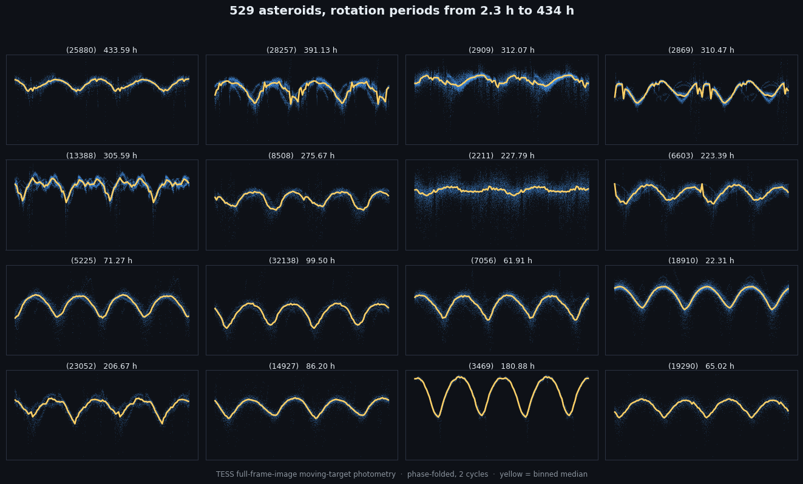
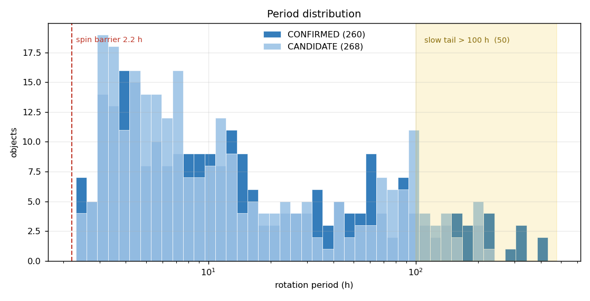
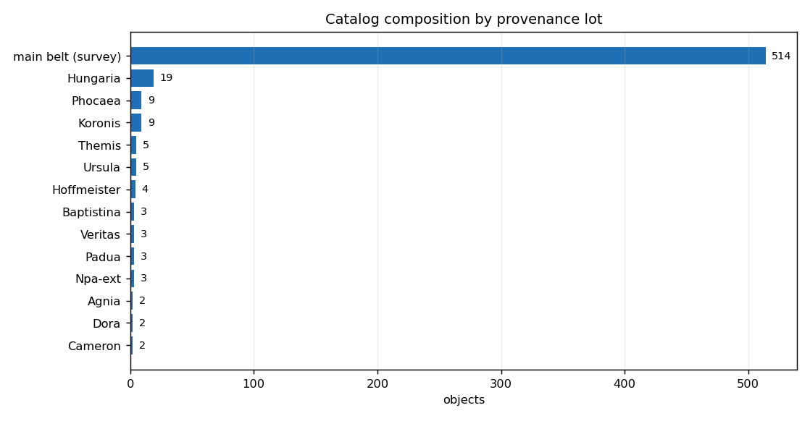

<div align="center">

# TESS-FFI Asteroid Rotation Catalog

**529 main-belt asteroids · 261 secure periods · 50 rotating slower than 100 hours · 2.3 h to 434 h**

Rotation periods measured from TESS Full-Frame-Image moving-target photometry, for asteroids
that had **no reliable published period**. Open data, open reasoning, one file per object.

[](https://doi.org/10.5281/zenodo.21446076)
[](LICENSE)




**[Browse every light curve in the gallery →](GALLERY.md)**

</div>

---

## Why this catalog exists

A rotation period longer than about 100 hours is nearly unreachable from the ground: one night
covers a few percent of a cycle, and the aliasing that follows is why the slow tail of the
asteroid population is so thinly populated. TESS stares at the same field for 27 days without
interruption, so a 400-hour rotation is simply 1.6 cycles of continuous coverage.

That is what this catalog is: the slow tail, plus everything else the same survey found on the
way. **50 objects rotate slower than 100 h and 14 slower than 200 h**, the slowest at
**433.59 h**, all first determinations.

| | |
|--|--|
| objects with an adopted period | **529** (261 CONFIRMED, 267 CANDIDATE, 1 MARGINAL) |
| first determinations | **320** from the novelty-selected belt-wide lots |
| slowest rotation | **(25880) 433.59 h** |
| fastest rotation | **2.29 h** (all 49 sub-barrier readings on km-sized bodies were re-audited and doubled, METHODOLOGY 3b) |
| P > 100 h / P > 200 h | **50 / 14** |
| light curves extracted | 3,803 asteroid-sector crossings over 92 TESS sectors |
| detections published as rejected | 15, with reasons |

 

## What's here

| path | contents |
|--|--|
| [`GALLERY.md`](GALLERY.md) | **thumbnail index of every folded light curve**, grouped, click through to full resolution |
| `catalog/catalog.csv` | adopted periods with shape and reliability code |
| `catalog/rejected.csv` | detections rejected as instrumental, with reasons |
| `catalog/data_dictionary.md` | column definitions |
| `objects/<number>.md` | per-object evidence sheet: per-sector detections, gates, and the reasoning behind every judgment call ([index](objects/README.md)) |
| `methodology/METHODOLOGY.md` | how the periods are derived: gates, thresholds, systematics |
| `methodology/VALIDATION_PLAN.md` | validation of the de-comb systematics method (V1-V7) |
| `lightcurves_alcdef/` | light curves in ALCDEF v2.3 format |
| `plots/<number>.png` | per-object phase fold at the adopted period, sectors phase-aligned |

## How to read a period

- **`shape` = 1P or 2P.** Asteroid light curves are usually double-peaked: an elongated body
  shows two maxima per rotation, so the rotation period is twice the photometric one. Each
  object's file states whether that doubling was **MEASURED** (odd-harmonic power or unequal
  minima at the long period, significant against a block bootstrap and reproduced across
  sectors) or adopted **BY CONVENTION** (symmetric fold above the amplitude cut, where
  photometry alone cannot decide). The distinction is not cosmetic and it is never hidden.
- **`quality_U`**: 2 = secure (multi-sector, systematics-checked), 1 = provisional candidate
  (single sector), 1- = marginal.
- **Caveats travel with the object.** A period resting only on a chunk-extracted curve is
  recorded as CANDIDATE with the reason stated, because the chunk-stitching filter removes
  variation slower than the chunk (METHODOLOGY section 5b).
- **Rejections are published on purpose.** The TESS momentum-dump comb produces convincing but
  false periods; documenting what was rejected, and why, is part of the method.

## Relationship to LCDB / ALCDEF

A supplement, not a replacement. Periods also go through the standard channels (Minor Planet
Bulletin, then ALCDEF and the Asteroid Lightcurve Database), where the community discovers and
cites them. What this repository adds is the full per-object reasoning and the method
description that a journal paper cannot carry.

## Integrity check

```bash
python3 validate_repo.py
```

Verifies that every `objects/<n>.md` matches `catalog.csv` / `rejected.csv` on period, shape,
and status, with no orphan or missing files. Exit 0 means the catalog and its reasoning cannot
have silently diverged.

## Citing

The badge above is the **concept DOI** ([10.5281/zenodo.21446076](https://doi.org/10.5281/zenodo.21446076)):
it never changes and always resolves to the newest release, so use it to point people at the
current data. When citing **in a paper**, cite the version DOI of the release you actually
used, so the numbers behind your results stay retrievable. All versions are on the
[Zenodo versions page](https://zenodo.org/search?q=conceptdoi:%2210.5281/zenodo.21446076%22&f=allversions%3Atrue).

See `CITATION.cff`. Please also cite the accompanying paper(s), the upstream data
(TESS: NASA/MIT; ZTF: Palomar/IPAC via the Fink broker) and the tools
(`tess-asteroids`, `lightkurve`).

## License

Data and documentation: CC BY 4.0 (see `LICENSE`). The processing code is not distributed;
the method is specified in full in `methodology/METHODOLOGY.md`.
