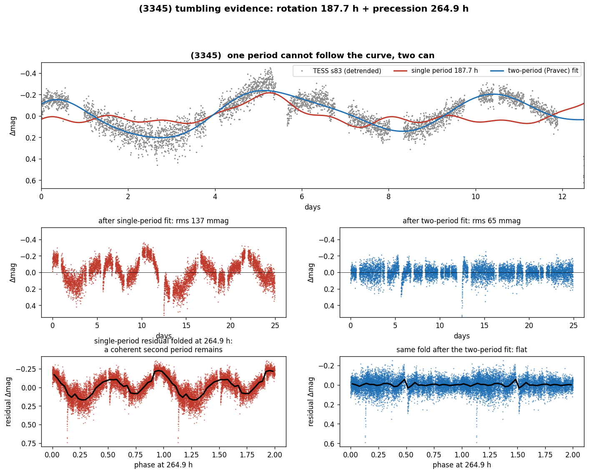
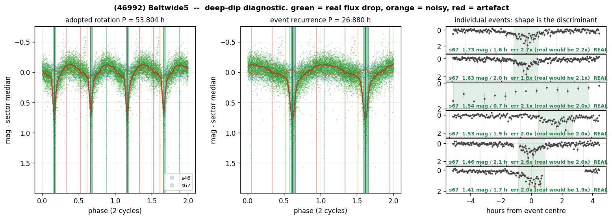

<div align="center">

# TESS-FFI Asteroid Rotation Catalog

**529 main-belt asteroids · 261 secure periods · 50 rotating slower than 100 hours · 2.3 h to 434 h**

*Every period ships with the evidence it rests on: cycles observed, measured uncertainty, and how the factor-of-two was decided.*

Rotation periods measured from TESS Full-Frame-Image moving-target photometry, for asteroids
that had **no reliable published period**. Open data, open reasoning, one file per object.

[](https://doi.org/10.5281/zenodo.21446076)
[](LICENSE)


**[Browse every light curve in the gallery →](GALLERY.md)**

</div>

---

## Why this catalog exists

A rotation period longer than about 100 hours is nearly unreachable from the ground: one night
covers a few percent of a cycle, and the aliasing that follows is why the slow tail of the
asteroid population is so thinly populated. TESS stares at the same field for 27 days without
interruption, so a 400-hour rotation is simply 1.6 cycles of continuous coverage.

That is what this catalog is: the slow tail, plus everything else the same survey found on the
way. **50 objects rotate slower than 100 h and 14 slower than 200 h**, the slowest at
**433.59 h**, all first determinations.

| | |
|--|--|
| objects with an adopted period | **529** (261 CONFIRMED, 267 CANDIDATE, 1 MARGINAL) |
| first determinations | **320** from the novelty-selected belt-wide lots |
| P > 100 h / P > 200 h | **50 / 14** as adopted, **19 / 1** on curves covering at least three cycles (see the ladder below) |
| slowest well-constrained rotation | **(2211) 227.79 h**, two sectors, 3.6 cycles, doubling measured |
| fastest rotation | **2.29 h** (all 49 sub-barrier readings on km-sized bodies were re-audited and doubled, METHODOLOGY 3b) |
| light curves extracted | 3,803 asteroid-sector crossings over 92 TESS sectors |
| detections published as rejected | 15, with reasons |

### How much each slow-rotation claim rests on

A period is only as good as the number of cycles observed and the way the factor-of-two was
decided, so `catalog/catalog.csv` now carries those quantities as columns (`n_sectors`,
`n_cycles_best`, `peak_width_frac`, `P_sigma_h`, `doubling`, `decomb`) and any reader can rebuild
any subset. Applied cumulatively to the 50 objects above 100 h:

| criterion | P > 100 h | P > 200 h |
|--|--|--|
| as adopted | 50 | 14 |
| not chunk-quarantined | 44 | 13 |
| at least 2 sectors | 31 | 12 |
| **at least 3 cycles of the adopted period** | **19** | **1** |
| de-comb not inconclusive | 16 | 1 |
| period measured to better than 20 per cent | 14 | 1 |
| doubling measured rather than conventional | 2 | 1 |

Two things this makes plain, and both are stated rather than buried. Most of the slow tail rests
on the **amplitude convention** for the factor of two, which is standard practice in asteroid
photometry (an elongated body shows two maxima per rotation) but is a convention, not a
measurement. And the longest periods rest on **one or two cycles**, where the periodogram peak is
tens of per cent wide: (25880), previously quoted here as the slowest rotation at 433.59 h,
covers 1.44 cycles and has a measured 1-sigma uncertainty near 26 h, so it is reported with that
uncertainty and is no longer used as a headline number.

 


## Three asteroids that tumble

A tumbling asteroid rotates around a precessing axis: its light curve is woven from **two
incommensurate periods** and never repeats. This survey's calibrated two-frequency search
([method](methodology/METHODOLOGY.md), §8) recovered 4 known LCDB tumblers and found **three
new candidates**, two of them on rotation periods this catalog itself determined:

| candidate | periods | second-frequency reproduction |
|--|--|--|
| **[(3345)](TUMBLERS.md#3345-rotation-1877-h--precession-2649-h)** | 187.7 h + 264.9 h | beat envelope visible by eye |
| **[(7887)](TUMBLERS.md#7887-rotation-1117-h--second-period-872-h)** | 111.7 h + 87.2 h | 0.7% across independent sectors |
| **[(6162)](TUMBLERS.md#6162-rotation-1677-h--second-period-1353-h)** | 167.7 h + 135.3 h | 0.9% across independent sectors |

The pipeline is validated on ground truth: run blind over 134 LCDB-listed tumblers it flags
them at 2.9x the rate of everything else (p = 0.0006), and its cleanest recovery, **(2000)
Herschel** (LCDB's highest-confidence tumbling code), matches the published rotation to 1%
with the second period reproduced across sectors to 0.3%:
[the proof chart and the recovered set are in the dossier](TUMBLERS.md#proof-that-the-pipeline-works-recovered-known-tumblers).



**[The full tumbling dossier →](TUMBLERS.md)**


## A candidate eclipsing binary

**[(46992)](objects/46992.md)** shows the one morphology a single rotating body cannot make: a
**flat baseline interrupted by narrow, deep eclipses** (0.6-1.6 mag, 0.6-2.7 h) at two phases
half a cycle apart. 17 of its 20 events pass the photon-statistics test (in-eclipse errors grow
exactly as a real flux drop requires), the events repeat on a strict 26.88 h clock (half the
53.8 h period, i.e. primary and secondary of a synchronous orbit), and they are absent at an
earlier epoch, as an eclipse season switching off predicts. No second instrument has seen the
events yet (ZTF has no coverage at the right epoch; the object is in solar conjunction until
late 2027), so it remains a **candidate**: the full evidence and caveats are in
[its reasoning sheet](objects/46992.md).

The search behind it now covers **2,210 objects**, including the ones with no determined
rotation period (an eclipsing binary does not need one to be found, and a deep eclipse is
itself a reason the period determination fails). Expanding it produced no second candidate:
the one object that emerged with the strongest formal significance turned out to be a single
narrow minimum of its own rotation curve, counted once per cycle, and was rejected by a test
added for exactly that failure. That test, and the reason (46992) is no longer called
"survey-significant" although its evidence is unchanged, are set out in its sheet.



## What's here

| path | contents |
|--|--|
| [`GALLERY.md`](GALLERY.md) | **thumbnail index of every folded light curve**, grouped, click through to full resolution |
| `catalog/catalog.csv` | adopted periods with shape, reliability code, and the evidence columns (cycles covered, measured peak width and period uncertainty, doubling provenance, de-comb verdict) |
| `catalog/evidence.csv` | the same evidence quantities for every object, for filtering |
| `catalog/rejected.csv` | detections rejected as instrumental, with reasons |
| `catalog/data_dictionary.md` | column definitions |
| `objects/<number>.md` | per-object evidence sheet: per-sector detections, gates, and the reasoning behind every judgment call ([index](objects/README.md)) |
| `methodology/METHODOLOGY.md` | how the periods are derived: gates, thresholds, systematics |
| `methodology/VALIDATION_PLAN.md` | validation of the de-comb systematics method (V1-V7) |
| `lightcurves_alcdef/` | light curves in ALCDEF v2.3 format |
| `plots/<number>.png` | per-object phase fold at the adopted period, sectors phase-aligned |

## How to read a period

- **`shape` = 1P or 2P.** Asteroid light curves are usually double-peaked: an elongated body
  shows two maxima per rotation, so the rotation period is twice the photometric one. Each
  object's file states whether that doubling was **MEASURED** (odd-harmonic power or unequal
  minima at the long period, significant against a block bootstrap and reproduced across
  sectors) or adopted **BY CONVENTION** (symmetric fold above the amplitude cut, where
  photometry alone cannot decide). The distinction is not cosmetic and it is never hidden.
- **`quality_U`**: 2 = secure (multi-sector, systematics-checked), 1 = provisional candidate
  (single sector), 1- = marginal.
- **Caveats travel with the object.** A period resting only on a chunk-extracted curve is
  recorded as CANDIDATE with the reason stated, because the chunk-stitching filter removes
  variation slower than the chunk (METHODOLOGY section 5b).
- **Rejections are published on purpose.** The TESS momentum-dump comb produces convincing but
  false periods; documenting what was rejected, and why, is part of the method.

## Relationship to LCDB / ALCDEF

A supplement, not a replacement. Periods also go through the standard channels (Minor Planet
Bulletin, then ALCDEF and the Asteroid Lightcurve Database), where the community discovers and
cites them. What this repository adds is the full per-object reasoning and the method
description that a journal paper cannot carry.

## Integrity check

```bash
python3 validate_repo.py
```

Verifies that every `objects/<n>.md` matches `catalog.csv` / `rejected.csv` on period, shape,
and status, with no orphan or missing files. Exit 0 means the catalog and its reasoning cannot
have silently diverged.

## Citing

The badge above is the **concept DOI** ([10.5281/zenodo.21446076](https://doi.org/10.5281/zenodo.21446076)):
it never changes and always resolves to the newest release, so use it to point people at the
current data. When citing **in a paper**, cite the version DOI of the release you actually
used, so the numbers behind your results stay retrievable. All versions are on the
[Zenodo versions page](https://zenodo.org/search?q=conceptdoi:%2210.5281/zenodo.21446076%22&f=allversions%3Atrue).

See `CITATION.cff`. Please also cite the accompanying paper(s), the upstream data
(TESS: NASA/MIT; ZTF: Palomar/IPAC via the Fink broker) and the tools
(`tess-asteroids`, `lightkurve`).

## License

Data and documentation: CC BY 4.0 (see `LICENSE`). The processing code is not distributed;
the method is specified in full in `methodology/METHODOLOGY.md`.
