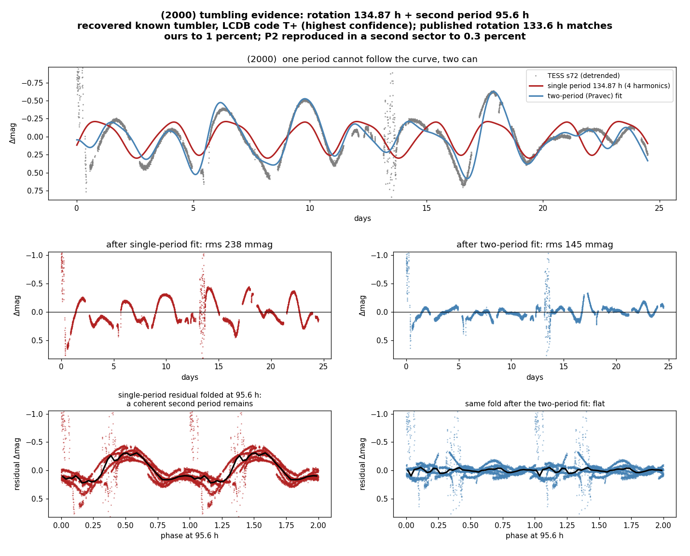
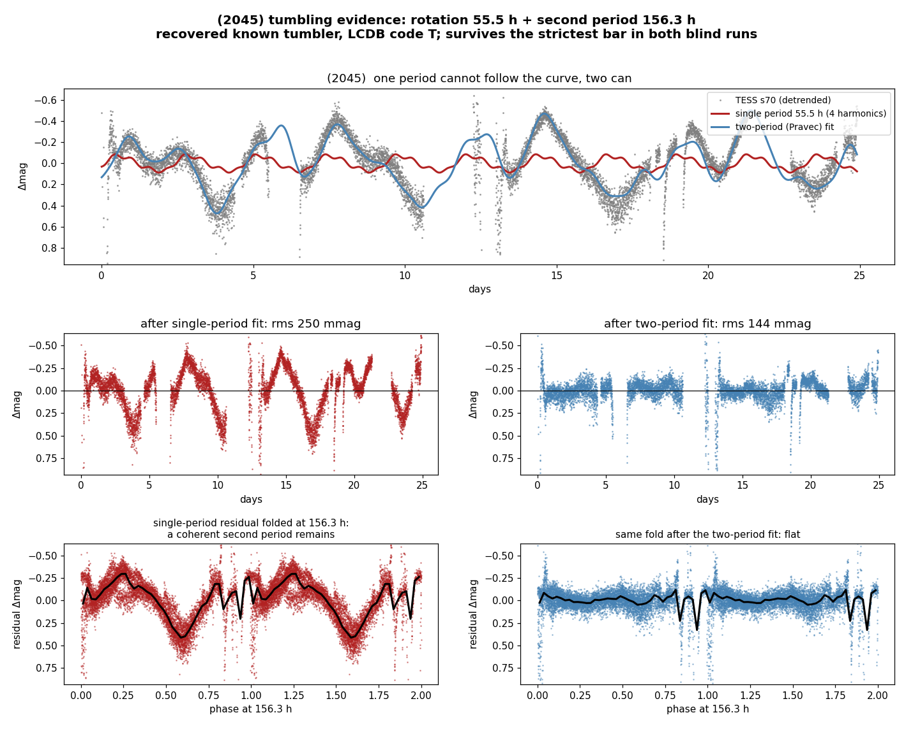
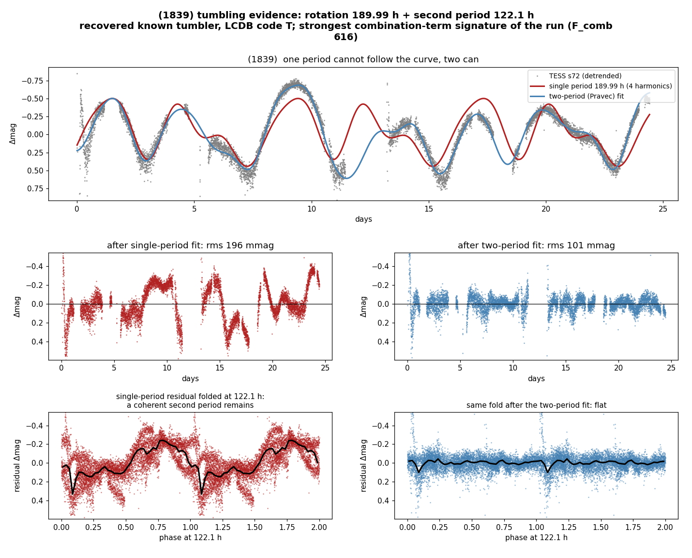
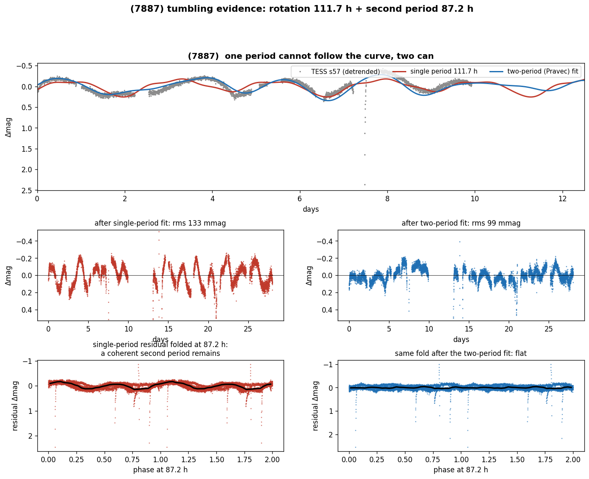
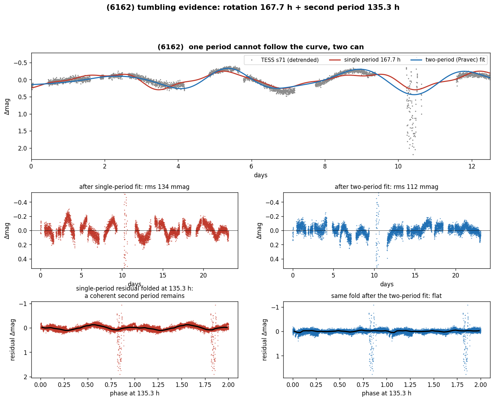

# Tumbling asteroids (non-principal-axis rotation)

Most asteroids spin like a wheel, around one fixed axis. A **tumbler** rotates around an axis
that itself precesses: the light curve is the product of two incommensurate periods and never
repeats exactly. Tumbling is where an asteroid's collision and spin-down history is written,
and it is structurally invisible to sparse ground-based photometry, which is why TESS's
uninterrupted 27-day stare is the right instrument and why so few tumblers are known.

**Method** (METHODOLOGY §8): a two-frequency Fourier fit in the Pravec et al. (2005)
formulation, with the combination terms (j·f1 ± k·f2) that separate genuine two-axis rotation
from two unrelated signals. Thresholds are calibrated empirically with LCDB-listed tumblers as
positive controls run through the identical pipeline; every candidate must survive a
common-fundamental (harmonic) veto, momentum-dump comb separation, an eigen-systematics
de-comb test, and reproduction of the second frequency across independent sectors. The
screen's selection function is measured by injection-recovery, not assumed: it only detects
second components comparable in amplitude to the primary, and it is deliberately blind near
low-order period ratios, where a real tumbler cannot be told apart from a harmonic-rich
single rotator (the full map is in METHODOLOGY §8).

## Proof that the pipeline works: recovered known tumblers

Run blind over 1,024 objects containing 134 LCDB-listed tumblers as positive controls, the
screen flags known tumblers at 2.9x the rate of everything else (13.4% vs 5.1%, Fisher exact
p = 0.0006). The cleanest recovery is **(2000) Herschel**, which carries the highest-confidence
tumbling code LCDB assigns (T+): our rotation period matches the published 133.6 h to 1%, and
the second period reproduces across two independent sectors to 0.3%. The chart below is the
whole argument in one figure: a generous single-period model (4 harmonics) cannot follow the
curve, the two-period Pravec fit can, and the residual of the single-period fit folds
coherently at the second period while the two-period residual folds flat.

Two more recoveries, same test, same bars:

- **(2045) Peking**, LCDB code T: the only object in the whole run that survives the strictest
  operating point (1% false-positive rate) in both blind runs.
  
- **(1839) Ragazza**, LCDB code T: the strongest combination-term signature of the run
  (F_comb 616), the physical fingerprint Pravec's method relies on.
  

## New candidates

### (3345), rotation 187.7 h + precession 264.9 h
The published LCDB rotation (~187 h) plus a NEW second frequency at 264.9 h (ratio 0.71,
non-harmonic). Beat-envelope modulation is visible by eye; a single-period fit leaves 137 mmag
of coherent residual, the two-period fit drops it to 65 mmag and leaves nothing folding at
either period. In the 2026-08-03 re-run of the full chain with a doubled control set, (3345)
was the only object outside the controls to re-emerge past every bar, without being looked for.

Its strongest single piece of evidence comes from the baseline-scaling test (METHODOLOGY §8):
across sectors whose durations differ by 52% (394 h to 598 h), the second period stays within
3% in hours. An artifact that scales with the observing window, the one systematic that
cross-sector reproduction cannot catch, would have varied by that same 52%.

**Two further TESS sectors were recovered and they weaken it (2026-08-04).** The coverage
table always held five flown crossings, not three: S12 (2019) and S66 (2023) had been dropped by
an automatic cut on galactic-plane crowding. Extracted by hand, S66 is a good curve (6,409
points), and it gives essentially nothing at the published second period of 187.7 h, while at
the value that would agree with the 2022 pair its harmonic veto fires. A second measurement
reframes the rest: with only 2 to 3 cycles per sector the periodogram peak is 30 to 45 per cent
wide, so the cross-sector reproduction bar of 10 per cent, one of the screen's main defences,
has very little power here. The five sectors do not formally contradict each other, but passing
that bar is weaker evidence than it looked.

**A physical two-axis model was attempted and does NOT confirm it (2026-08-04).** A rigid body
in free precession has no free coefficients: its two periods are locked together by the inertia
ratios and the excitation, and one state must fit every sector. The observed period ratio does
turn out to be reachable by ordinary bodies (69 of 2,384 simulated states match it and the
observed amplitude, nearly all in short-axis mode). But when those states are fitted to the
actual photometry, the best one improves on a non-tumbling rotator only because of its extra
shape freedom: its own light curve is dominated by a single period of 131 h, half the observed
264.9 h, and it never produces the second frequency near 180 h that makes the object a
candidate. Forcing the model to carry the observed periods gives harmonics of one fundamental
(531.7 h and 132.7 h) and fits one sector badly (per-sector chi2 2.6, 8.1, 1.5).
The full result, including the limits of the ellipsoid shape model, is in the working notes:
On the present evidence (3345) is a **weak candidate**: the two-frequency detection is strong in
four sectors and the baseline-scaling test passes, but there is no physical model behind it and
the reproduction bar it passed is weak at these period-to-baseline ratios. Settling it needs
period resolution rather than more data of the same kind: a phase-connected fit across the
2019 to 2024 baseline would pin the second period to about 0.1 per cent instead of 30.

### (7887), rotation 111.7 h + second period 87.2 h
A rotation period first determined by this survey ([reasoning](objects/7887.md)). The second
frequency reproduces to **0.7%** across two independent sectors (87.24 / 86.67 h), passes the
harmonic veto in both, and survives the de-comb with a 1-5% power change.

### (6162), rotation 167.7 h + second period 135.3 h
Also a first-determination rotator of this survey ([reasoning](objects/6162.md)). Second
frequency reproduced to **0.9%** (136.63 / 135.34 h), harmonic veto passed in both sectors,
de-comb survived.

## Status

These are **candidates**, reported separately from the rotation catalog (they become catalog
claims only after independent confirmation, e.g. a physical two-axis model fit or a second
epoch). The falling residual rms is necessary but not sufficient: a two-period model has more
freedom, which is why the bars above lean on reproduction across sectors and on the
combination terms, not on the fit improvement alone. All three candidates sit at non-rational
period ratios (0.71, 0.78, 0.81), inside the sensitive part of the measured selection
function; a candidate at a low-order rational ratio would not be claimable at all.
