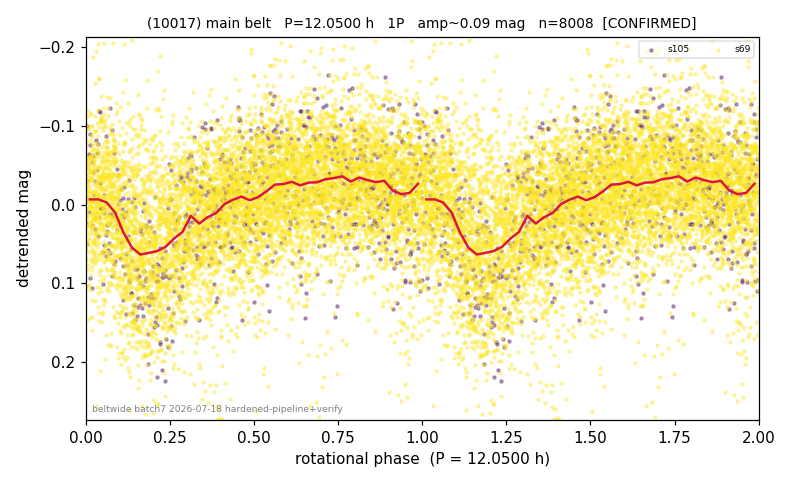

# (10017)

**Adopted:** 12.05 h, 1P, CONFIRMED

<!-- AUTO:START (regenerated from pipeline outputs; do not hand-edit this block) -->
## Evidence (auto)

Detected in 2 sector(s):

| sector | N | baseline (h) | P_phot (h) | power | FAP | cycles | flags |
|--|--|--|--|--|--|--|--|
| s69 | 7260 | 523.6 | 11.9796 | 0.1792 | 3.5e-306 | 43.7 | star-cleaned:48 |
| s105 | 759 | 59.8 | 12.1133 | 0.197 | 1.4e-32 | 4.9 | clean |

- Refined shape: **1P** (folded amp_fourier 0.1); flags: sick-dips-excised:s69(2)
- DIA (de-comb): survived(dPW=+3%,R2=0.01,s69@12.046h,2sec)
- Gates: FAP<1e-3 and power>=0.10 per detecting sector; >=2 sectors agree (harmonic-aware); folded-amplitude rule -> 1P.

<!-- AUTO:END -->
