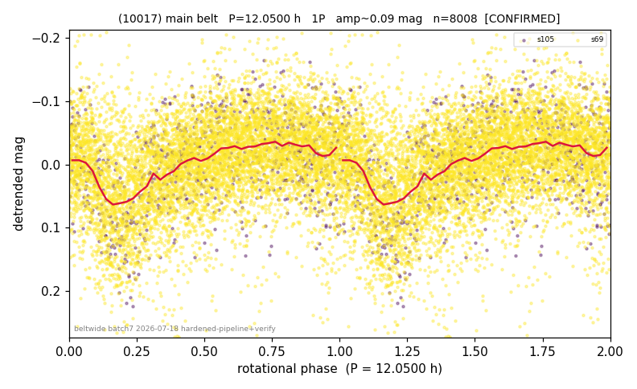

# (10017)

**Adopted:** 12.05 h, 1P, CONFIRMED

<!-- AUTO:START (regenerated from pipeline outputs; do not hand-edit this block) -->
## Evidence (auto)

Detected in 2 sector(s):

| sector | N | baseline (h) | P_phot (h) | power | FAP | cycles | flags |
|--|--|--|--|--|--|--|--|
| s69 | 7260 | 523.6 | 11.9796 | 0.1792 | 3.5e-306 | 43.7 | star-cleaned:48 |
| s105 | 759 | 59.8 | 12.1133 | 0.197 | 1.4e-32 | 4.9 | clean |

- Pipeline refine said: **1P** (folded amp_fourier 0.1); flags: sick-dips-excised:s69(2)
- DIA (de-comb): survived(dPW=+3%,R2=0.01,s69@12.046h,2sec)
- Coverage: **2 sector(s)**, best sector covers **43.45 cycles** of the adopted period. Measured periodogram peak width 2% of the period, i.e. about **+/- 0.1 h** (1 sigma); the decimal places in the adopted value are not a precision claim.
- Factor of two: no doubling was applied.
- Gates: FAP<1e-3 and power>=0.10 per detecting sector; >=2 sectors agree (harmonic-aware).
- Adopted shape: **1P** (folded-amplitude rule; pipeline agrees).

### Why this row reads the way it does

- Priors upheld. s105: LS P=12.11h pw=0.20 FAP=3.0e-33; PDM 11.85h. s69: LS P=11.98h pw=0.15 FAP=6.0e-252 (43.7 cycles, peak isolated, next pe

<!-- AUTO:END -->
