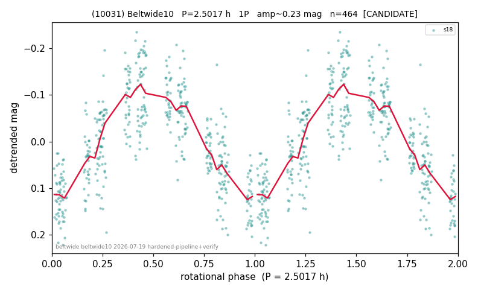

# (10031)

**Adopted:** 2.5017 h, 1P, CANDIDATE

<!-- AUTO:START (regenerated from pipeline outputs; do not hand-edit this block) -->
## Evidence (auto)

Detected in 1 sector(s):

| sector | N | baseline (h) | P_phot (h) | power | FAP | cycles | flags |
|--|--|--|--|--|--|--|--|
| s18 | 464 | 424.0 | 2.5017 | 0.6495 | 3.0e-101 | 169.5 | 2P-ambiguous |

- Pipeline refine said: **1P** (folded amp_fourier 0.279); flags: clean
- DIA (de-comb): not triggered (clean, fast, non-comb)
- Gates: FAP<1e-3 and power>=0.10 per detecting sector; single strong sector (candidate ceiling).
- Adopted shape: **1P** (folded-amplitude rule; pipeline agrees).

### Why this row reads the way it does

- folded_amp=0.247. Single-sector s18 (cap); power 0.65 FAP 4e-101; above barrier; clean.

<!-- AUTO:END -->
