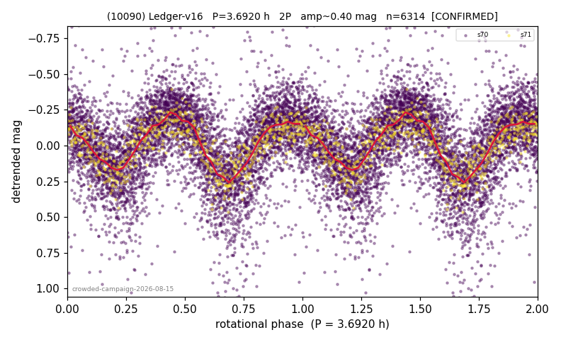

# (10090)

**Adopted:** 3.692 h, 2P, CONFIRMED

<!-- AUTO:START (regenerated from pipeline outputs; do not hand-edit this block) -->
## Evidence (auto)

Detected in 2 sector(s):

| sector | N | baseline (h) | P_phot (h) | power | FAP | cycles | flags |
|--|--|--|--|--|--|--|--|
| s70 | 5628 | 463.1 | 1.8451 | 0.3946 | 0.0e+00 | 251.0 | star-cleaned:140,2P-ambiguous |
| s71 | 699 | 38.8 | 1.8463 | 0.6086 | 7.0e-138 | 21.0 | 2P-ambiguous |

- Coverage: **2 sector(s)**, best sector covers **125.43 cycles** of the adopted period. Measured periodogram peak width 0% of the period, i.e. about **+/- 0.002881 h** (1 sigma); the decimal places in the adopted value are not a precision claim.
- Factor of two: **adopted on the amplitude convention**: standard practice for an elongated body, but a convention rather than a measurement.
- Gates: FAP<1e-3 and power>=0.10 per detecting sector; >=2 sectors agree (harmonic-aware).
- Adopted shape: **2P** (folded-amplitude rule; pipeline agrees).

### Why this row reads the way it does

- crowded-field campaign (|b| 5-15 full ledger tier, METHODOLOGY 5b-quater), adversarial review 2026-08-15: 2/2 true detections (own peaks 1.844/1.846h), powers 0.41/0.61, null-calibrated gate 0/200; P_phot = 24h/13 exactly but common-mode field test clean (62 objects, 0% gate-pass at this frequency)
- 2P by amplitude rule (folded_amp=0.45)

<!-- AUTO:END -->
