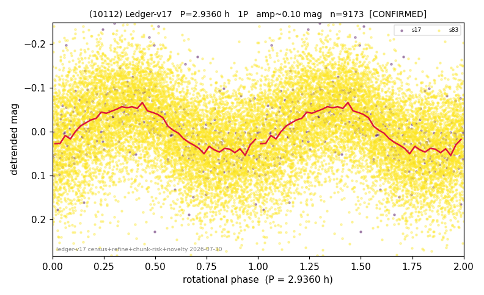

# (10112)

**Adopted:** 5.872 h, 2P, CONFIRMED

<!-- AUTO:START (regenerated from pipeline outputs; do not hand-edit this block) -->
## Evidence (auto)

Detected in 2 sector(s):

| sector | N | baseline (h) | P_phot (h) | power | FAP | cycles | flags |
|--|--|--|--|--|--|--|--|
| s17 | 389 | 494.5 | 2.9356 | 0.3091 | 6.7e-28 | 168.4 | star-cleaned:6 |
| s83 | 8795 | 598.4 | 2.9365 | 0.1742 | 0.0e+00 | 203.8 | star-cleaned:50,2P-ambiguous |

- Pipeline refine said: **1P** (folded amp_fourier 0.152); flags: sick-dips-excised:s83(3)
- DIA (de-comb): survived(dPW=+3%,R2=0.06,s17@2.936h,3sec)
- Gates: FAP<1e-3 and power>=0.10 per detecting sector; >=2 sectors agree (harmonic-aware).
- **Adopted shape 2P OVERRIDES the pipeline's 1P** (doubling audit 2026-07-25: folded amplitude >= 0.25 mag, so a single-peaked curve is physically implausible; Harris convention -> 2P. The census 3-test doubling logic was measured at only 30% recall against 289 LCDB U>=2 ground-truth periods).

### Why this row reads the way it does

- 2 sector(s) detecting
- cross-sector fold correlation 0.83
- single-peaked at folded amp 0.152 mag
- CORRECTED 2.936->5.8720 h (2026-08-02 full 1P re-audit): doubling MEASURED at odd-harmonic 13.3 sigma with ALL detecting sectors significant (2/2); threshold odd>=8+full-reproduction calibrated to 0/60 false fires on the 4P null test (the minima-asymmetry branch alone fired falsely at z up to 34 and is not accepted)

<!-- AUTO:END -->
