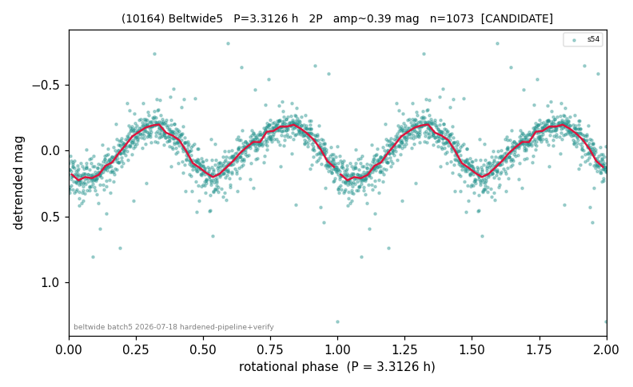

# (10164)

**Adopted:** 3.3126 h, 2P, CANDIDATE

<!-- AUTO:START (regenerated from pipeline outputs; do not hand-edit this block) -->
## Evidence (auto)

Detected in 1 sector(s):

| sector | N | baseline (h) | P_phot (h) | power | FAP | cycles | flags |
|--|--|--|--|--|--|--|--|
| s54 | 1073 | 254.8 | 1.6563 | 0.7401 | 8.1e-309 | 153.9 | star-cleaned:5,2P-ambiguous |

- Refined shape: **2P** (folded amp_fourier 0.433); flags: sick-dips-excised:s54(2);near-threshold:0.43
- DIA (de-comb): survived(dPW=-3%,R2=0.09,s54@1.656h,1sec)
- Gates: FAP<1e-3 and power>=0.10 per detecting sector; single strong sector (candidate ceiling); folded-amplitude rule -> 2P.

<!-- AUTO:END -->
