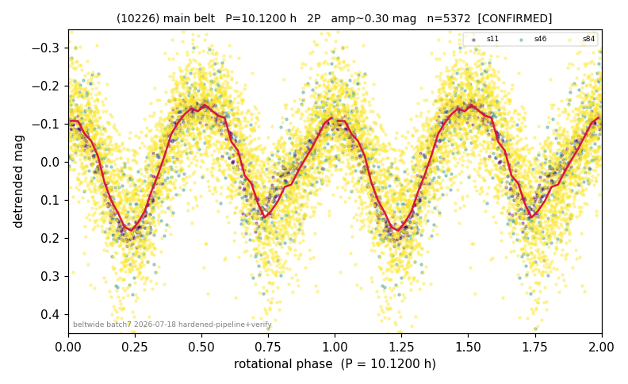

# (10226)

**Adopted:** 10.12 h, 2P, CONFIRMED

<!-- AUTO:START (regenerated from pipeline outputs; do not hand-edit this block) -->
## Evidence (auto)

Detected in 3 sector(s):

| sector | N | baseline (h) | P_phot (h) | power | FAP | cycles | flags |
|--|--|--|--|--|--|--|--|
| s11 | 690 | 574.5 | 5.0624 | 0.7561 | 1.9e-206 | 56.7 | clean |
| s46 | 577 | 148.8 | 5.0615 | 0.6033 | 2.0e-111 | 29.4 | 2P-ambiguous |
| s84 | 4113 | 364.7 | 5.0609 | 0.4615 | 0.0e+00 | 72.1 | 2P-ambiguous |

- Pipeline refine said: **1P** (folded amp_fourier 0.334); flags: clean
- DIA (de-comb): not triggered (the object is clean, fast and non-comb, so the test does not apply)
- Coverage: **3 sector(s)**, best sector covers **56.77 cycles** of the adopted period. Measured periodogram peak width 1% of the period, i.e. about **+/- 0.01692 h** (1 sigma); the decimal places in the adopted value are not a precision claim.
- Factor of two: **adopted on the amplitude convention**: standard practice for an elongated body, but a convention rather than a measurement.
- Gates: FAP<1e-3 and power>=0.10 per detecting sector; >=2 sectors agree (harmonic-aware).
- **Adopted shape 2P OVERRIDES the pipeline's 1P.** The catalog shape is a deliberate call, not the census default; what supports it for this object is the factor-of-two line above and the note at the end of this block (METHODOLOGY 3b). The census 3-test doubling logic was measured at only 30% recall against 289 LCDB U>=2 ground-truth periods, which is why it is overridden rather than followed.

### Why this row reads the way it does

- 3/3 sectors LS-agree tight: s11=5.065h(pw.75,FAP4e-204) s46=5.062h(pw.60) s84=5.063h(pw.46,FAP~0). Folded amp 0.28<0.40->1P upheld. 2P-fold ; P doubled 2026-07-25 (doubling audit: amp>=0.25 + Harris convention)

<!-- AUTO:END -->
