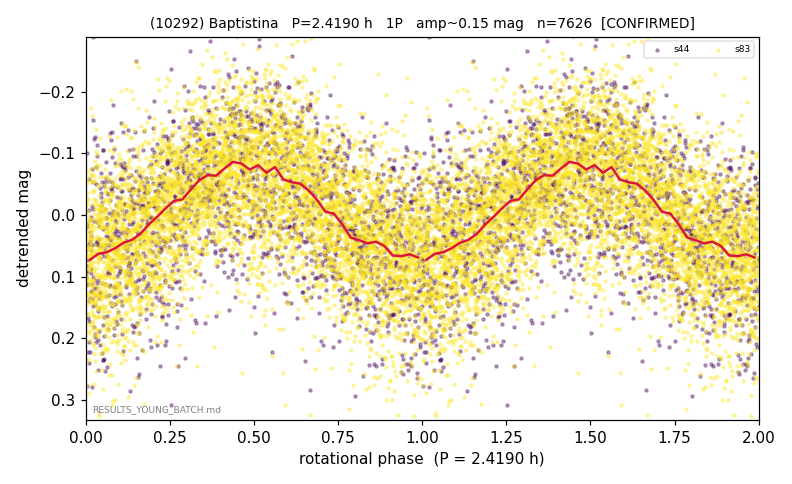

# (10292)

**Adopted:** 4.838 h, 2P, CONFIRMED

<!-- AUTO:START (regenerated from pipeline outputs; do not hand-edit this block) -->
## Evidence (auto)

Detected in 2 sector(s):

| sector | N | baseline (h) | P_phot (h) | power | FAP | cycles | flags |
|--|--|--|--|--|--|--|--|
| s44 | 1932 | 420.5 | 2.4185 | 0.2326 | 1.0e-106 | 173.9 | star-cleaned:10,2P-ambiguous |
| s83 | 5705 | 382.3 | 2.4182 | 0.307 | 0.0e+00 | 158.1 | star-cleaned:31,2P-ambiguous |

- Pipeline refine said: **1P** (folded amp_fourier 0.177); flags: sick-dips-excised:s44(3),s83(3)
- DIA (de-comb): survived_v2(ret=1.000[1.00-1.00],s83@2.418h)
- Coverage: **2 sector(s)**, best sector covers **173.84 cycles** of the adopted period. Measured periodogram peak width 1% of the period, i.e. about **+/- 0.005933 h** (1 sigma); the decimal places in the adopted value are not a precision claim.
- Factor of two: no doubling was applied.
- Gates: FAP<1e-3 and power>=0.10 per detecting sector; >=2 sectors agree (harmonic-aware).
- **Adopted shape 2P OVERRIDES the pipeline's 1P** (doubling audit 2026-07-25: folded amplitude >= 0.25 mag, so a single-peaked curve is physically implausible; Harris convention -> 2P. The census 3-test doubling logic was measured at only 30% recall against 289 LCDB U>=2 ground-truth periods).

### Why this row reads the way it does

- daily-alias proximity rejected via cross-sector coherence
- DOUBLING CORRECTED 2026-08-30: adopted period doubled from 2.419 h. The previous value came from the folded-amplitude rule, which was found biased low (9 of 9 disagreements with MPB 2024-2026 in the same direction). Odd-harmonic test at the long period gives z1=5.78 with margin 3.21 over non-harmonic multiples 1.7x/2.3x (reference group: 0 of 38 above margin 2).

<!-- AUTO:END -->
