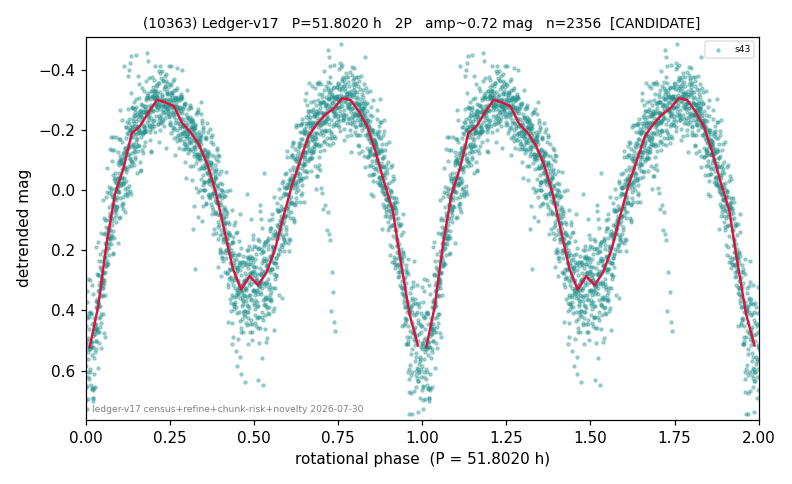

# (10363)

**Adopted:** 51.802 h, 2P, CANDIDATE

<!-- AUTO:START (regenerated from pipeline outputs; do not hand-edit this block) -->
## Evidence (auto)

Detected in 2 sector(s):

| sector | N | baseline (h) | P_phot (h) | power | FAP | cycles | flags |
|--|--|--|--|--|--|--|--|
| s43 | 2356 | 462.7 | 25.901 | 0.7944 | 0.0e+00 | 17.9 | 2P-ambiguous |
| s44 | 25 | 4.3 |  |  |  |  |  |

- Pipeline refine said: **2P** (folded amp_fourier 0.695); flags: near-comb(amp-cleared):n=13;gap-alias-risk:60h
- DIA (de-comb): **NOT RUN for this lot.** No de-comb verdict exists for this object, so momentum-dump contamination has not been excluded by that test here.
- Gates: FAP<1e-3 and power>=0.10 per detecting sector; single strong sector (candidate ceiling).
- Adopted shape: **2P** (folded-amplitude rule; pipeline agrees).

### Why this row reads the way it does

- 1 sector(s) detecting
- doubling BY CONVENTION: amplitude rule on folded amp 0.695 mag, not individually audited

<!-- AUTO:END -->
