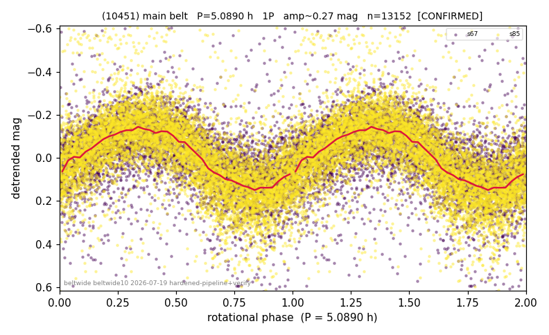

# (10451)

**Adopted:** 5.089 h, 1P, CONFIRMED

<!-- AUTO:START (regenerated from pipeline outputs; do not hand-edit this block) -->
## Evidence (auto)

Detected in 2 sector(s):

| sector | N | baseline (h) | P_phot (h) | power | FAP | cycles | flags |
|--|--|--|--|--|--|--|--|
| s67 | 5441 | 452.4 | 5.0895 | 0.3057 | 0.0e+00 | 88.9 | star-cleaned:91,2P-ambiguous |
| s85 | 7773 | 596.0 | 5.088 | 0.3937 | 0.0e+00 | 117.1 | star-cleaned:61,2P-ambiguous |

- Refined shape: **1P** (folded amp_fourier 0.36); flags: sick-dips-excised:s67(14),s85(28);near-threshold:0.36
- DIA (de-comb): survived(dPW=-1%,R2=0.00,s85@5.089h,4sec)
- Gates: FAP<1e-3 and power>=0.10 per detecting sector; >=2 sectors agree (harmonic-aware); folded-amplitude rule -> 1P.

<!-- AUTO:END -->
