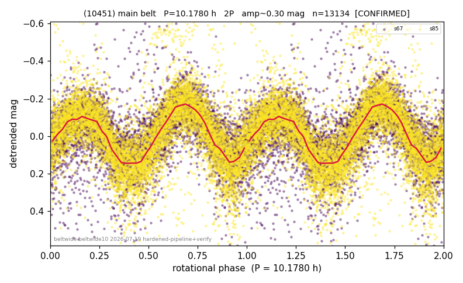

# (10451)

**Adopted:** 10.178 h, 2P, CONFIRMED

<!-- AUTO:START (regenerated from pipeline outputs; do not hand-edit this block) -->
## Evidence (auto)

Detected in 2 sector(s):

| sector | N | baseline (h) | P_phot (h) | power | FAP | cycles | flags |
|--|--|--|--|--|--|--|--|
| s67 | 5441 | 452.4 | 5.0895 | 0.3057 | 0.0e+00 | 88.9 | star-cleaned:91,2P-ambiguous |
| s85 | 7773 | 596.0 | 5.088 | 0.3937 | 0.0e+00 | 117.1 | star-cleaned:61,2P-ambiguous |

- Pipeline refine said: **1P** (folded amp_fourier 0.36); flags: sick-dips-excised:s67(14),s85(28);near-threshold:0.36
- DIA (de-comb): survived(dPW=-1%,R2=0.00,s85@5.089h,4sec)
- Coverage: **2 sector(s)**, best sector covers **58.56 cycles** of the adopted period. Measured periodogram peak width 1% of the period, i.e. about **+/- 0.01702 h** (1 sigma); the decimal places in the adopted value are not a precision claim.
- Factor of two: **adopted on the amplitude convention**: standard practice for an elongated body, but a convention rather than a measurement.
- Gates: FAP<1e-3 and power>=0.10 per detecting sector; >=2 sectors agree (harmonic-aware).
- **Adopted shape 2P OVERRIDES the pipeline's 1P** (doubling audit 2026-07-25: folded amplitude >= 0.25 mag, so a single-peaked curve is physically implausible; Harris convention -> 2P. The census 3-test doubling logic was measured at only 30% recall against 289 LCDB U>=2 ground-truth periods).

### Why this row reads the way it does

- folded_amp=0.27. s67+s85 agree <0.01% (FAP~0 both); fold coherence r=0.996; near-threshold flag resolved (raw amp 0.36, folded 0.27<0.40 -> 1P).; P doubled 2026-07-25 (doubling audit: amp>=0.25 + Harris convention)

<!-- AUTO:END -->
