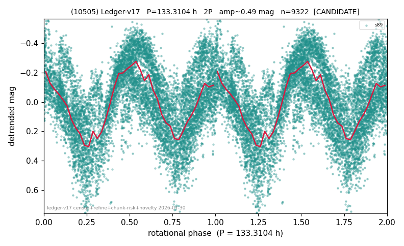

# (10505)

**Adopted:** 133.3104 h, 2P, CANDIDATE

<!-- AUTO:START (regenerated from pipeline outputs; do not hand-edit this block) -->
## Evidence (auto)

Detected in 1 sector(s):

| sector | N | baseline (h) | P_phot (h) | power | FAP | cycles | flags |
|--|--|--|--|--|--|--|--|
| s89 | 9561 | 666.9 | 66.6552 | 0.4113 | 0.0e+00 | 5.0 | star-cleaned:19 |

- Pipeline refine said: **2P** (folded amp_fourier 0.533); flags: near-comb(amp-cleared):n=5;sick-dips-excised:s89(16)
- DIA (de-comb): survived(dPW=+1%,R2=0.01,s89@66.655h,3sec)
- Coverage: **1 sector(s)**, best sector covers **4.9 cycles** of the adopted period. Measured periodogram peak width 10% of the period, i.e. about **+/- 2.9 h** (1 sigma); the decimal places in the adopted value are not a precision claim.
- Factor of two: **adopted on the amplitude convention**: standard practice for an elongated body, but a convention rather than a measurement.
- Gates: FAP<1e-3 and power>=0.10 per detecting sector; single strong sector (candidate ceiling).
- Adopted shape: **2P** (folded-amplitude rule; pipeline agrees).

### Why this row reads the way it does

- 1 sector(s) detecting
- doubling BY CONVENTION: amplitude rule on folded amp 0.533 mag, not individually audited
- CHUNK QUARANTINE (SUPPRESSED): the adopted period is at least half the extraction chunk span, and median-matching the chunks removes variation slower than one chunk. Needs a direct re-extraction before this period can be claimed
- CHUNK QUARANTINE LIFTED by direct re-extraction 2026-08-05: the sector(s) were re-extracted without chunking and the power at the adopted period is retained or improved (s89 power 0.378->0.412). The stitching filter was not creating this period.

<!-- AUTO:END -->
