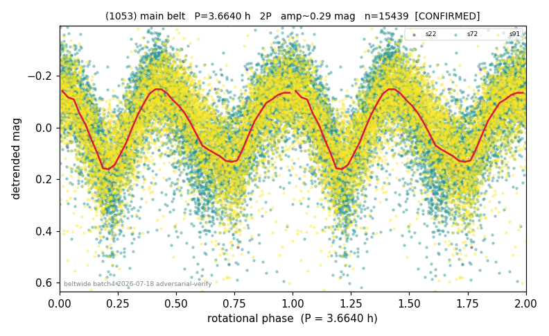

# (1053)

**Adopted:** 3.664 h, 2P, CONFIRMED

<!-- AUTO:START (regenerated from pipeline outputs; do not hand-edit this block) -->
## Evidence (auto)

Detected in 3 sector(s):

| sector | N | baseline (h) | P_phot (h) | power | FAP | cycles | flags |
|--|--|--|--|--|--|--|--|
| s22 | 698 | 516.0 | 1.8313 | 0.6964 | 6.4e-176 | 281.8 | 2P-ambiguous |
| s72 | 8051 | 576.7 | 1.8323 | 0.4116 | 0.0e+00 | 157.4 | star-cleaned:115 |
| s91 | 6730 | 586.5 | 1.8331 | 0.3677 | 0.0e+00 | 320.0 | star-cleaned:68,2P-ambiguous |

- Pipeline refine said: **1P** (folded amp_fourier 0.289); flags: amp-from-clean-sectors(ignored s72);sick-dips-excised:s72(12),s91(8)
- DIA (de-comb): survived(dPW=+4%,R2=0.32,s22@1.832h,5sec)
- Gates: FAP<1e-3 and power>=0.10 per detecting sector; >=2 sectors agree (harmonic-aware).
- **Adopted shape 2P OVERRIDES the pipeline's 1P** (doubling audit 2026-07-25: folded amplitude >= 0.25 mag, so a single-peaked curve is physically implausible; Harris convention -> 2P. The census 3-test doubling logic was measured at only 30% recall against 289 LCDB U>=2 ground-truth periods).

<!-- AUTO:END -->
