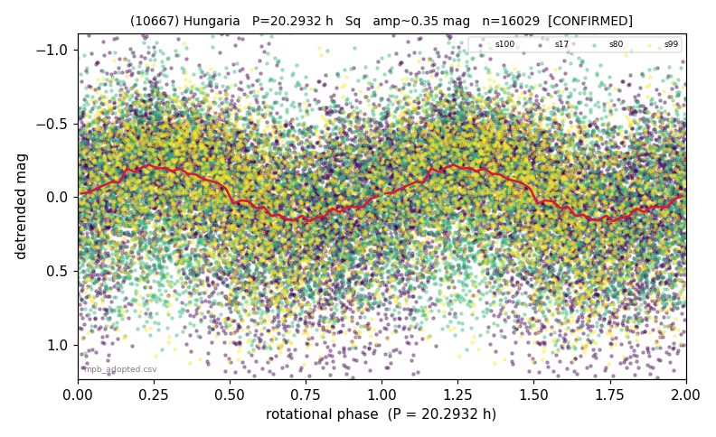

# (10667)

**Adopted:** 20.2932 h, Sq, CONFIRMED

<!-- AUTO:START (regenerated from pipeline outputs; do not hand-edit this block) -->
## Evidence (auto)

Detected in 0 sector(s):

| sector | N | baseline (h) | P_phot (h) | power | FAP | cycles | flags |
|--|--|--|--|--|--|--|--|

- Gates: FAP<1e-3 and power>=0.10 per detecting sector; >=2 sectors agree (harmonic-aware).
- Adopted shape: **Sq** (folded-amplitude rule; pipeline agrees).

### Why this row reads the way it does

- paper #1 (MPB 53-415, revised, 19 objects)

<!-- AUTO:END -->
