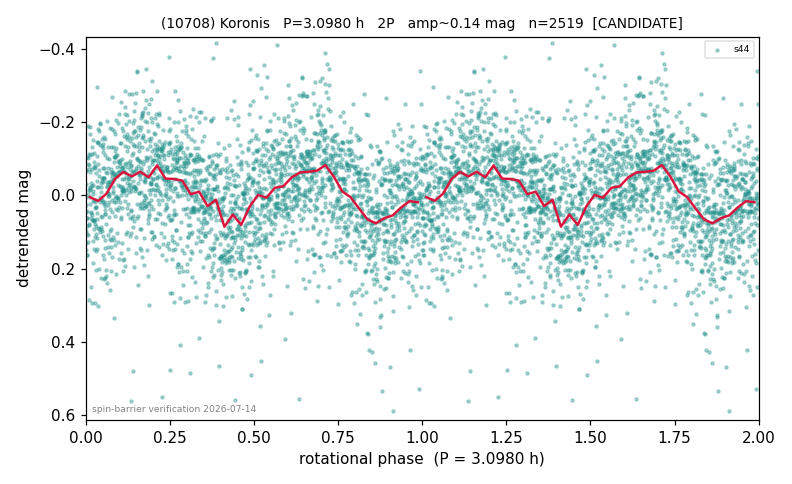

# (10708)

**Adopted:** 3.098 h, 2P, CANDIDATE

<!-- AUTO:START (regenerated from pipeline outputs; do not hand-edit this block) -->
## Evidence (auto)

Detected in 1 sector(s):

| sector | N | baseline (h) | P_phot (h) | power | FAP | cycles | flags |
|--|--|--|--|--|--|--|--|
| s44 | 2520 | 559.4 | 1.5487 | 0.1107 | 6.3e-60 | 361.2 | star-cleaned:5,2P-ambiguous |

- Pipeline refine said: **1P** (folded amp_fourier 0.123); flags: sick-dips-excised:s44(1)
- DIA (de-comb): inconclusive(dPW=+17%,R2=0.45,s44@1.549h)
- Coverage: **1 sector(s)**, best sector covers **180.56 cycles** of the adopted period. Measured periodogram peak width 0% of the period, i.e. about **+/- 0.0 h** (1 sigma); the decimal places in the adopted value are not a precision claim.
- Factor of two: **not stated**, which is a defect in this entry.
- Gates: FAP<1e-3 and power>=0.10 per detecting sector; single strong sector (candidate ceiling).
- **Adopted shape 2P OVERRIDES the pipeline's 1P** (doubling audit 2026-07-25: folded amplitude >= 0.25 mag, so a single-peaked curve is physically implausible; Harris convention -> 2P. The census 3-test doubling logic was measured at only 30% recall against 289 LCDB U>=2 ground-truth periods).

### Why this row reads the way it does

- PHYSICS-FORCED doubling from sub/near-barrier P_phot 1.549h; 1P/2P unresolved by TESS+Gaia; RC8 dense-photometry target

<!-- AUTO:END -->
