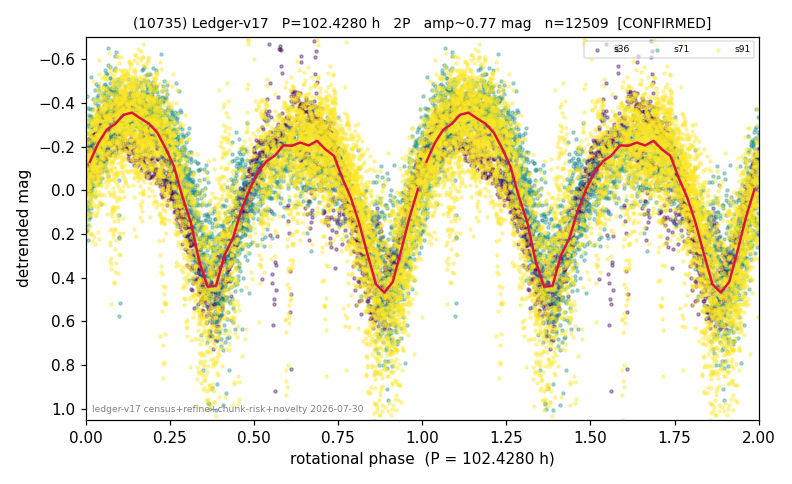

# (10735)

**Adopted:** 102.428 h, 2P, CONFIRMED

<!-- AUTO:START (regenerated from pipeline outputs; do not hand-edit this block) -->
## Evidence (auto)

Detected in 3 sector(s):

| sector | N | baseline (h) | P_phot (h) | power | FAP | cycles | flags |
|--|--|--|--|--|--|--|--|
| s36 | 2937 | 597.2 | 51.1649 | 0.8079 | 0.0e+00 | 11.7 | star-cleaned:21,2P-ambiguous |
| s71 | 2813 | 166.8 | 52.6747 | 0.6435 | 0.0e+00 | 3.2 | 2P-untestable,2P-ambiguous |
| s91 | 6991 | 606.1 | 51.1891 | 0.4958 | 0.0e+00 | 11.8 | star-cleaned:136,2P-ambiguous |

- Pipeline refine said: **2P** (folded amp_fourier 0.74); flags: amp-from-clean-sectors(ignored s71);gap-alias-risk:100h;sick-dips-excised:s36(7),s71(1),s9
- DIA (de-comb): survived(dPW=+2%,R2=0.10,s36@51.214h,9sec)
- Coverage: **3 sector(s)**, best sector covers **5.92 cycles** of the adopted period. Measured periodogram peak width 7% of the period, i.e. about **+/- 1.473 h** (1 sigma); the decimal places in the adopted value are not a precision claim.
- Factor of two: **measured on the data** (odd-harmonic power or unequal minima, significant and reproduced), METHODOLOGY 3b.
- Gates: FAP<1e-3 and power>=0.10 per detecting sector; >=2 sectors agree (harmonic-aware).
- Adopted shape: **2P** (folded-amplitude rule; pipeline agrees).

### Why this row reads the way it does

- 3 sector(s) detecting
- cross-sector fold correlation 0.96
- doubling BY CONVENTION: 0.74 mag amplitude; odd-harmonic significant in 1 of 3 sectors and unequal minima in a different 1 of 3, so not reproduced
- chunked sectors flagged (SUPPRESSED;direct-sector-supported) but a directly extracted sector carries the period
- chunk-extracted sectors re-extracted DIRECTLY 2026-08-06: power at the adopted period retained (s36 0.687->0.682, s71 0.641->0.645, s91 0.534->0.531); the direct curves are now the published ones, so this period no longer rests on chunked photometry

<!-- AUTO:END -->
