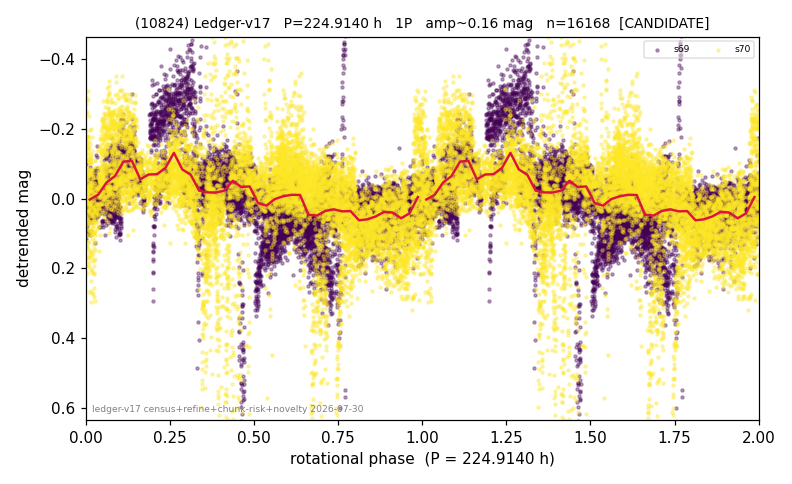

# (10824)

**Adopted:** 224.914 h, 1P, CANDIDATE

<!-- AUTO:START (regenerated from pipeline outputs; do not hand-edit this block) -->
## Evidence (auto)

Detected in 2 sector(s):

| sector | N | baseline (h) | P_phot (h) | power | FAP | cycles | flags |
|--|--|--|--|--|--|--|--|
| s69 | 7615 | 545.8 | 219.5687 | 0.3505 | 0.0e+00 | 2.5 | star-cleaned:91,phase-curve-risk,2P-unte |
| s70 | 8620 | 600.9 | 115.1301 | 0.1844 | 0.0e+00 | 5.2 | star-cleaned:24,2P-ambiguous |

- Pipeline refine said: **1P** (folded amp_fourier 0.23); flags: few-cycle:1.3;sick-dips-excised:s69(4),s70(58);harmonic-only-agreement:s70(pw=0.07);period
- DIA (de-comb): **NOT RUN for this lot.** No de-comb verdict exists for this object, so momentum-dump contamination has not been excluded by that test here.
- Gates: FAP<1e-3 and power>=0.10 per detecting sector; single strong sector (candidate ceiling).
- Adopted shape: **1P** (folded-amplitude rule; pipeline agrees).

### Why this row reads the way it does

- 2 sector(s) detecting
- cross-sector fold correlation 0.60
- single-peaked at folded amp 0.230 mag
- fold-shape audit says the 2P reading is the supported one: odd-harmonic 6.45 sigma in s69 and unequal minima in both sectors (z=23.9, 4.1), but see the chunk caveat: the stitching steps are 4x the folded amplitude, so this curve cannot be what proves it
- CHUNK QUARANTINE (SUPPRESSED;BROKEN_CHUNK;AMP_DOMINATED): the adopted period is at least half the extraction chunk span, and median-matching the chunks removes variation slower than one chunk; a chunk returned too few points for its median to mean anything, or the applied offsets are large and not a smooth ramp; the stitching steps applied between chunks are LARGER than the object's own folded amplitude, so any fold shape may be an artefact. Needs a direct re-extraction before this period can be claimed
- pipeline flag: few-cycle
- pipeline flag: harmonic-only-agreement

<!-- AUTO:END -->
