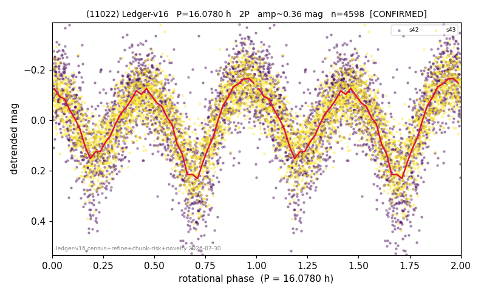

# (11022)

**Adopted:** 16.078 h, 2P, CONFIRMED

<!-- AUTO:START (regenerated from pipeline outputs; do not hand-edit this block) -->
## Evidence (auto)

Detected in 2 sector(s):

| sector | N | baseline (h) | P_phot (h) | power | FAP | cycles | flags |
|--|--|--|--|--|--|--|--|
| s42 | 2273 | 603.2 | 8.0398 | 0.4432 | 4.4e-284 | 37.5 | star-cleaned:34 |
| s43 | 2359 | 551.8 | 8.0381 | 0.5974 | 0.0e+00 | 34.3 | star-cleaned:6 |

- Pipeline refine said: **2P** (folded amp_fourier 0.422); flags: sick-dips-excised:s42(3);near-threshold:0.42
- DIA (de-comb): survived(dPW=-1%,R2=0.02,s43@8.039h,5sec)
- Coverage: **2 sector(s)**, best sector covers **37.52 cycles** of the adopted period. Measured periodogram peak width 1% of the period, i.e. about **+/- 0.03764 h** (1 sigma); the decimal places in the adopted value are not a precision claim.
- Factor of two: **adopted on the amplitude convention**: standard practice for an elongated body, but a convention rather than a measurement.
- Gates: FAP<1e-3 and power>=0.10 per detecting sector; >=2 sectors agree (harmonic-aware).
- Adopted shape: **2P** (folded-amplitude rule; pipeline agrees).

### Why this row reads the way it does

- 2 sector(s) detecting
- cross-sector fold correlation 0.98
- doubling BY CONVENTION: amplitude rule on folded amp 0.422 mag, not individually audited

<!-- AUTO:END -->
