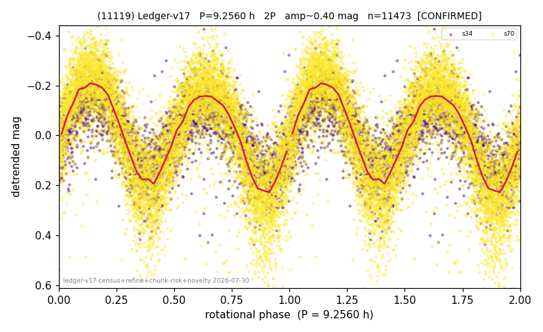

# (11119)

**Adopted:** 9.256 h, 2P, CONFIRMED

<!-- AUTO:START (regenerated from pipeline outputs; do not hand-edit this block) -->
## Evidence (auto)

Detected in 2 sector(s):

| sector | N | baseline (h) | P_phot (h) | power | FAP | cycles | flags |
|--|--|--|--|--|--|--|--|
| s34 | 2886 | 596.3 | 4.6274 | 0.5442 | 0.0e+00 | 128.9 | star-cleaned:22,2P-ambiguous |
| s70 | 8616 | 600.9 | 4.6291 | 0.6641 | 0.0e+00 | 129.8 | star-cleaned:73,2P-ambiguous |

- Pipeline refine said: **2P** (folded amp_fourier 0.488); flags: sick-dips-excised:s34(1),s70(22)
- DIA (de-comb): survived_v2(ret=1.001[1.00-1.00],s70@4.628h)
- Coverage: **2 sector(s)**, best sector covers **64.92 cycles** of the adopted period. Measured periodogram peak width 1% of the period, i.e. about **+/- 0.01342 h** (1 sigma); the decimal places in the adopted value are not a precision claim.
- Factor of two: **adopted on the amplitude convention**: standard practice for an elongated body, but a convention rather than a measurement.
- Gates: FAP<1e-3 and power>=0.10 per detecting sector; >=2 sectors agree (harmonic-aware).
- Adopted shape: **2P** (folded-amplitude rule; pipeline agrees).

### Why this row reads the way it does

- 2 sector(s) detecting
- cross-sector fold correlation 0.99
- doubling BY CONVENTION: amplitude rule on folded amp 0.488 mag, not individually audited

<!-- AUTO:END -->
