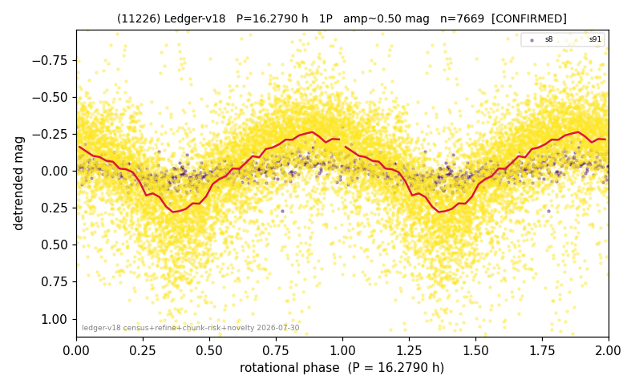

# (11226)

**Adopted:** 16.279 h, 1P, CONFIRMED

<!-- AUTO:START (regenerated from pipeline outputs; do not hand-edit this block) -->
## Evidence (auto)

Detected in 2 sector(s):

| sector | N | baseline (h) | P_phot (h) | power | FAP | cycles | flags |
|--|--|--|--|--|--|--|--|
| s8 | 603 | 548.0 | 16.2967 | 0.3472 | 5.9e-52 | 33.6 | star-cleaned:4,2P-ambiguous |
| s91 | 7142 | 650.3 | 16.2617 | 0.3525 | 0.0e+00 | 40.0 | star-cleaned:79,2P-ambiguous |

- Pipeline refine said: **1P** (folded amp_fourier 0.158); flags: amp-from-clean-sectors(ignored s91);sick-dips-excised:s91(50)
- DIA (de-comb): survived_v2(ret=1.022[1.00-1.04],s8@16.279h)
- Coverage: **2 sector(s)**, best sector covers **39.95 cycles** of the adopted period. Measured periodogram peak width 2% of the period, i.e. about **+/- 0.1561 h** (1 sigma); the decimal places in the adopted value are not a precision claim.
- Factor of two: no doubling was applied.
- Gates: FAP<1e-3 and power>=0.10 per detecting sector; >=2 sectors agree (harmonic-aware).
- Adopted shape: **1P** (folded-amplitude rule; pipeline agrees).

### Why this row reads the way it does

- 2 sector(s) detecting
- cross-sector fold correlation 0.92
- single-peaked at folded amp 0.158 mag

<!-- AUTO:END -->
