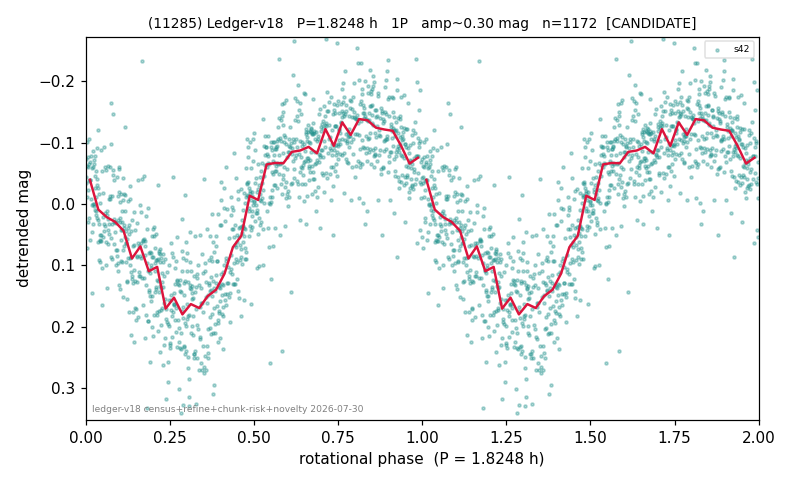

# (11285)

**Adopted:** 1.8248 h, 1P, CANDIDATE

<!-- AUTO:START (regenerated from pipeline outputs; do not hand-edit this block) -->
## Evidence (auto)

Detected in 1 sector(s):

| sector | N | baseline (h) | P_phot (h) | power | FAP | cycles | flags |
|--|--|--|--|--|--|--|--|
| s42 | 1176 | 359.0 | 1.8248 | 0.7039 | 6.9e-306 | 196.7 | star-cleaned:2,2P-ambiguous |

- Pipeline refine said: **1P** (folded amp_fourier 0.316); flags: sick-dips-excised:s42(2)
- DIA (de-comb): not triggered (clean, fast, non-comb)
- Gates: FAP<1e-3 and power>=0.10 per detecting sector; single strong sector (candidate ceiling).
- Adopted shape: **1P** (folded-amplitude rule; pipeline agrees).

### Why this row reads the way it does

- 1 sector(s) detecting
- single-peaked at folded amp 0.316 mag

<!-- AUTO:END -->
