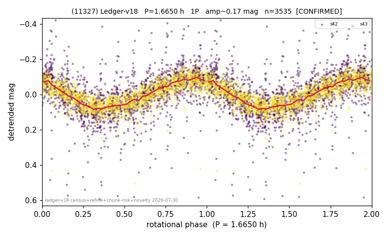

# (11327)

**Adopted:** 3.33 h, 2P, CONFIRMED

<!-- AUTO:START (regenerated from pipeline outputs; do not hand-edit this block) -->
## Evidence (auto)

Detected in 2 sector(s):

| sector | N | baseline (h) | P_phot (h) | power | FAP | cycles | flags |
|--|--|--|--|--|--|--|--|
| s42 | 1923 | 579.4 | 1.6657 | 0.2108 | 1.6e-94 | 347.8 | star-cleaned:20,2P-ambiguous |
| s43 | 1649 | 456.5 | 1.6644 | 0.4948 | 1.1e-239 | 274.3 | star-cleaned:12,2P-ambiguous |

- Pipeline refine said: **1P** (folded amp_fourier 0.176); flags: sick-dips-excised:s42(19),s43(4)
- DIA (de-comb): not triggered (clean, fast, non-comb)
- Gates: FAP<1e-3 and power>=0.10 per detecting sector; >=2 sectors agree (harmonic-aware).
- **Adopted shape 2P OVERRIDES the pipeline's 1P** (doubling audit 2026-07-25: folded amplitude >= 0.25 mag, so a single-peaked curve is physically implausible; Harris convention -> 2P. The census 3-test doubling logic was measured at only 30% recall against 289 LCDB U>=2 ground-truth periods).

### Why this row reads the way it does

- 2 sector(s) detecting
- cross-sector fold correlation 0.98
- single-peaked at folded amp 0.176 mag
- CORRECTED 1.665->3.3300 h (2026-08-01 sub-barrier sweep): all 49 catalog periods below 2.2 h sat on 5-16 km bodies, impossible as true rotations; doubling by SPIN-BARRIER PHYSICS: fold symmetric (photometry cannot decide), but a D~8 km body cannot rotate below the 2.2 h rubble-pile barrier, so the single-peaked reading is physically excluded

<!-- AUTO:END -->
