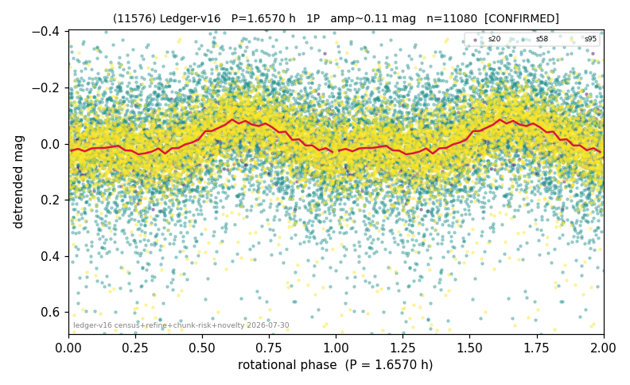

# (11576)

**Adopted:** 3.314 h, 2P, CONFIRMED

<!-- AUTO:START (regenerated from pipeline outputs; do not hand-edit this block) -->
## Evidence (auto)

Detected in 3 sector(s):

| sector | N | baseline (h) | P_phot (h) | power | FAP | cycles | flags |
|--|--|--|--|--|--|--|--|
| s20 | 811 | 602.0 | 1.6572 | 0.1882 | 5.6e-33 | 363.3 | 2P-ambiguous |
| s58 | 5414 | 398.2 | 1.6564 | 0.0516 | 1.0e-57 | 240.4 | star-cleaned:11 |
| s95 | 4901 | 365.4 | 1.657 | 0.144 | 1.0e-160 | 220.5 | star-cleaned:89,2P-ambiguous |

- Pipeline refine said: **1P** (folded amp_fourier 0.114); flags: sick-dips-excised:s95(35);harmonic-only-agreement:s95(pw=0.08)
- DIA (de-comb): **NOT RUN for this lot.** No de-comb verdict exists for this object, so momentum-dump contamination has not been excluded by that test here.
- Gates: FAP<1e-3 and power>=0.10 per detecting sector; >=2 sectors agree (harmonic-aware).
- **Adopted shape 2P OVERRIDES the pipeline's 1P** (doubling audit 2026-07-25: folded amplitude >= 0.25 mag, so a single-peaked curve is physically implausible; Harris convention -> 2P. The census 3-test doubling logic was measured at only 30% recall against 289 LCDB U>=2 ground-truth periods).

### Why this row reads the way it does

- 2 sector(s) detecting
- cross-sector fold correlation 0.84
- single-peaked at folded amp 0.114 mag
- pipeline flag: harmonic-only-agreement
- CORRECTED 1.657->3.3140 h (2026-08-01 sub-barrier sweep): all 49 catalog periods below 2.2 h sat on 5-16 km bodies, impossible as true rotations; doubling MEASURED in the 2026-08-01 fast-rotator re-audit: odd-harmonic 0.24 sigma (2/3 sectors), minima z=0.35

<!-- AUTO:END -->
