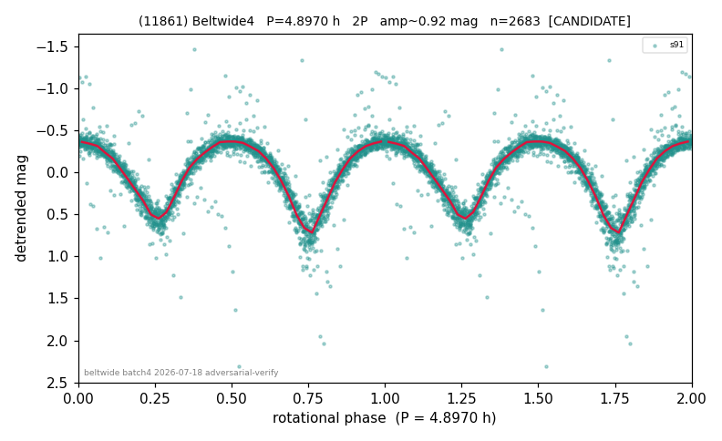

# (11861)

**Adopted:** 4.897 h, 2P, CANDIDATE

<!-- AUTO:START (regenerated from pipeline outputs; do not hand-edit this block) -->
## Evidence (auto)

Detected in 1 sector(s):

| sector | N | baseline (h) | P_phot (h) | power | FAP | cycles | flags |
|--|--|--|--|--|--|--|--|
| s91 | 2683 | 322.9 | 2.4477 | 0.7511 | 0.0e+00 | 131.9 | star-cleaned:20,2P-ambiguous |

- Gates: FAP<1e-3 and power>=0.10 per detecting sector; single strong sector (candidate ceiling); folded-amplitude rule -> 2P.

<!-- AUTO:END -->
