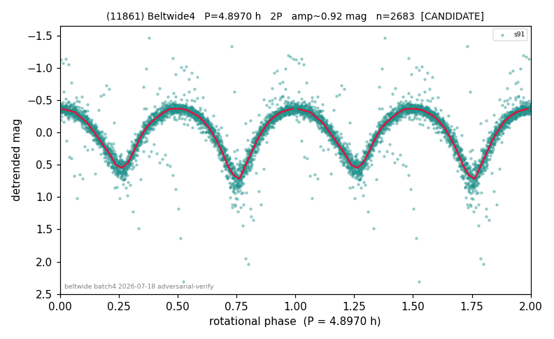

# (11861)

**Adopted:** 4.897 h, 2P, CANDIDATE

<!-- AUTO:START (regenerated from pipeline outputs; do not hand-edit this block) -->
## Evidence (auto)

Detected in 1 sector(s):

| sector | N | baseline (h) | P_phot (h) | power | FAP | cycles | flags |
|--|--|--|--|--|--|--|--|
| s91 | 2683 | 322.9 | 2.4477 | 0.7511 | 0.0e+00 | 131.9 | star-cleaned:20,2P-ambiguous |

- Pipeline refine said: **2P** (folded amp_fourier 0.954); flags: sick-dips-excised:s91(11)
- DIA (de-comb): survived_v2(ret=0.997[0.99-1.00],s91@2.448h)
- Coverage: **1 sector(s)**, best sector covers **65.94 cycles** of the adopted period. Measured periodogram peak width 1% of the period, i.e. about **+/- 0.0142 h** (1 sigma); the decimal places in the adopted value are not a precision claim.
- Factor of two: **adopted on the amplitude convention**: standard practice for an elongated body, but a convention rather than a measurement.
- Gates: FAP<1e-3 and power>=0.10 per detecting sector; single strong sector (candidate ceiling).
- Adopted shape: **2P** (folded-amplitude rule; pipeline agrees).

### Why this row reads the way it does

- Single TESS sector (91, baseline 322.9h, n=2683 pts after clean, with an internal 162.6h downlink gap): LS finds P=2.4485h (power=0.752, FAP approx 0)
- 2P by amplitude rule (folded_amp=0.954)

<!-- AUTO:END -->
