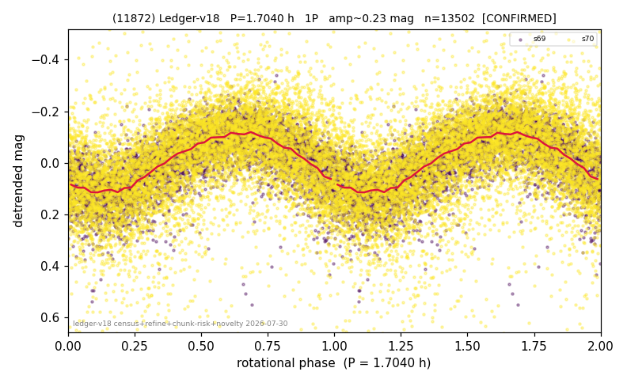

# (11872)

**Adopted:** 1.704 h, 1P, CONFIRMED

<!-- AUTO:START (regenerated from pipeline outputs; do not hand-edit this block) -->
## Evidence (auto)

Detected in 2 sector(s):

| sector | N | baseline (h) | P_phot (h) | power | FAP | cycles | flags |
|--|--|--|--|--|--|--|--|
| s69 | 4774 | 344.2 | 1.7047 | 0.5421 | 0.0e+00 | 201.9 | star-cleaned:20,2P-ambiguous |
| s70 | 8803 | 600.9 | 1.7043 | 0.3268 | 0.0e+00 | 352.6 | star-cleaned:40,2P-ambiguous |

- Pipeline refine said: **1P** (folded amp_fourier 0.239); flags: sick-dips-excised:s69(17),s70(46)
- DIA (de-comb): not triggered (clean, fast, non-comb)
- Gates: FAP<1e-3 and power>=0.10 per detecting sector; >=2 sectors agree (harmonic-aware).
- Adopted shape: **1P** (folded-amplitude rule; pipeline agrees).

### Why this row reads the way it does

- 2 sector(s) detecting
- cross-sector fold correlation 0.98
- single-peaked at folded amp 0.239 mag

<!-- AUTO:END -->
