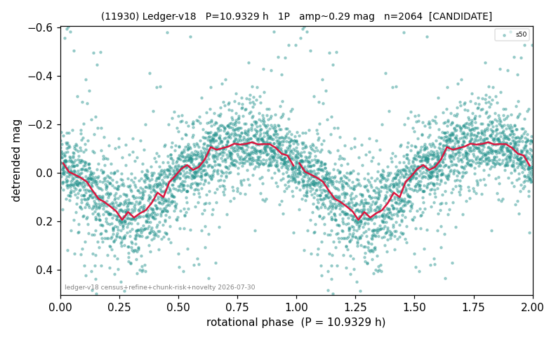

# (11930)

**Adopted:** 10.9329 h, 1P, CANDIDATE

<!-- AUTO:START (regenerated from pipeline outputs; do not hand-edit this block) -->
## Evidence (auto)

Detected in 1 sector(s):

| sector | N | baseline (h) | P_phot (h) | power | FAP | cycles | flags |
|--|--|--|--|--|--|--|--|
| s50 | 2068 | 626.8 | 10.9329 | 0.4506 | 4.7e-264 | 57.3 | star-cleaned:31,2P-ambiguous |

- Pipeline refine said: **1P** (folded amp_fourier 0.304); flags: sick-dips-excised:s50(4)
- DIA (de-comb): not triggered (clean, fast, non-comb)
- Gates: FAP<1e-3 and power>=0.10 per detecting sector; single strong sector (candidate ceiling).
- Adopted shape: **1P** (folded-amplitude rule; pipeline agrees).

### Why this row reads the way it does

- 1 sector(s) detecting
- single-peaked at folded amp 0.304 mag

<!-- AUTO:END -->
