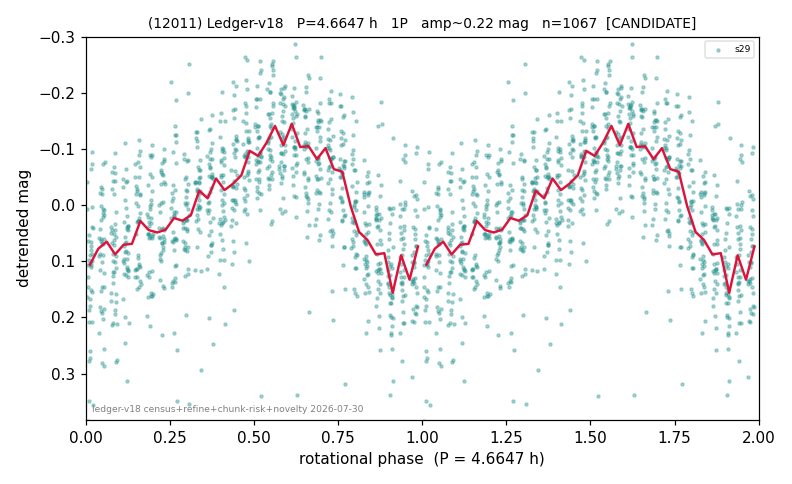

# (12011)

**Adopted:** 4.6647 h, 1P, CONFIRMED

<!-- AUTO:START (regenerated from pipeline outputs; do not hand-edit this block) -->
## Evidence (auto)

Detected in 1 sector(s):

| sector | N | baseline (h) | P_phot (h) | power | FAP | cycles | flags |
|--|--|--|--|--|--|--|--|
| s29 | 1088 | 214.3 | 4.6647 | 0.333 | 1.7e-91 | 45.9 | star-cleaned:6,2P-ambiguous |

- Pipeline refine said: **1P** (folded amp_fourier 0.238); flags: sick-dips-excised:s29(15)
- DIA (de-comb): survived(dPW=-10%,R2=0.31,s29@4.665h,2sec)
- Coverage: **1 sector(s)**, best sector covers **45.95 cycles** of the adopted period. Measured periodogram peak width 2% of the period, i.e. about **+/- 0.03745 h** (1 sigma); the decimal places in the adopted value are not a precision claim.
- Factor of two: no doubling was applied.
- Gates: FAP<1e-3 and power>=0.10 per detecting sector; >=2 sectors agree (harmonic-aware).
- Adopted shape: **1P** (folded-amplitude rule; pipeline agrees).

### Why this row reads the way it does

- 1 sector(s) detecting
- single-peaked at folded amp 0.238 mag
- PROMOTED CANDIDATE->CONFIRMED 2026-08-15 (TESS+ZTF joint, the user-blessed pathway): independent ZTF blind Lomb-Scargle over 6.0 yr / 347 g+r points recovers 4.6568 h = TESS-P 4.6647h to 0.17%, power 0.537, trials-corrected FAP 1.7e-52, beating every alias/comb candidate (comb n=84 3.914h at 0.501); a ZTF detection cannot be a TESS comb tooth or TESS red noise, so this is a genuine second realization and the single-sector ceiling no longer applies
- SHAPE AMBIGUOUS (adversarial review 2026-08-16): calibrated odd-harmonic z = 3.1 (single sector), directional evidence for 2P but below the declared >=8-sigma-reproduced bar; A_fit is in the 0.25-0.40 ambiguous band. Published as 1P with P/2 -> 2P possible; must NOT be counted as a short-period rotator in any statistic

<!-- AUTO:END -->
