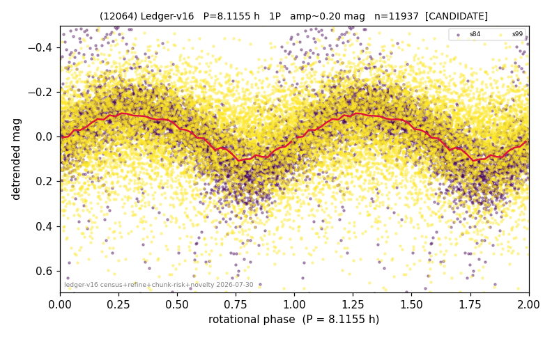

# (12064)

**Adopted:** 8.1155 h, 1P, CANDIDATE

<!-- AUTO:START (regenerated from pipeline outputs; do not hand-edit this block) -->
## Evidence (auto)

Detected in 2 sector(s):

| sector | N | baseline (h) | P_phot (h) | power | FAP | cycles | flags |
|--|--|--|--|--|--|--|--|
| s84 | 4832 | 358.8 | 8.1155 | 0.456 | 0.0e+00 | 44.2 | star-cleaned:67,2P-ambiguous |
| s99 | 7178 | 650.9 | 8.1089 | 0.061 | 2.3e-93 | 80.3 | clean |

- Pipeline refine said: **1P** (folded amp_fourier 0.306); flags: sick-dips-excised:s84(39)
- DIA (de-comb): not triggered (clean, fast, non-comb)
- Gates: FAP<1e-3 and power>=0.10 per detecting sector; single strong sector (candidate ceiling).
- Adopted shape: **1P** (folded-amplitude rule; pipeline agrees).

### Why this row reads the way it does

- 1 sector(s) detecting
- single-peaked at folded amp 0.306 mag

<!-- AUTO:END -->
