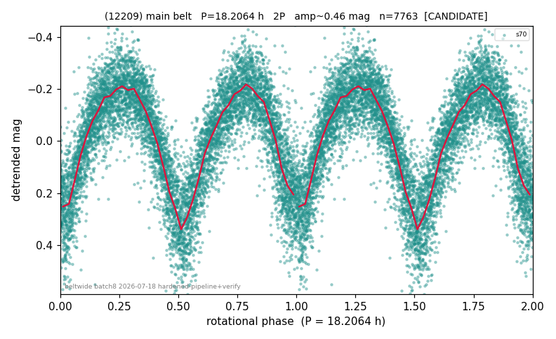

# (12209)

**Adopted:** 18.2064 h, 2P, CANDIDATE

<!-- AUTO:START (regenerated from pipeline outputs; do not hand-edit this block) -->
## Evidence (auto)

Detected in 1 sector(s):

| sector | N | baseline (h) | P_phot (h) | power | FAP | cycles | flags |
|--|--|--|--|--|--|--|--|
| s70 | 7776 | 600.9 | 9.1032 | 0.6845 | 0.0e+00 | 33.0 | clean |

- Pipeline refine said: **2P** (folded amp_fourier 0.513); flags: sick-dips-excised:s70(11)
- DIA (de-comb): survived(dPW=+0%,R2=0.01,s70@9.103h,2sec)
- Coverage: **1 sector(s)**, best sector covers **33.0 cycles** of the adopted period. Measured periodogram peak width 1% of the period, i.e. about **+/- 0.05 h** (1 sigma); the decimal places in the adopted value are not a precision claim.
- Factor of two: **adopted on the amplitude convention**: standard practice for an elongated body, but a convention rather than a measurement.
- Gates: FAP<1e-3 and power>=0.10 per detecting sector; single strong sector (candidate ceiling).
- Adopted shape: **2P** (folded-amplitude rule; pipeline agrees).

### Why this row reads the way it does

- folded_amp=0.51. Single sector (s70) confirmed by direct reproduction: LS fundamental P=9.1032h, power=0.68, Baluev FAP=0.0, robustly independent of the 11-point sick-dip excision (power 0.6845 with vs 0.6851 without, same period) - not

<!-- AUTO:END -->
