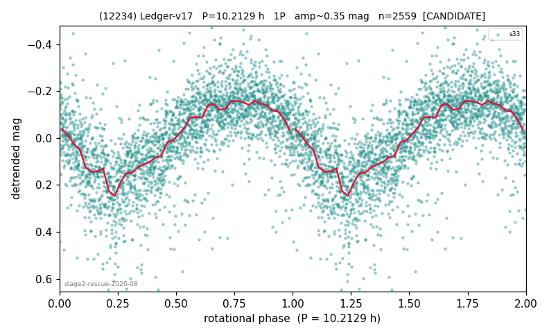

# (12234)

**Adopted:** 10.2129 h, 1P, CONFIRMED

<!-- AUTO:START (regenerated from pipeline outputs; do not hand-edit this block) -->
## Evidence (auto)

Detected in 1 sector(s):

| sector | N | baseline (h) | P_phot (h) | power | FAP | cycles | flags |
|--|--|--|--|--|--|--|--|
| s33 | 2564 | 615.5 | 10.2153 | 0.455 | 0.0e+00 | 60.3 | 2P-ambiguous |

- Coverage: **1 sector(s)**, best sector covers **60.27 cycles** of the adopted period. Measured periodogram peak width 1% of the period, i.e. about **+/- 0.05921 h** (1 sigma); the decimal places in the adopted value are not a precision claim.
- Factor of two: no doubling was applied.
- Gates: FAP<1e-3 and power>=0.10 per detecting sector; >=2 sectors agree (harmonic-aware).
- Adopted shape: **1P** (folded-amplitude rule; pipeline agrees).

### Why this row reads the way it does

- stage-2 crowding-rescue harvest (|b| 5-15 deg, METHODOLOGY 5b-ter), verified 2026-08-10 by refutation-first waves: blind LS+PDM re-derivation, harmonic-aware comb test, field control where near-comb (LS power at the same frequency on >=15 unknown objects of the same sector), shape rules per 3b, all vetoes checked
- 1 sector(s) detecting; single strong sector (candidate ceiling)
- PROMOTED CANDIDATE->CONFIRMED 2026-08-15 (TESS+ZTF joint, the user-blessed pathway): independent ZTF blind Lomb-Scargle over 6.6 yr / 453 g+r points recovers 10.2083 h = TESS-P 10.2129h to 0.04%, power 0.596, trials-corrected FAP 2.1e-83, beating every alias/comb candidate (alias 7.1643h at 0.584); a ZTF detection cannot be a TESS comb tooth or TESS red noise, so this is a genuine second realization and the single-sector ceiling no longer applies

<!-- AUTO:END -->
