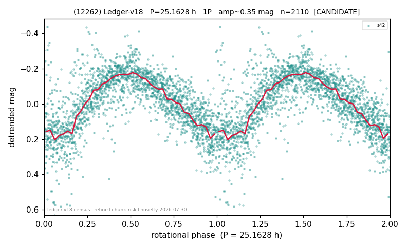

# (12262)

**Adopted:** 25.1628 h, 1P, CANDIDATE

<!-- AUTO:START (regenerated from pipeline outputs; do not hand-edit this block) -->
## Evidence (auto)

Detected in 1 sector(s):

| sector | N | baseline (h) | P_phot (h) | power | FAP | cycles | flags |
|--|--|--|--|--|--|--|--|
| s42 | 2120 | 565.5 | 25.1628 | 0.5833 | 0.0e+00 | 22.5 | star-cleaned:25,2P-ambiguous |

- Pipeline refine said: **1P** (folded amp_fourier 0.363); flags: near-comb(amp-cleared):n=13;sick-dips-excised:s42(9);near-threshold:0.36
- DIA (de-comb): survived(dPW=+2%,R2=0.12,s42@25.163h,1sec)
- Gates: FAP<1e-3 and power>=0.10 per detecting sector; single strong sector (candidate ceiling).
- Adopted shape: **1P** (folded-amplitude rule; pipeline agrees).

### Why this row reads the way it does

- 1 sector(s) detecting
- single-peaked at folded amp 0.363 mag

<!-- AUTO:END -->
