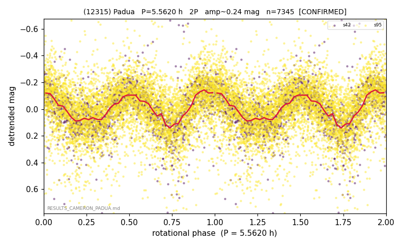

# (12315)

**Adopted:** 5.562 h, 2P, CONFIRMED

<!-- AUTO:START (regenerated from pipeline outputs; do not hand-edit this block) -->
## Evidence (auto)

Detected in 2 sector(s):

| sector | N | baseline (h) | P_phot (h) | power | FAP | cycles | flags |
|--|--|--|--|--|--|--|--|
| s42 | 1699 | 587.9 | 2.7818 | 0.2733 | 2.2e-113 | 211.3 | star-cleaned:13,2P-ambiguous |
| s95 | 5683 | 598.8 | 2.781 | 0.1773 | 8.5e-236 | 215.3 | star-cleaned:133,2P-ambiguous |

- Pipeline refine said: **1P** (folded amp_fourier 0.282); flags: sick-dips-excised:s42(6),s95(20)
- DIA (de-comb): survived(dPW=+4%,R2=0.39,s42@2.781h,2sec)
- Gates: FAP<1e-3 and power>=0.10 per detecting sector; >=2 sectors agree (harmonic-aware).
- **Adopted shape 2P OVERRIDES the pipeline's 1P** (doubling audit 2026-07-25: folded amplitude >= 0.25 mag, so a single-peaked curve is physically implausible; Harris convention -> 2P. The census 3-test doubling logic was measured at only 30% recall against 289 LCDB U>=2 ground-truth periods).

### Why this row reads the way it does

- 2/2 sectors; amp 0.297 gray zone, no minima asymmetry -> 1P; P doubled 2026-07-25 (doubling audit: amp>=0.25 + Harris convention)

<!-- AUTO:END -->
