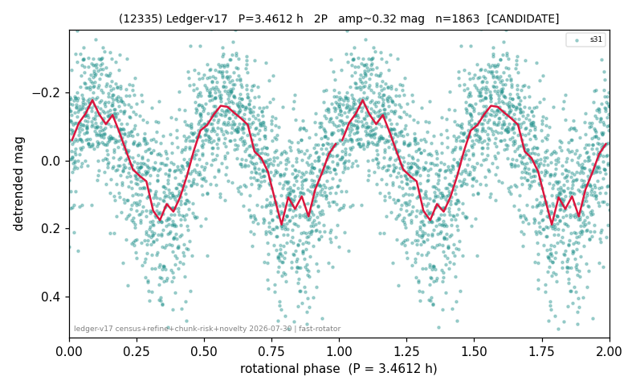

# (12335)

**Adopted:** 3.4612 h, 2P, CONFIRMED

<!-- AUTO:START (regenerated from pipeline outputs; do not hand-edit this block) -->
## Evidence (auto)

Detected in 2 sector(s):

| sector | N | baseline (h) | P_phot (h) | power | FAP | cycles | flags |
|--|--|--|--|--|--|--|--|
| s31 | 1864 | 438.8 | 1.7306 | 0.4229 | 8.6e-218 | 253.6 | 2P-ambiguous |
| s87 | 1508 | 117.2 | 1.7307 | 0.166 | 1.7e-55 | 67.7 | star-cleaned:53,2P-ambiguous |

- Pipeline refine said: **1P** (folded amp_fourier 0.328); flags: clean
- DIA (de-comb): not triggered (the object is clean, fast and non-comb, so the test does not apply)
- Coverage: **2 sector(s)**, best sector covers **126.79 cycles** of the adopted period. Measured periodogram peak width 0% of the period, i.e. about **+/- 0.002701 h** (1 sigma); the decimal places in the adopted value are not a precision claim.
- Factor of two: **measured on the data** (odd-harmonic power or unequal minima, significant and reproduced), METHODOLOGY 3b.
- Gates: FAP<1e-3 and power>=0.10 per detecting sector; >=2 sectors agree (harmonic-aware).
- **Adopted shape 2P OVERRIDES the pipeline's 1P** (doubling audit 2026-07-25: folded amplitude >= 0.25 mag, so a single-peaked curve is physically implausible; Harris convention -> 2P. The census 3-test doubling logic was measured at only 30% recall against 289 LCDB U>=2 ground-truth periods).

### Why this row reads the way it does

- 1 sector(s) detecting
- single-peaked at folded amp 0.328 mag
- CORRECTED 1.7306->3.4612 h (2026-08-01 sub-barrier sweep): all 49 catalog periods below 2.2 h sat on 5-16 km bodies, impossible as true rotations; doubling MEASURED in the 2026-08-01 fast-rotator re-audit: odd-harmonic 3.29 sigma (1/1 sectors), minima z=1.18
- s87 crowding-rescued (2026-08-08, |b| 5-15 deg rescue, 5-point crowding penalty, 72 vs 77 per cent LCDB agreement): power 0.14, FAP 1.5e-43 at the adopted photometric period, 33.9 cycles, chunk-extracted
- PROMOTED CANDIDATE->CONFIRMED: second independent detecting sector passes the per-sector gates; single-sector ceiling no longer applies

<!-- AUTO:END -->
