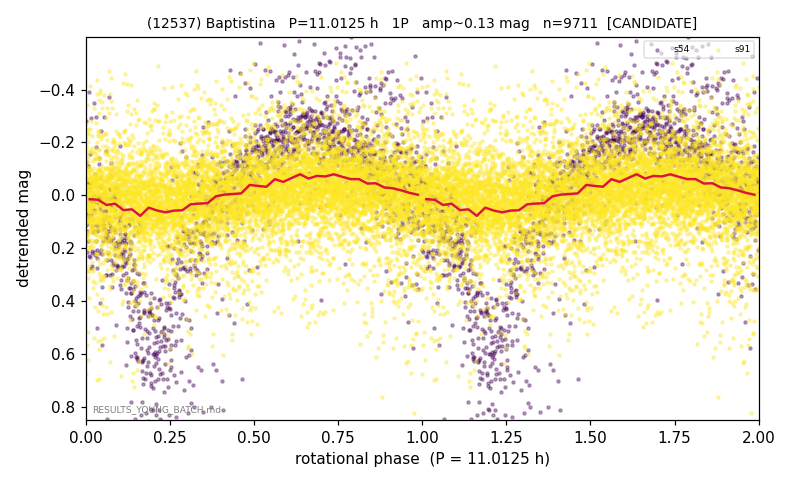

# (12537)

**Adopted:** 11.0125 h, 1P, CANDIDATE

<!-- AUTO:START (regenerated from pipeline outputs; do not hand-edit this block) -->
## Evidence (auto)

Detected in 2 sector(s):

| sector | N | baseline (h) | P_phot (h) | power | FAP | cycles | flags |
|--|--|--|--|--|--|--|--|
| s54 | 1662 | 592.2 | 11.0125 | 0.542 | 7.0e-277 | 53.8 | star-cleaned:12,2P-ambiguous |
| s91 | 8179 | 649.1 | 229.7007 | 0.0716 | 4.0e-127 | 2.8 | star-cleaned:98,phase-curve-risk |

- Pipeline refine said: **2P** (folded amp_fourier 0.72); flags: near-comb(amp-cleared):n=15;sick-dips-excised:s54(25)
- DIA (de-comb): survived(dPW=+4%,R2=0.03,s54@11.012h,4sec)
- Gates: FAP<1e-3 and power>=0.10 per detecting sector; single strong sector (candidate ceiling).
- **Adopted shape 1P OVERRIDES the pipeline's 2P** (doubling audit 2026-07-25: folded amplitude >= 0.25 mag, so a single-peaked curve is physically implausible; Harris convention -> 1P. The census 3-test doubling logic was measured at only 30% recall against 289 LCDB U>=2 ground-truth periods).

<!-- AUTO:END -->
