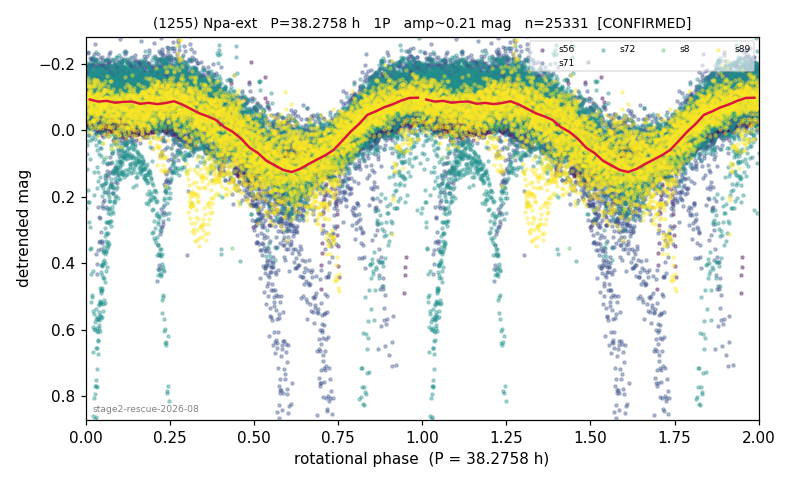

# (1255)

**Adopted:** 38.2758 h, 1P, CONFIRMED

<!-- AUTO:START (regenerated from pipeline outputs; do not hand-edit this block) -->
## Evidence (auto)

Detected in 5 sector(s):

| sector | N | baseline (h) | P_phot (h) | power | FAP | cycles | flags |
|--|--|--|--|--|--|--|--|
| s8 | 489 | 436.0 | 38.2762 | 0.68 | 1.6e-116 | 5.7 | star-cleaned:3 |
| s56 | 5685 | 388.2 | 38.8324 | 0.37 | 0.0e+00 | 10.0 | clean |
| s71 | 6933 | 572.3 | 38.2432 | 0.3416 | 0.0e+00 | 7.5 | clean |
| s72 | 7407 | 583.4 | 154.6804 | 0.234 | 0.0e+00 | 3.8 | star-cleaned:34,2P-untestable,2P-ambiguo |
| s89 | 5021 | 326.1 | 38.3955 | 0.4271 | 0.0e+00 | 4.2 | clean |

- Pipeline refine said: **2P** (folded amp_fourier 0.419); flags: gap-alias-risk:100h;sick-dips-excised:s56(4),s71(55),s72(16);incoherent-sectors:4/5;near-t
- DIA (de-comb): **NOT RUN for this lot.** No de-comb verdict exists for this object, so momentum-dump contamination has not been excluded by that test here.
- Coverage: **5 sector(s)**, best sector covers **15.24 cycles** of the adopted period. Measured periodogram peak width 5% of the period, i.e. about **+/- 0.7767 h** (1 sigma); the decimal places in the adopted value are not a precision claim.
- Factor of two: no doubling was applied.
- Gates: FAP<1e-3 and power>=0.10 per detecting sector; >=2 sectors agree (harmonic-aware).
- **Adopted shape 1P OVERRIDES the pipeline's 2P** (doubling audit 2026-07-25: folded amplitude >= 0.25 mag, so a single-peaked curve is physically implausible; Harris convention -> 1P. The census 3-test doubling logic was measured at only 30% recall against 289 LCDB U>=2 ground-truth periods).

### Why this row reads the way it does

- stage-2 crowding-rescue harvest (|b| 5-15 deg, METHODOLOGY 5b-ter), verified 2026-08-10 by refutation-first waves: blind LS+PDM re-derivation, harmonic-aware comb test, field control where near-comb, shape rules per 3b, all vetoes checked
- SETTLES conflict: refutes Hanus+2013 LCI 29.467h and LCDB 29.536h U=2 on our data (LS power 14x at our period vs published, PDM theta 0.29 vs 0.95, fold 1.9x cleaner; 4/5 sectors concordant at FAP<1e-100, fifth at 4.00xP within 1.0%); window-alias hypothesis tested and rejected (k non-integer across sectors); amp 0.20 -> 1P
- NOVELTY REVISION (our value is 1/2 of theirs) (2026-08-16 cross-match against catalogues the ledger could not see): Gowanlock+2024 publishes 76.624h. NOT a first determination; the paper must present it as such

<!-- AUTO:END -->
