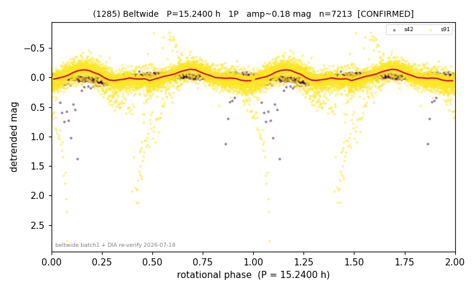

# (1285)

**Adopted:** 15.24 h, 1P, CONFIRMED

<!-- AUTO:START (regenerated from pipeline outputs; do not hand-edit this block) -->
## Evidence (auto)

Detected in 2 sector(s):

| sector | N | baseline (h) | P_phot (h) | power | FAP | cycles | flags |
|--|--|--|--|--|--|--|--|
| s42 | 1870 | 558.8 | 15.2386 | 0.2692 | 6.5e-123 | 36.7 | 2P-ambiguous |
| s91 | 5343 | 528.4 | 7.6206 | 0.3697 | 0.0e+00 | 69.3 | star-cleaned:62,2P-ambiguous |

- Refined shape: **1P** (folded amp_fourier 0.077); flags: sector-dropped:s91(range>3mag);sick-dips-excised:s42(2)
- DIA (de-comb): survived(dPW=+13%,R2=0.35,s91@7.620h,3sec)
- Gates: FAP<1e-3 and power>=0.10 per detecting sector; >=2 sectors agree (harmonic-aware); folded-amplitude rule -> 1P.

<!-- AUTO:END -->

## Doubt
S91 flagged as contaminated (mag-7 star-crossing spike + faint dips to -2.5 mag); the DIA had never run on it (fell through the old comb/slow-only trigger and the range>3 mag sector-skip).
## Evidence
(a) S91 contamination is real but localized; the census bright-clip removes the 62 bad points and S91 still detects 7.62 h = P/2 (FAP ~0 over 69 cycles) -- a 1-2 day star-crossing cannot fake a 69-cycle coherent period. (b) S42 clean: 15.24 h, FAP 1e-123, 0 contamination. (c) SysRem DIA: S42 survives at 15.24 h (drop -2%), S91 survives at 7.62 h (drop +13%) -> astrophysical. (d) Folded amp 0.09 (S42) / 0.24 (S91), both < 0.40 -> 1P.
## Verdict
1P / 15.24 h, confirmed, 2-sector (S42 fundamental + S91 harmonic). Disagrees with the published LCDB 20.3 h (a genuine literature disagreement). This case motivated the contamination-triggered DIA rule.
