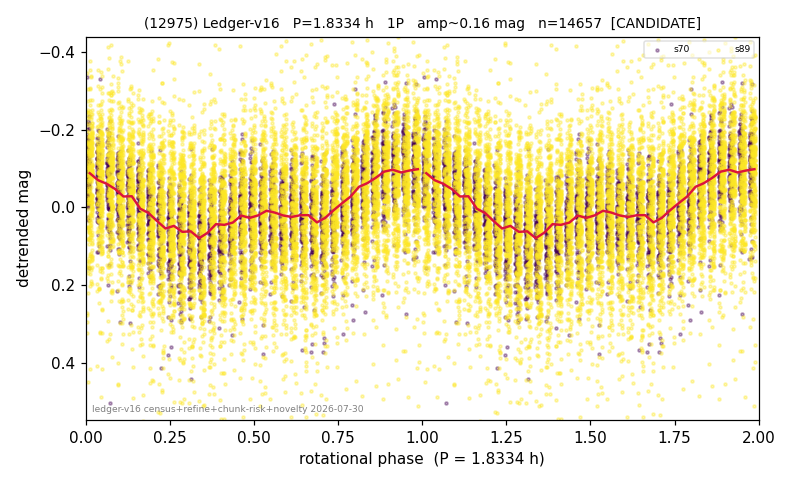

# (12975)

**Adopted:** 3.6668 h, 2P, CANDIDATE

<!-- AUTO:START (regenerated from pipeline outputs; do not hand-edit this block) -->
## Evidence (auto)

Detected in 2 sector(s):

| sector | N | baseline (h) | P_phot (h) | power | FAP | cycles | flags |
|--|--|--|--|--|--|--|--|
| s70 | 4695 | 301.6 | 1.8334 | 0.3176 | 0.0e+00 | 164.5 | star-cleaned:2,2P-ambiguous |
| s89 | 9968 | 675.9 | 1.8336 | 0.0955 | 3.7e-212 | 368.6 | star-cleaned:80 |

- Pipeline refine said: **1P** (folded amp_fourier 0.161); flags: clean
- DIA (de-comb): not triggered (the object is clean, fast and non-comb, so the test does not apply)
- Coverage: **2 sector(s)**, best sector covers **184.33 cycles** of the adopted period. Measured periodogram peak width 0% of the period, i.e. about **+/- 0.0 h** (1 sigma); the decimal places in the adopted value are not a precision claim.
- Factor of two: **measured on the data** (odd-harmonic power or unequal minima, significant and reproduced), METHODOLOGY 3b.
- Gates: FAP<1e-3 and power>=0.10 per detecting sector; single strong sector (candidate ceiling).
- **Adopted shape 2P OVERRIDES the pipeline's 1P** (doubling audit 2026-07-25: folded amplitude >= 0.25 mag, so a single-peaked curve is physically implausible; Harris convention -> 2P. The census 3-test doubling logic was measured at only 30% recall against 289 LCDB U>=2 ground-truth periods).

### Why this row reads the way it does

- 1 sector(s) detecting
- single-peaked at folded amp 0.161 mag
- CORRECTED 1.8334->3.6668 h (2026-08-01 sub-barrier sweep): all 49 catalog periods below 2.2 h sat on 5-16 km bodies, impossible as true rotations; doubling MEASURED in the 2026-08-01 fast-rotator re-audit: odd-harmonic 5.56 sigma (2/2 sectors), minima z=-0.74

<!-- AUTO:END -->
