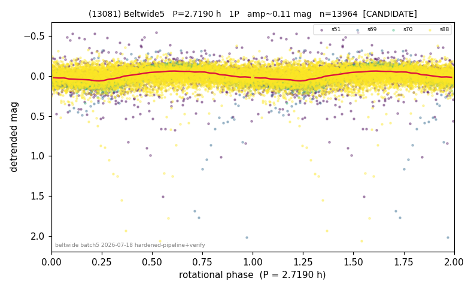

# (13081)

**Adopted:** 5.438 h, 2P, CANDIDATE

<!-- AUTO:START (regenerated from pipeline outputs; do not hand-edit this block) -->
## Evidence (auto)

Detected in 4 sector(s):

| sector | N | baseline (h) | P_phot (h) | power | FAP | cycles | flags |
|--|--|--|--|--|--|--|--|
| s51 | 1406 | 582.2 | 5.4408 | 0.1912 | 1.0e-60 | 107.0 | star-cleaned:49,2P-ambiguous |
| s69 | 4289 | 282.4 | 2.7191 | 0.5285 | 0.0e+00 | 103.9 | star-cleaned:32 |
| s70 | 1928 | 124.7 | 2.7187 | 0.6113 | 0.0e+00 | 45.9 | 2P-ambiguous |
| s88 | 6341 | 457.7 | 5.4366 | 0.1231 | 5.3e-176 | 84.2 | star-cleaned:28,2P-ambiguous |

- Pipeline refine said: **1P** (folded amp_fourier 0.154); flags: sick-dips-excised:s51(3),s69(3),s88(5);harmonic-only-agreement:s69(pw=0.00),s70(pw=0.00);s
- DIA (de-comb): survived_v2(ret=0.996[0.98-1.00],s70@2.719h)
- Coverage: **4 sector(s)**, best sector covers **214.11 cycles** of the adopted period. Measured periodogram peak width 1% of the period, i.e. about **+/- 0.006669 h** (1 sigma); the decimal places in the adopted value are not a precision claim.
- Factor of two: no doubling was applied.
- Gates: FAP<1e-3 and power>=0.10 per detecting sector; single strong sector (candidate ceiling).
- **Adopted shape 2P OVERRIDES the pipeline's 1P** (doubling audit 2026-07-25: folded amplitude >= 0.25 mag, so a single-peaked curve is physically implausible; Harris convention -> 2P. The census 3-test doubling logic was measured at only 30% recall against 289 LCDB U>=2 ground-truth periods).

### Why this row reads the way it does

- Queue CONFIRMED 1P@5.438h rests on harmonic-only-agreement: s69/s70 (FAP~0, LS pw=.53/.61) show ZERO power at 5.438h, real peak=2.719h; only s51/s88 w
- DOUBLING CORRECTED 2026-08-30: adopted period doubled from 2.719 h. The previous value came from the folded-amplitude rule, which was found biased low (9 of 9 disagreements with MPB 2024-2026 in the same direction). Odd-harmonic test at the long period gives z1=14.95 with margin 12.21 over non-harmonic multiples 1.7x/2.3x (reference group: 0 of 38 above margin 2).

<!-- AUTO:END -->
