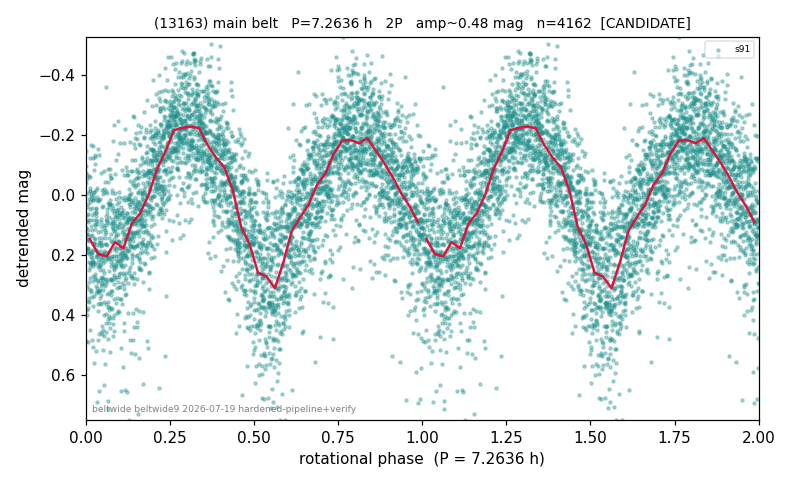

# (13163)

**Adopted:** 7.2636 h, 2P, CANDIDATE

<!-- AUTO:START (regenerated from pipeline outputs; do not hand-edit this block) -->
## Evidence (auto)

Detected in 1 sector(s):

| sector | N | baseline (h) | P_phot (h) | power | FAP | cycles | flags |
|--|--|--|--|--|--|--|--|
| s91 | 4187 | 516.7 | 3.6318 | 0.5294 | 0.0e+00 | 142.3 | star-cleaned:73,2P-ambiguous |

- Refined shape: **2P** (folded amp_fourier 0.467); flags: sick-dips-excised:s91(19)
- DIA (de-comb): survived(dPW=-0%,R2=0.00,s91@3.632h,1sec)
- Gates: FAP<1e-3 and power>=0.10 per detecting sector; single strong sector (candidate ceiling); folded-amplitude rule -> 2P.

<!-- AUTO:END -->
