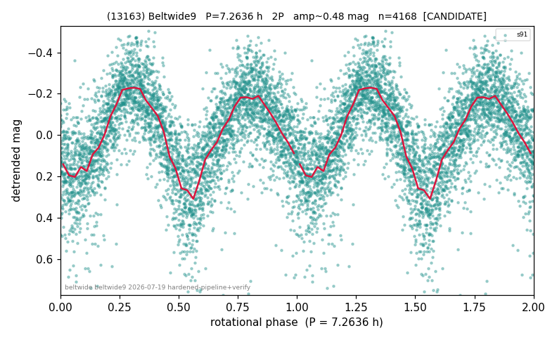

# (13163)

**Adopted:** 7.2636 h, 2P, CANDIDATE

<!-- AUTO:START (regenerated from pipeline outputs; do not hand-edit this block) -->
## Evidence (auto)

Detected in 1 sector(s):

| sector | N | baseline (h) | P_phot (h) | power | FAP | cycles | flags |
|--|--|--|--|--|--|--|--|
| s91 | 4187 | 516.7 | 3.6318 | 0.5294 | 0.0e+00 | 142.3 | star-cleaned:73,2P-ambiguous |

- Pipeline refine said: **2P** (folded amp_fourier 0.467); flags: sick-dips-excised:s91(19)
- DIA (de-comb): survived(dPW=-0%,R2=0.00,s91@3.632h,1sec)
- Coverage: **1 sector(s)**, best sector covers **71.13 cycles** of the adopted period. Measured periodogram peak width 1% of the period, i.e. about **+/- 0.01 h** (1 sigma); the decimal places in the adopted value are not a precision claim.
- Factor of two: **adopted on the amplitude convention**: standard practice for an elongated body, but a convention rather than a measurement.
- Gates: FAP<1e-3 and power>=0.10 per detecting sector; single strong sector (candidate ceiling).
- Adopted shape: **2P** (folded-amplitude rule; pipeline agrees).

### Why this row reads the way it does

- folded_amp=0.473. Single-sector s91 (cap); fundamental 3.6318h FAP~0 power 0.53; amp>0.40 -> 2P with real minima asymmetry; window clears comb.

<!-- AUTO:END -->
