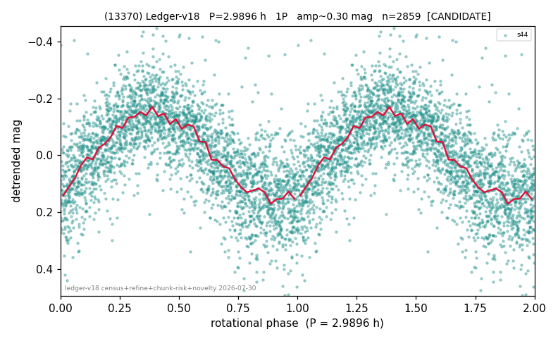

# (13370)

**Adopted:** 2.9896 h, 1P, CANDIDATE

<!-- AUTO:START (regenerated from pipeline outputs; do not hand-edit this block) -->
## Evidence (auto)

Detected in 1 sector(s):

| sector | N | baseline (h) | P_phot (h) | power | FAP | cycles | flags |
|--|--|--|--|--|--|--|--|
| s44 | 2882 | 578.7 | 2.9896 | 0.4904 | 0.0e+00 | 193.6 | star-cleaned:26,2P-ambiguous |

- Pipeline refine said: **1P** (folded amp_fourier 0.327); flags: sick-dips-excised:s44(1)
- DIA (de-comb): inconclusive(dPW=+16%,R2=0.45,s44@2.990h)
- Coverage: **1 sector(s)**, best sector covers **193.56 cycles** of the adopted period. Measured periodogram peak width 0% of the period, i.e. about **+/- 0.006 h** (1 sigma); the decimal places in the adopted value are not a precision claim.
- Factor of two: no doubling was applied.
- Gates: FAP<1e-3 and power>=0.10 per detecting sector; single strong sector (candidate ceiling).
- Adopted shape: **1P** (folded-amplitude rule; pipeline agrees).

### Why this row reads the way it does

- 1 sector(s) detecting
- single-peaked at folded amp 0.327 mag

<!-- AUTO:END -->
