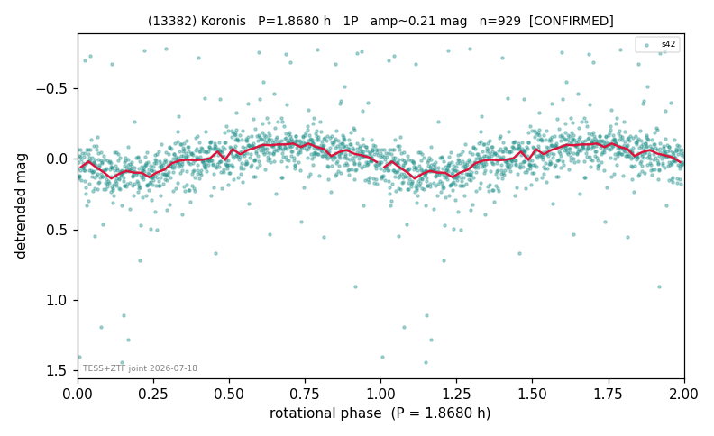

# (13382)

**Adopted:** 1.868 h, 1P, CONFIRMED

<!-- AUTO:START (regenerated from pipeline outputs; do not hand-edit this block) -->
## Evidence (auto)

Detected in 1 sector(s):

| sector | N | baseline (h) | P_phot (h) | power | FAP | cycles | flags |
|--|--|--|--|--|--|--|--|
| s42 | 929 | 355.0 | 1.8681 | 0.3064 | 1.1e-69 | 190.0 | star-cleaned:26,2P-ambiguous |

- Refined shape: **1P** (folded amp_fourier 0.2); flags: sick-dips-excised:s42(8)
- DIA (de-comb): survived(dPW=+4%,R2=0.06,s42@1.868h,1sec)
- Gates: FAP<1e-3 and power>=0.10 per detecting sector; >=2 sectors agree (harmonic-aware); folded-amplitude rule -> 1P.

<!-- AUTO:END -->
