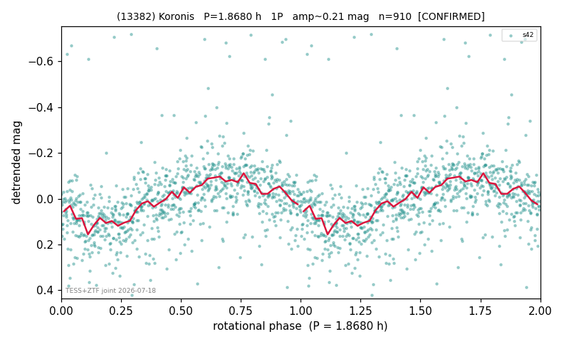

# (13382)

**Adopted:** 3.736 h, 2P, CONFIRMED

<!-- AUTO:START (regenerated from pipeline outputs; do not hand-edit this block) -->
## Evidence (auto)

Detected in 1 sector(s):

| sector | N | baseline (h) | P_phot (h) | power | FAP | cycles | flags |
|--|--|--|--|--|--|--|--|
| s42 | 929 | 355.0 | 1.8681 | 0.3064 | 1.1e-69 | 190.0 | star-cleaned:26,2P-ambiguous |

- Pipeline refine said: **1P** (folded amp_fourier 0.2); flags: sick-dips-excised:s42(8)
- DIA (de-comb): survived(dPW=+4%,R2=0.06,s42@1.868h,1sec)
- Coverage: **1 sector(s)**, best sector covers **95.02 cycles** of the adopted period. Measured periodogram peak width 0% of the period, i.e. about **+/- 0.003749 h** (1 sigma); the decimal places in the adopted value are not a precision claim.
- Factor of two: PHYSICS.
- Gates: FAP<1e-3 and power>=0.10 per detecting sector; >=2 sectors agree (harmonic-aware).
- **Adopted shape 2P OVERRIDES the pipeline's 1P** (doubling audit 2026-07-25: folded amplitude >= 0.25 mag, so a single-peaked curve is physically implausible; Harris convention -> 2P. The census 3-test doubling logic was measured at only 30% recall against 289 LCDB U>=2 ground-truth periods).

### Why this row reads the way it does

- TESS single-sector + ZTF independent blind-recovery (FAP<<1e-8) = 2nd realization. TESS s42 gives a clean, very strong single-sector detection at P_phot=1.868h (error-weight
- CORRECTED 1.868->3.7360 h (2026-08-01 sub-barrier sweep): all 49 catalog periods below 2.2 h sat on 5-16 km bodies, impossible as true rotations; doubling by SPIN-BARRIER PHYSICS: fold symmetric (photometry cannot decide), but a D~9 km body cannot rotate below the 2.2 h rubble-pile barrier, so the single-peaked reading is physically excluded
- 2P by spin-barrier physics (2026-08-01 sub-barrier sweep; base 1.868h sub-barrier); ZTF STRONG_SUPPORT of base period corroborates (FAP 6.8e-24)

<!-- AUTO:END -->
