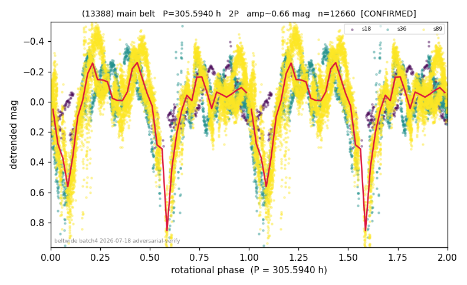

# (13388)

**Adopted:** 305.594 h, 2P, CONFIRMED

<!-- AUTO:START (regenerated from pipeline outputs; do not hand-edit this block) -->
## Evidence (auto)

Detected in 3 sector(s):

| sector | N | baseline (h) | P_phot (h) | power | FAP | cycles | flags |
|--|--|--|--|--|--|--|--|
| s18 | 572 | 490.5 | 152.7974 | 0.4778 | 1.4e-76 | 3.2 | 2P-untestable,2P-ambiguous |
| s36 | 2655 | 577.8 | 153.6989 | 0.3518 | 4.4e-245 | 3.8 | star-cleaned:8,2P-untestable,2P-ambiguou |
| s89 | 9470 | 673.3 | 75.6389 | 0.3612 | 0.0e+00 | 4.5 | star-cleaned:15 |

- Refined shape: **1P** (folded amp_fourier 0.343); flags: few-cycle:1.6;gap-alias-risk:107h;sector-dropped:s36,s89(range>3mag)
- DIA (de-comb): survived(dPW=-12%,R2=0.08,s18@152.797h,8sec)
- Gates: FAP<1e-3 and power>=0.10 per detecting sector; >=2 sectors agree (harmonic-aware); folded-amplitude rule -> 2P.

<!-- AUTO:END -->

## Reasoning
SUPER-SLOW #3, 3 sectors (S18/36/89) comb-free, base ~152-154 h in all three; sidereal P_sid=307.0 h, PDM Theta<=0.47. Refine wanted 153 h (1P); sidereal resolves to 305.6 h (2P).
## Verdict
CONFIRMED 2P / 305.594 h.

## Mutual-event candidate (2026-07-19, unconfirmed, reported)
Deep review of the "big dip" in the published fold found it is NOT contamination:
the fold contains narrow (5-8% of the period at half depth), deep (0.66-0.81 mag),
smooth minima recurring at the base period (152.8 h = P/2, two per system period),
phase-locked within each sector (chance ~1e-3), present in the 2020 and 2025
apparitions and absent in 2019 (aspect-dependent), with depths at the 0.75 mag
equal-pair ceiling. Same-star recrossing, bright-star proximity, and TESS-orbit
systematics were tested and excluded (Horizons + TIC control). These properties
match mutual events of a fully synchronous binary with system period ~305.6 h,
which would be record-class; they are inconsistent with ellipsoidal shape minima
(which would be 20-25% of P wide). UNCONFIRMED: an extreme contact/bilobed shape
is not fully excluded. The adopted 305.594 h is the photometric system period under
either reading and is unaffected. Full evidence: RESULTS_13388_BINARY_CANDIDATE.md
(working dir). Follow-up: event-timing ephemeris, ZTF archival, targeted ground
photometry at predicted events (~0.7 mag, V~16, amateur-reachable).
